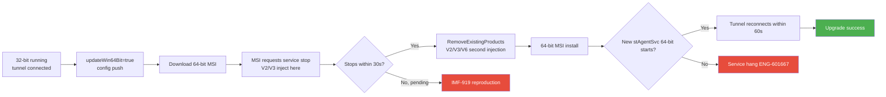
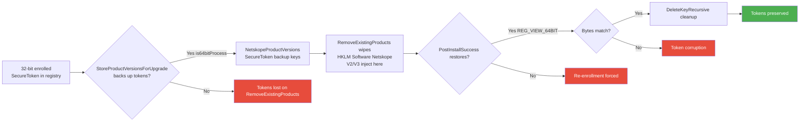
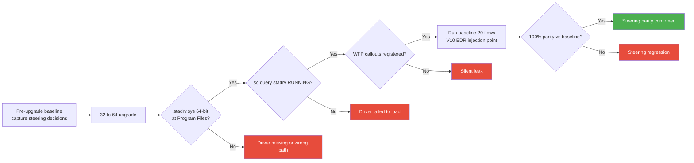
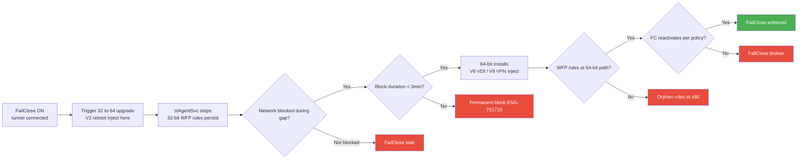
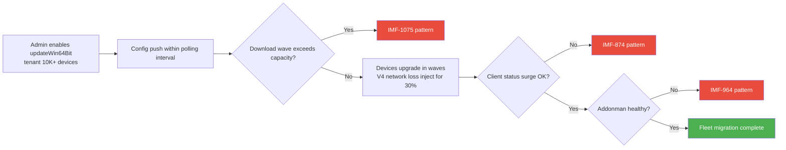
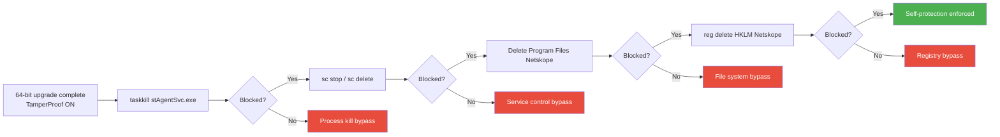
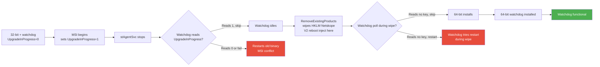
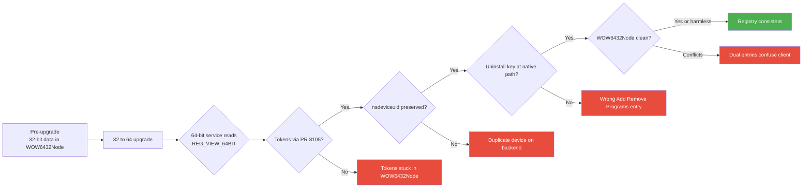
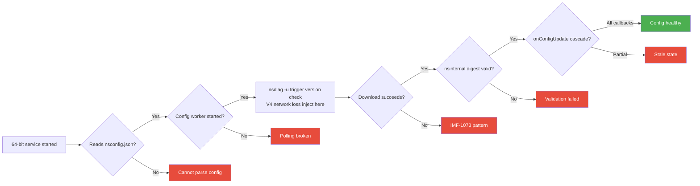

# SYSPLAN-3211: System Test — NPLAN-3211 — Windows 64-Bit Client Support

## Source
- Parent test plan: [nplan-3211-64bit.md](../test_plans/nplan-3211-64bit.md), [nplan-3211-64bit-Webui.md](../test_plans/nplan-3211-64bit-Webui.md)
- SOP: [SYSTEST-01](systest-01.md)
- PR reference: [PR #8105](../doc/pr/pr8105.md) — Enrollment token backup/restore
- IMF data: [IMFs](../doc/bug_20260609/imfs_overall.md) (date: 2026-06-09)
- Date created: 2026-06-16

---

## System Test Objective

Validate that the 32→64 Windows client cross-bitness MSI upgrade does NOT introduce systemic failures. The upgrade triggers `RemoveExistingProducts` (registry hive wipe), changes install path (`Program Files (x86)` → `Program Files`), swaps the WFP driver (stadrv.sys) bitness, and re-registers all services. Each step is a chain reaction with proven IMF failure modes. Each P0 enumerates V1 (clean) plus 1-3 disruption/environment variants of the SAME failure mode.

---

## IMF-Informed Risk Profile

| IMF / Bug | Severity | What Broke | Root Cause | Our Test |
|---|---|---|---|---|
| **IMF-919** | High | Upgrade aborted, ERROR_SERVICE_CANNOT_ACCEPT_CTRL | Windows Installer + service stop timing | SYS-001, SYS-002, SYS-007 |
| **IMF-1075** | High | SJC1 unable to download client installers | Downloader outage | SYS-005, SYS-010 |
| **IMF-874** | Low | Config API spike | Traffic increase | SYS-005 |
| **IMF-878** | Middle | Config API spike | Versioned steering rollout | SYS-005 |
| **IMF-964** | Critical | Duplicate IP rules from soft IRQ | Processing surge | SYS-005 |
| **IMF-1073** | Critical | SJC2 config update failure → clients disabled | provisioner-clientservices failure | SYS-009 |
| **IMF-1136** | High | FR4 ~74 tenants config failures | Regional config service | SYS-009 |
| **ENG-466704** | Day-1 | Secure enrollment failing on Citrix | UPN secure enrollment | SYS-002 V6 |
| **ENG-624953** | Day-1 | VDI DaaS terminating connections | Multi-user race | SYS-001 V6, SYS-009 |
| **ENG-487939** | Yes-regression | Unable to upgrade with self-protection | Self-protection blocked installer | SYS-006 |
| **ENG-781465** | Day-1 | Client gray out — ProductID mismatch | Registry inconsistency | SYS-008 |
| **ENG-991833** | Day-1 | FailClose not working with IPSec/VPN swap | enableFCOnNetworkDisconnect interaction | SYS-004 V9 |

---

## Scope

### In Scope (System-Level)
- Cross-bitness upgrade orchestrations: 32→64, 64→64, 64→32 rollback
- Token backup/restore via PR #8105 across enterprise environments
- Registry view correctness post-upgrade (REG_VIEW_64BIT vs WOW6432Node)
- WFP driver bitness swap and steering parity
- FailClose persistence across cross-bitness window
- Watchdog interaction during cross-bitness upgrade
- Fleet-scale migration backend load

### Out of Scope
- WebUI functional tests (parent plan)
- Backend API correctness (backend QE)
- macOS / Linux / Android / iOS (Windows-only feature)
- Email invitation link rendering (functional)

## Platforms
- Windows 11 (x64) — primary
- Windows 10 (x64)
- Windows 11 ARM64 (V1 only)
- Windows Server 2019 (Citrix VDA — V6 target)

## Prerequisites
- Tenant with `nplan3211_64_bit_support` = ON, `updateWin64Bit` toggleable
- 32-bit baseline enrolled, tunnel connected (SWG)
- Registry/file/log access; crash dump dirs monitored
- VM-based environments for V2/V3 disruption (force-reboot, force-stop)
- Citrix VDA for V6
- SCCM/Intune for V8
- Cisco AnyConnect for V9
- CrowdStrike for V10 (only SYS-003 — narrow V5/V10 criteria)

---

## Test Cases — P0 (MUST HAVE) — Maximum 10 cases, 1-4 variants each

### SYS-001: 32→64 Cross-Bitness MSI Upgrade — Service Stop Timing
- **Priority**: P0
- **Platforms**: Windows 10, Windows 11
- **IMF Link**: **IMF-919**
- **Related Bugs**: ENG-733657, ENG-988826, ENG-601667
- **Objective**: Verify cross-bitness MSI upgrade survives service-stop timing window across disruption variants
- **Risk**: IMF-919 reproduces under any orchestration that extends or interrupts the service-stop window. V5 AV omitted — generic upgrade alone doesn't meet narrow AV criteria. V7 AOAC, V9 VPN, V10 EDR omitted — picked top 3 by evidence strength.

#### Variant V1 — Clean Baseline
- **Steps**: 32-bit baseline → set `updateWin64Bit=true` → force `nsdiag -u` → monitor Event Log + nsInstallation.log → verify both services 64-bit + tunnel reconnects < 60s → repeat 5x
- **Expected**: 5/5 success, 0 ERROR_SERVICE_CANNOT_ACCEPT_CTRL, service restart < 30s
- **Failure indicators**: Event Log error 0x425; service stuck PENDING > 60s; nsInstallation.log Error 1618

#### Variant V2 — Reboot Mid-Upgrade
- **Injection**: Hard reboot (`shutdown /r /f /t 0`) when nsInstallation.log shows `RemoveExistingProducts`
- **Steps delta**: Watch for RemoveExistingProducts → force reboot → on boot capture UpgradeInProgress + binary directories + service registration → verify Windows Installer recovery (auto or `msiexec /fa`) → verify final state has nsclient functional (rolled back OR new version)
- **Expected delta**: System recovers to original or new version; nsclient never permanently absent; UpgradeInProgress reset to 0 after recovery
- **Additional failure indicators**: nsclient binaries missing from BOTH `Program Files\Netskope` and `Program Files (x86)\Netskope`; ghost Add/Remove Programs entry; `msiexec /fa` cannot recover (source MSI deleted)

#### Variant V3 — Power Loss Mid-Upgrade
- **Injection**: VM force-stop (hypervisor power off) at MSI install phase
- **Steps delta**: Same as V2 but use VM force-stop instead of `shutdown /r /f`; check disk-level integrity post-boot; verify Windows Installer transaction log recovers
- **Expected delta**: Disk integrity preserved; no half-written binaries causing BSOD; retry works
- **Additional failure indicators**: Half-written DLL/driver causes BSOD on boot; registry hive corruption requiring offline repair

#### Variant V6 — Citrix VDI Multi-User
- **IMF Link** (variant-specific): ENG-624953 (Day-1: VDI DaaS terminating connections)
- **Injection**: V1 on Citrix VDA host with 3 active user sessions
- **Steps delta**: VDA host with 3 sessions + tunnels → trigger upgrade on host → verify per-user tunnels recover within 30s → verify nsdeviceuid distinct per session (not cloned)
- **Expected delta**: Existing sessions reconnect within 30s of new service start; no cross-session interference; deviceUid per-session
- **Additional failure indicators**: Sessions terminated (ENG-624953); shared tunnel; FailClose for UserA affects UserB

### SYS-002: Enrollment Token Preservation Across Cross-Bitness RemoveExistingProducts
- **Priority**: P0
- **Platforms**: Windows 10, Windows 11
- **IMF Link**: **IMF-919** (timing leaves tokens in inconsistent state)
- **Related Bugs**: ENG-951409, **ENG-466704** (Day-1: secure enrollment failing on Citrix), ENG-543428, ENG-873979
- **Objective**: Verify PR #8105 backup/restore preserves AuthToken + EncToken byte-for-byte across orchestration variants
- **Risk**: Without backup, every 32→64 upgrade forces re-enrollment → fleet-scale provisioner storm. ENG-466704 shows VDI golden image is a distinct failure mode.

#### Variant V1 — Clean Baseline (10 iterations)
- **Steps**: 32-bit IDP/secure enrollment with both AuthToken + EncToken → capture registry tokens → trigger 32→64 upgrade → mid-upgrade verify backup keys at NetskopeProductVersions\SecureToken → post-upgrade capture restored tokens from REG_VIEW_64BIT → diff byte-for-byte → verify backup cleanup → verify NO re-enrollment screen → repeat 10x mixing IDP and Email
- **Expected**: 10/10 byte-for-byte match, backup cleanup confirmed, no re-enrollment
- **Failure indicators**: `No AuthToken data to backup`, `Failed to restore`, enrollment screen, byte mismatch

#### Variant V6 — Citrix VDI Golden Image Upgrade
- **IMF Link** (variant-specific): ENG-466704 (secure enrollment failing on Citrix)
- **Injection**: Apply 32→64 upgrade to VDA golden image with secure-enrolled identity
- **Steps delta**: Build VDA golden image with 32-bit + secure enrollment → apply upgrade to image → verify tokens preserved in image → publish, spin 3 user sessions → verify no re-enrollment per session, per-session deviceUid is unique (not cloned)
- **Expected delta**: Golden image tokens preserved; per-session deviceUid generation works (tokens are install-level, deviceUid is session-level)
- **Additional failure indicators**: All 3 VDI sessions report same deviceUid (cloning); ENG-466704 reproduction (secure enrollment fails on VDA); tokens leak across sessions

#### Variant V8 — MDM-Deployed Upgrade (SCCM/Intune)
- **Injection**: Upgrade pushed via SCCM/Intune deployment, not auto-upgrade
- **Steps delta**: 32-bit deployed via SCCM → push 64-bit MSI via SCCM upgrade deployment → verify tokens preserved (MDM context runs as SYSTEM) → verify no re-enrollment
- **Expected delta**: MDM-deployed upgrade preserves tokens identically to auto-upgrade
- **Additional failure indicators**: MDM context lacks registry write permission to backup path; tokens lost despite PR #8105 because of different security context

### SYS-003: WFP Driver Bitness Swap and Steering Parity
- **Priority**: P0
- **Platforms**: Windows 10, Windows 11
- **IMF Link**: **IMF-919** (mixed-bitness state during upgrade)
- **Related Bugs**: ENG-742949, ENG-729176, ENG-747635, ENG-438565
- **Objective**: Verify 64-bit stadrv.sys registers WFP callouts identically to 32-bit and steering decisions match pre-upgrade baseline
- **Risk**: Driver bitness mismatch creates silent traffic leak — security gap. **V10 EDR variant justified here** (and only here in this plan) because feature touches WFP driver / kernel callouts where AV/EDR kernel sensors may conflict — meets narrow V5 criteria.

#### Variant V1 — Clean Baseline
- **Steps**: Pre-upgrade capture steering for 20 representative flows (HTTP, HTTPS, DNS-TCP, UDP 3478, cert-pinned, IPv6, IP bypass) → perform upgrade → verify `sc query stadrv` RUNNING + binary at native 64-bit path + PE header is 64-bit → `netsh wfp show filters > wfp.xml` verify Netskope callouts → re-run 20 flows + diff decisions → 30-min mixed traffic soak
- **Expected**: 100% steering parity; no BSOD; CPU within 10% of baseline
- **Failure indicators**: `Steering Exception`; traffic to gateway without inspection (pcap); BSOD with stadrv.sys in stack; stadrv STOPPED

#### Variant V10 — CrowdStrike Kernel Sensor Co-Load
- **Injection**: V1 with CrowdStrike kernel sensor active during driver swap
- **Steps delta**: V1 with CrowdStrike pre-installed → record kernel-level interactions during driver swap → after upgrade, verify both kernel components coexist + steering parity unchanged
- **Expected delta**: Both kernel components coexist; no BSOD on driver swap; CrowdStrike doesn't disable stadrv; steering parity unchanged
- **Additional failure indicators**: BSOD on driver swap; CrowdStrike disables stadrv; kernel callout registration conflict; per-NPLAN-3211 specifically — sensor flags new 64-bit driver as untrusted

#### Variant V7 — AOAC Suspend/Resume Through Driver Swap
- **Injection**: Sleep/wake cycles immediately after driver swap completes
- **Steps delta**: V1 step 1-4 baseline → 5x sleep/wake cycles post-upgrade → after each wake, run 5 representative flows → verify steering parity maintained
- **Expected delta**: Steering parity across sleep/wake; driver state restored correctly
- **Additional failure indicators**: WFP filters lost on wake; first packet post-wake bypasses steering; `Disabled due to error`

### SYS-004: FailClose Persistence Across Cross-Bitness Window
- **Priority**: P0
- **Platforms**: Windows 10, Windows 11
- **IMF Link**: **IMF-919** (upgrade leaves WFP rules orphaned)
- **Related Bugs**: ENG-895081 (Day-1 Critical), ENG-751720, ENG-422599, **ENG-991833** (FailClose + IPSec/VPN swap, Day-1)
- **Objective**: Verify FailClose enforces during upgrade gap but never permanently blocks across orchestration variants
- **Risk**: WFP rules from killed 32-bit driver may persist into 64-bit init window. ENG-991833 makes VPN-swap variant a distinct probe.

#### Variant V1 — Clean Baseline
- **Steps**: FC ON → continuous external ping → trigger upgrade → measure block duration during gap → post-upgrade verify WFP rules at `Program Files\Netskope` (NOT x86) → verify FC state matches policy → reboot, verify FC persists
- **Expected**: Block duration < 3 min; no permanent block; WFP rules at 64-bit paths
- **Failure indicators**: Ping fails > 5 min; WFP referencing x86; permanent block; `fail close activated` with no reconnect

#### Variant V6 — Citrix VDI Multi-User FailClose
- **Injection**: V1 on VDA with 3 users, FC ON for all
- **Steps delta**: 3 user sessions, FC ON for all → trigger upgrade on host → monitor per-user FC state during/after → verify per-user isolation
- **Expected delta**: Per-user FC isolation maintained; no cross-user FC bleed; existing connections not unnecessarily terminated
- **Additional failure indicators**: ENG-624953 (sessions terminated); ENG-918131 (multi-session SWG broken); cross-user FC bleed

#### Variant V9 — Cisco AnyConnect VPN Co-Active
- **IMF Link** (variant-specific): ENG-991833 (Day-1: FailClose + IPSec/VPN swap)
- **Injection**: AnyConnect VPN connected during V1
- **Steps delta**: AnyConnect connected, NSC FC ON → trigger upgrade → observe FC behavior across the swap → verify FC distinguishes VPN tunnel from NSC tunnel
- **Expected delta**: FC correctly distinguishes VPN from NSC tunnel; no false-block of VPN traffic; no false-allow during NSC gap
- **Additional failure indicators**: ENG-991833 reproduction (FC misbehavior with VPN swap); VPN disconnects during NSC upgrade

### SYS-005: Fleet-Scale Migration — Downloader and Provisioner Load
- **Priority**: P0
- **Platforms**: Backend infrastructure (endpoint impact)
- **IMF Link**: **IMF-1075**, **IMF-874**, **IMF-878**, **IMF-964**
- **Related Bugs**: ENG-446703 (MSI files piling up)
- **Objective**: Verify enabling `updateWin64Bit=true` for a large tenant doesn't overload backend
- **Risk**: 10K+ devices simultaneously downloading 64-bit MSI (~100MB each) plus config-update load triggers IMF-1075 pattern. V8 ring deployment is the matrix-forced enterprise alternative path.

#### Variant V1 — Clean Baseline (50-device wave)
- **Steps**: 50+ test devices on 32-bit (or load gen for 10K) → capture baseline backend metrics → T0 enable `updateWin64Bit=true` → monitor 30 min: downloader 5xx rate (< 0.1%), config p95 (< 5s), addonman pod restarts (0) → verify no clients disabled → verify MSI cache cleaned post-upgrade
- **Expected**: Backend metrics within 20% of baseline; no addonman restart; no client disable
- **Failure indicators**: Downloader 503/504; `config update failed, retry in X minutes` flooding logs; multiple disabled events; disk space alerts

#### Variant V4 — Network Loss During Wave (Partial Fleet)
- **Injection**: 30% of fleet loses network during the upgrade wave
- **Steps delta**: V1 steps 1-3 → at T+5min, disable network on 15 of 50 devices → re-enable at T+15min → observe retry behavior + thundering herd risk
- **Expected delta**: Devices that lost network retry on backoff; eventually all complete; no second IMF-1075 wave from retry surge
- **Additional failure indicators**: Retry storm causes second backend overload; permanently stuck devices on wrong version

#### Variant V8 — MDM Ring Deployment (SCCM/Intune)
- **Injection**: Migration coordinated through SCCM/Intune deployment rings instead of FF flip
- **Steps delta**: Configure SCCM ring (10/40/50 split) → deploy 64-bit MSI to ring 1 → monitor → expand to rings 2-3 over 30 min → compare backend load profile vs V1
- **Expected delta**: Ring deployment yields smoother backend load curve; no overload at ring boundaries
- **Additional failure indicators**: SCCM deployment status misreports; clients enroll with MDM identity but backend tracks them as auto-upgrade

### SYS-006: Self-Protection / TamperProof on 64-Bit Install Path
- **Priority**: P0
- **Platforms**: Windows 10, Windows 11
- **IMF Link**: **IMF-919** (mixed state during upgrade leaves protection gap)
- **Related Bugs**: ENG-487939, ENG-457109, ENG-781465, ENG-986514, ENG-718773
- **Objective**: Verify TamperProof covers 64-bit install path with no protection gap
- **Risk**: Post-upgrade self-protection rules referencing `Program Files (x86)` leave 64-bit binaries unprotected

#### Variant V1 — Clean Baseline
- **Steps**: 32→64 upgrade with TamperProof ON → as local admin attempt: `taskkill /f /im stAgentSvc.exe` (must fail) → `sc stop`, `sc delete` (must fail) → delete files at native path (must fail) → `reg delete HKLM\Software\Netskope` (must fail) → verify ProductID matches 64-bit MSI ProductCode → 3rd party uninstaller test (CCleaner)
- **Expected**: All bypass attempts blocked; ProductID consistent (no ENG-781465 mismatch)
- **Failure indicators**: Any operation succeeds; ENG-781465 reproduction (ProductID mismatch); ENG-986514 (CCleaner bypass)

#### Variant V8 — MDM Uninstall Path
- **Injection**: SCCM/Intune-issued uninstall WITHOUT TamperProof password (negative) and WITH valid password (positive)
- **Steps delta**: Configure MDM uninstall command without password → must fail; with password → must succeed
- **Expected delta**: MDM with password succeeds; without password fails; MDM context doesn't bypass TamperProof
- **Additional failure indicators**: MDM context bypasses TamperProof; password not validated in MDM path

### SYS-007: Watchdog Interaction During Cross-Bitness Upgrade
- **Priority**: P0
- **Platforms**: Windows 10, Windows 11
- **IMF Link**: **IMF-919** (upgrade timing extends with watchdog active)
- **Related Bugs**: ENG-733657, ENG-960369
- **Objective**: Verify watchdog (stAgentSvcMon) honors `UpgradeInProgress` flag during cross-bitness upgrade
- **Risk**: Watchdog reads `HKLM\SOFTWARE\Netskope\UpgradeInProgress` — RemoveExistingProducts wipes that hive. Watchdog may see "no flag" → restart attempt → MSI conflict → half-upgraded state.

#### Variant V1 — Clean Baseline
- **Steps**: Watchdog FF on, baseline → trigger 32→64 upgrade → capture watchdog log throughout → search for `AgentService is stopped. restart it.` during upgrade window (must NOT appear) → post-upgrade verify both services 64-bit, UpgradeInProgress=0, single instance → kill 64-bit stAgentSvc post-upgrade, verify watchdog restarts it within 60s
- **Expected**: No watchdog restart attempt during upgrade; single service instance; post-upgrade watchdog 64-bit functional
- **Failure indicators**: Watchdog log shows `restart it.` during upgrade; two stAgentSvc instances; UpgradeInProgress stuck at 1; 64-bit watchdog fails to restart 64-bit service

#### Variant V2 — Reboot Mid-Upgrade with Watchdog On
- **Injection**: Hard reboot during MSI install phase with watchdog FF on
- **Steps delta**: V1 setup → trigger upgrade → reboot at RemoveExistingProducts → on boot, capture binary directory state + watchdog service state + UpgradeInProgress key state → wait 90s for watchdog poll
- **Expected delta**: System recovers; nsclient never permanently absent; watchdog re-evaluates correctly post-boot
- **Additional failure indicators**: nsclient binaries missing post-recovery; watchdog tries to restart non-existent service; orphan service entries

#### Variant V6 — Citrix VDI with Watchdog
- **Injection**: V1 on Citrix VDA host with 3 sessions and watchdog FF on
- **Steps delta**: VDA host with watchdog enabled, 3 sessions → trigger upgrade on host → verify watchdog correctly handles host-level upgrade without affecting per-user sessions
- **Expected delta**: Per-user tunnels recover; watchdog state correct on host; no session terminated by watchdog-triggered restart
- **Additional failure indicators**: VDA sessions terminated; watchdog confused by multi-session SCM state

### SYS-008: Registry View Consistency — REG_VIEW_64BIT vs WOW6432Node
- **Priority**: P0
- **Platforms**: Windows 10, Windows 11
- **IMF Link**: **IMF-919** (upgrade leaves registry in inconsistent state)
- **Related Bugs**: **ENG-781465** (Day-1: client gray out — ProductID mismatch), ENG-873979, ENG-1014125, ENG-842447
- **Objective**: Verify all registry reads/writes use REG_VIEW_64BIT after upgrade
- **Risk**: 32-bit installer wrote to WOW6432Node; 64-bit client reads native — values appear empty, deviceUid lost → backend treats device as new. ENG-781465 is a Day-1 customer-facing manifestation.

#### Variant V1 — Clean Baseline
- **Steps**: Pre-upgrade export `HKLM\SOFTWARE\WOW6432Node\Netskope` and `HKLM\SOFTWARE\Netskope` → capture nsdeviceuid → perform 32→64 upgrade → post-upgrade verify all critical values in native 64-bit view (SecureToken, deviceUid, ProductID) → verify Uninstall entry at native path (NOT WOW6432Node) → single Add/Remove Programs entry → backend recognizes same device (not new) → repeat with `encryptClientConfig=true`
- **Expected**: All active data in REG_VIEW_64BIT; single Uninstall entry; nsdeviceuid preserved; backend recognizes same device
- **Failure indicators**: Conflicting dual entries; two Add/Remove Programs entries; ENG-781465 reproduction (ProductID mismatch); backend shows new device entry

#### Variant V6 — VDI Golden Image Registry State
- **Injection**: V1 applied to VDA golden image; verify registry semantics in shared image
- **Steps delta**: Build golden image → capture registry → upgrade golden image → verify registry post-upgrade → publish image, spin sessions → verify per-session registry overlays work correctly
- **Expected delta**: Golden image registry consistent post-upgrade; per-session registry overlays work; no inherited broken state
- **Additional failure indicators**: Golden image corruption; sessions inherit broken registry from image; deviceUid cloning across sessions

### SYS-009: Config Download Integrity After Cross-Bitness Path Change
- **Priority**: P0
- **Platforms**: Windows 10, Windows 11
- **IMF Link**: **IMF-1073** (Critical: config update failure disables clients), **IMF-1136**
- **Related Bugs**: ENG-795746, ENG-664964
- **Objective**: Verify config worker thread reads from correct path post-upgrade and full callback cascade fires
- **Risk**: Config path stays at `C:\ProgramData\netskope\stagent\` (architecture-independent), but the binary that reads it changes — bitness-specific JSON parser, file lock, or registry-view bug breaks polling loop

#### Variant V1 — Clean Baseline
- **Steps**: Pre-upgrade capture nsconfig.json → perform upgrade → verify nsconfig.json at unchanged ProgramData path → verify `config thread started` from 64-bit service → force `nsdiag -u`, wait 30s → verify `New config version`, `full config update`, `Notify for config updates` log lines → verify nsinternal.json digest valid → push WebUI config change, verify pickup within 60s → verify all callbacks fire (tunnel, NPA, FailClose, UI) → repeat with `encryptClientConfig=true`
- **Expected**: Config polling functional; WebUI changes propagate; full callback cascade fires
- **Failure indicators**: `config update failed, retry in X minutes` recurring; `Client config validation failed`; partial cascade

#### Variant V4 — Network Loss During Post-Upgrade Sync
- **Injection**: Disable network immediately after upgrade completes, before first config sync
- **Steps delta**: V1 steps 1-3 → disable network → wait 5 min → re-enable → verify config sync recovers on backoff
- **Expected delta**: Config worker retries with backoff; recovers when network restored
- **Additional failure indicators**: Worker thread crashes on network error; permanent backoff state

#### Variant V6 — VDI Multi-Session Config Delivery
- **Injection**: V1 on VDA with 3 active sessions
- **Steps delta**: VDA with 3 sessions → force config sync → verify per-user `Notify for config ready for sessId` fires for each session → verify per-user tunnel state updates correctly
- **Expected delta**: Per-VDI-session config delivery race handled; each session updates independently
- **Additional failure indicators**: Per-user config delivery race; ENG-918131 pattern (multi-session SWG broken)

### SYS-010: 64→32 Rollback Path (Backend Mitigation)
- **Priority**: P0
- **Platforms**: Windows 10, Windows 11
- **IMF Link**: **IMF-1075** (downloader is the rollback control point)
- **Related Bugs**: ENG-960369, ENG-533221, ENG-988826
- **Objective**: Verify the documented rollback (wipe 64-bit MSI from downloader → checkupdate serves 32-bit → 64→32 cross-bitness) works without breaking enrolled devices
- **Risk**: If 64-bit has a critical bug at fleet scale, this is the ONLY recovery path. Documented in parent plan but never end-to-end validated.

```mermaid
flowchart LR
    START[Fleet on 64-bit<br/>critical bug found] --> ADMIN[Admin removes 64-bit MSI<br/>from downloader]
    ADMIN --> CHECK[checkupdate returns 32-bit URL]
    CHECK --> TRIGGER[Client downloads 32-bit MSI<br/>V2 reboot inject here]
    TRIGGER --> STOP[64-bit service stops]
    STOP --> REMOVE[RemoveExistingProducts]
    REMOVE --> BACKUP{Token backup 64-to-32?}
    BACKUP -->|Yes| INSTALL_32[32-bit installs to x86]
    BACKUP -->|No| FAIL_TOKEN[Re-enrollment forced]
    INSTALL_32 --> RESTORE{Tokens to WOW6432Node?}
    RESTORE -->|Yes| START_32[32-bit service starts]
    RESTORE -->|No| FAIL_RESTORE[Service starts unenrolled]
    START_32 --> LOOP{Upgrade loop?}
    LOOP -->|No| DONE[Rollback complete]
    LOOP -->|Yes| FAIL_LOOP[Stuck loop]
    style DONE fill:#4CAF50,color:#fff
    style FAIL_TOKEN fill:#e74c3c,color:#fff
    style FAIL_RESTORE fill:#e74c3c,color:#fff
    style FAIL_LOOP fill:#e74c3c,color:#fff
```

#### Variant V1 — Clean Baseline
- **Steps**: Device on 64-bit, fully enrolled → backend simulate "wipe 64-bit installer" (reconfigure downloader to serve 32-bit) → trigger upgrade check → verify client downloads 32-bit MSI → monitor 64→32 transition → verify tokens preserved → 32-bit operational, tunnel reconnected, NO re-enrollment screen → verify Add/Remove Programs shows 32-bit entry → verify NO upgrade loop
- **Expected**: Rollback within 5 min; no re-enrollment; 32-bit operational; no loop
- **Failure indicators**: Stuck in upgrade loop; re-enrollment prompt; service fails to start (architecture mismatch); registry conflict

#### Variant V2 — Reboot Mid-Rollback
- **Injection**: Force reboot during the 64→32 transition
- **Steps delta**: V1 steps 1-5 → reboot at RemoveExistingProducts phase → observe recovery
- **Expected delta**: System recovers to either 64-bit (rollback aborted) or completes 32-bit; never stranded
- **Additional failure indicators**: Half-rolled-back state with no functional client

#### Variant V6 — VDI Fleet Rollback
- **Injection**: V1 applied to Citrix VDA host with 3 active sessions
- **Steps delta**: Apply rollback to host → verify per-user sessions reconnect on 32-bit within 30s → verify no token loss for any session
- **Expected delta**: Sessions reconnect within 30s of 32-bit service start; no token loss per session
- **Additional failure indicators**: Sessions terminated; per-session FC state lost

---

## Test Cases — P1 (SHOULD HAVE)

(P1 cases get V1 baseline only; no variants required)

### SYS-011: ARM64 Emulation — 64-Bit x86 Client Under ARM Translation
- Platforms: Windows 11 ARM64 (Surface Pro X)
- Related Bugs: ENG-925894 (install failing on Amazon Workspaces — missing DLL)
- Steps: install on ARM64 device, verify service runs under emulation, verify WFP driver loads, test steering, measure perf delta
- Expected: functional, perf within 2x of native x86-64

### SYS-012: AOAC / Modern Standby — Sleep/Wake After Cross-Bitness Upgrade
- Platforms: Windows 11 AOAC hardware
- Related Bugs: ENG-726602, ENG-754190, ENG-830275, ENG-783149, ENG-766069 (12+ AOAC bugs)
- Steps: 32→64 upgrade on AOAC device, 10 sleep/wake cycles, verify tunnel reconnect within 30s, no `Disabled due to error`
- Expected: 30s recovery per wake; no crash dumps

### SYS-013: AV Real-Time Scan Interop
- Platforms: Windows 10/11 with CrowdStrike, Defender, McAfee
- Related Bugs: ENG-455132, ENG-487256
- Justification: AV co-load on a generic upgrade is a P1 interop concern (not promoted to per-case V5 variant per narrow AV criteria)
- Steps: enable AV real-time scan, run 32→64 upgrade, verify no quarantine of stAgentSvc/stAgentSvcMon binaries, verify upgrade timing within 60s
- Expected: no quarantine, upgrade completes

### SYS-014: Concurrent Heavy Traffic During Cross-Bitness Upgrade
- Related Bugs: ENG-747635, ENG-729176
- Steps: continuous mixed traffic during upgrade, measure interruption, verify clean upgrade
- Expected: interruption < 3 min; no crash

### SYS-015: NPA + EPDLP Cross-Functional Integration
- Related Bugs: ENG-766017, ENG-625957, ENG-637794
- Steps: upgrade with NPA + EPDLP enabled, verify both functional post-upgrade
- Expected: no regression vs 32-bit

---

## Test Cases — P2 (GOOD TO HAVE)

### SYS-016: Chained Sequential Upgrades — 32 → 64-old → 64-new (PR #8105 Test Case 3)
Verify token preservation across multiple upgrade cycles.

### SYS-017: nsdiag.exe (64-bit) Functionality
Verify nsdiag at new path reports tunnel status, generates diagnostics correctly.

### SYS-018: Service Description Localization (FR / DE)
Verify 64-bit service description NOT localized.

### SYS-019: Config Encryption with 64-Bit Registry
Verify config encryption/decryption works correctly with REG_VIEW_64BIT only.

### SYS-020: Downgrade Prevention Logic
Verify client refuses to install older 64-bit version over a newer one.

### SYS-021: BWAN Integration Sanity (per parent plan note)
Sanity case for BWAN-installed-separately interaction with 64-bit client.

---

## Variant Coverage Summary

Legend: `Y` = covered; `-` = not applicable / not picked (top 3 evidence rule); `(P1)` = covered as P1 case

| Case | V1 | V2 Reboot | V3 Power | V4 Network | V5 AV | V6 VDI | V7 AOAC | V8 MDM | V9 VPN | V10 EDR |
|---|---|---|---|---|---|---|---|---|---|---|
| SYS-001 (Cross-bitness MSI) | Y | Y | Y | - | - | Y | (P1 SYS-012) | - | - | - |
| SYS-002 (Token preservation) | Y | - | - | - | - | Y | - | Y | - | - |
| SYS-003 (WFP driver swap) | Y | - | - | - | - | - | Y | - | - | Y |
| SYS-004 (FailClose persistence) | Y | - | - | - | - | Y | - | - | Y | - |
| SYS-005 (Fleet-scale load) | Y | - | - | Y | - | - | - | Y | - | - |
| SYS-006 (Self-protection) | Y | - | - | - | - | - | - | Y | - | - |
| SYS-007 (Watchdog interaction) | Y | Y | - | - | - | Y | - | - | - | - |
| SYS-008 (Registry view) | Y | - | - | - | - | Y | - | - | - | - |
| SYS-009 (Config download) | Y | - | - | Y | - | Y | - | - | - | - |
| SYS-010 (64→32 rollback) | Y | Y | - | - | - | Y | - | - | - | - |

**Variant counts per case** (all within 1-4 cap):
- SYS-001: 4 (V1 + 3) — V2/V3/V6
- SYS-002: 3 (V1 + 2) — V6/V8
- SYS-003: 3 (V1 + 2) — V7/V10  ← only case with V10 EDR; matches narrow criteria (WFP driver/kernel)
- SYS-004: 3 (V1 + 2) — V6/V9
- SYS-005: 3 (V1 + 2) — V4/V8
- SYS-006: 2 (V1 + 1) — V8
- SYS-007: 3 (V1 + 2) — V2/V6
- SYS-008: 2 (V1 + 1) — V6
- SYS-009: 3 (V1 + 2) — V4/V6
- SYS-010: 3 (V1 + 2) — V2/V6

**Total**: ~28 distinct test orchestrations across 10 P0 cases.

**V5 (AV) intentionally omitted from all P0 cases** — generic cross-bitness upgrade doesn't meet narrow V5 criteria. AV interop coverage moved to P1 (SYS-013) per the discipline. V10 EDR appears only on SYS-003 (WFP driver/kernel — meets narrow criteria).

---

## Priority Rationale

| Case | Priority | IMF Link | Justification |
|---|---|---|---|
| SYS-001 | P0 | IMF-919 | Direct upgrade-time race; 32→64 doubles the IMF-919 surface |
| SYS-002 | P0 | IMF-919 + ENG-466704 | Token loss = forced re-enrollment = fleet storm; V6 closes VDI gap |
| SYS-003 | P0 | IMF-919 | Driver bitness mismatch = silent steering leak (security); only case with V10 EDR per narrow AV criteria |
| SYS-004 | P0 | IMF-919 + ENG-895081 + ENG-991833 | Permanent block scenario; V9 closes VPN swap gap |
| SYS-005 | P0 | IMF-1075, 874, 878, 964 | Fleet activation = exact backend overload pattern |
| SYS-006 | P0 | IMF-919 + ENG-487939 | Self-protection bypass = security incident |
| SYS-007 | P0 | IMF-919 | Watchdog interference = unrecoverable half-upgraded state |
| SYS-008 | P0 | IMF-919 + ENG-781465 | Registry view mismatch = invisible data loss |
| SYS-009 | P0 | IMF-1073, 1136 | Config failure = client disable |
| SYS-010 | P0 | IMF-1075 | Rollback path is the ONLY mitigation if 64-bit has critical bug |

---

## Execution Approach

**Time budget**: 5 days

### Phase 1 — V1 Baselines (Day 1-2)
- Run V1 of all 10 P0 cases on Windows 10/11
- This is the equivalent of a baseline plan execution
- **Gate**: V1 passes for all 10 → proceed to disruption variants

### Phase 2 — Disruption Variants (V2/V3/V4) (Day 2-3)
- Apply V2 (reboot) to SYS-001, SYS-007, SYS-010
- Apply V3 (power loss) to SYS-001
- Apply V4 (network loss) to SYS-005, SYS-009
- **Gate**: No "system permanently broken" outcome on any disruption

### Phase 3 — Environment Variants (V6/V7/V8/V9/V10) (Day 3-4)
- VDI (V6): SYS-001, SYS-002, SYS-004, SYS-007, SYS-008, SYS-009, SYS-010
- AOAC (V7): SYS-003
- MDM (V8): SYS-002, SYS-005, SYS-006
- VPN (V9): SYS-004
- EDR (V10): SYS-003 only
- **Gate**: No regression vs baseline architecture; matrix-forced enterprise environments validated

### Phase 4 — P1 Coverage (Day 4-5)
- SYS-011 (ARM64), SYS-012 (AOAC), SYS-013 (AV interop), SYS-014 (heavy traffic), SYS-015 (NPA+EPDLP)
- P2 cases as schedule allows

---

## Exit Criteria

- All 10 P0 V1 baselines PASS on Windows 10 + Windows 11
- All disruption variants (V2/V3/V4) PASS or have documented "system recovers" outcome
- VDI variants (V6) PASS for all 7 cases that include them
- AV interop (P1 SYS-013) — no quarantine of new 64-bit binaries
- MDM variants (V8) PASS — token preservation in MDM-deployed context confirmed
- VPN variant (V9 on SYS-004) PASS — FailClose × VPN swap verified (ENG-991833 not reproduced)
- EDR variant (V10 on SYS-003) PASS — CrowdStrike co-load doesn't BSOD the driver swap
- Variant Coverage Summary table confirms each P0 row has V1 + at most 3 Y entries
- All findings filed per SYSTEST-01 Section 9 standard
