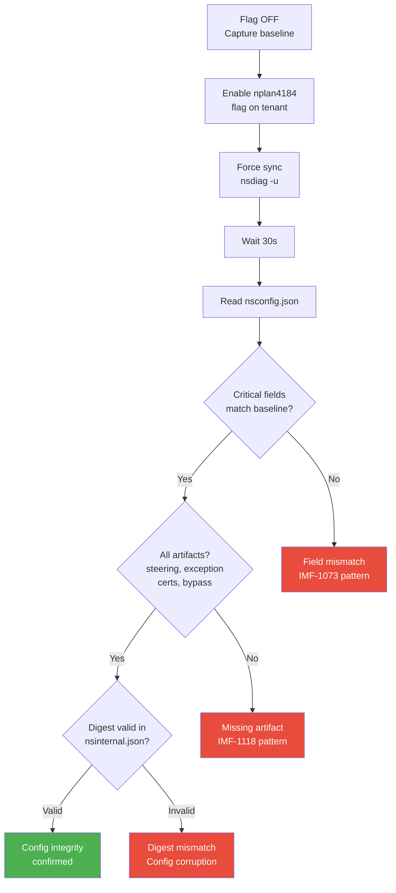
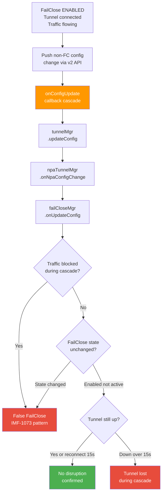
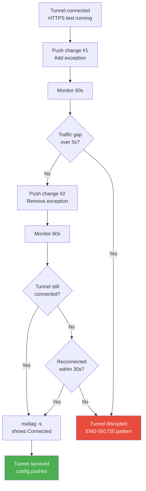
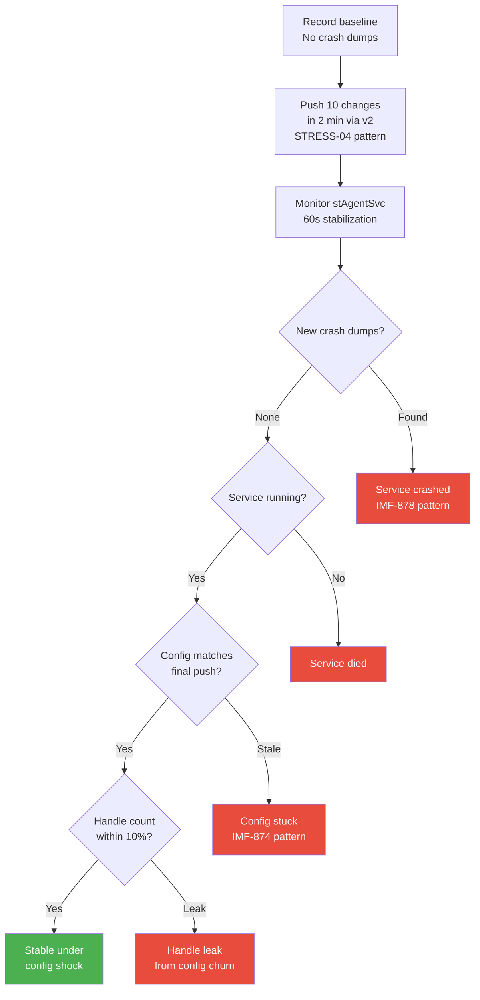
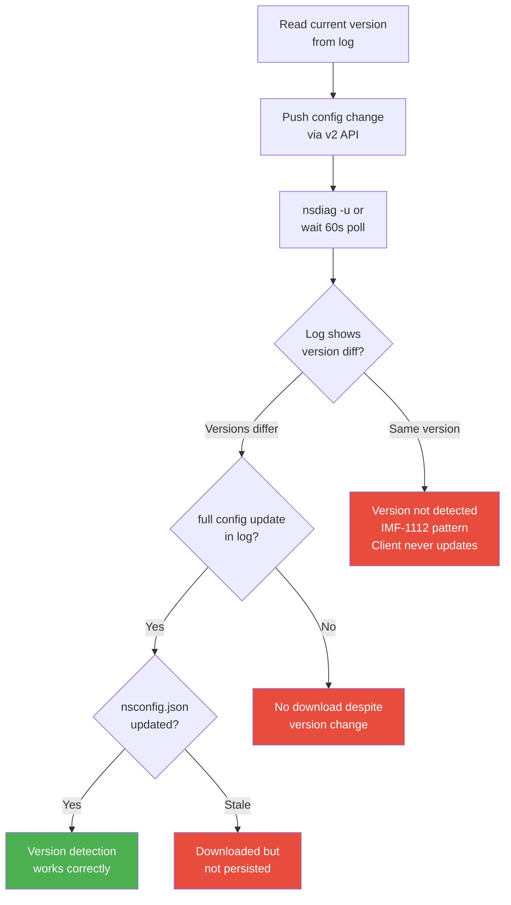
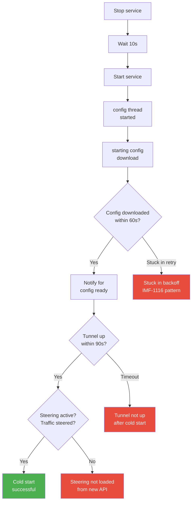
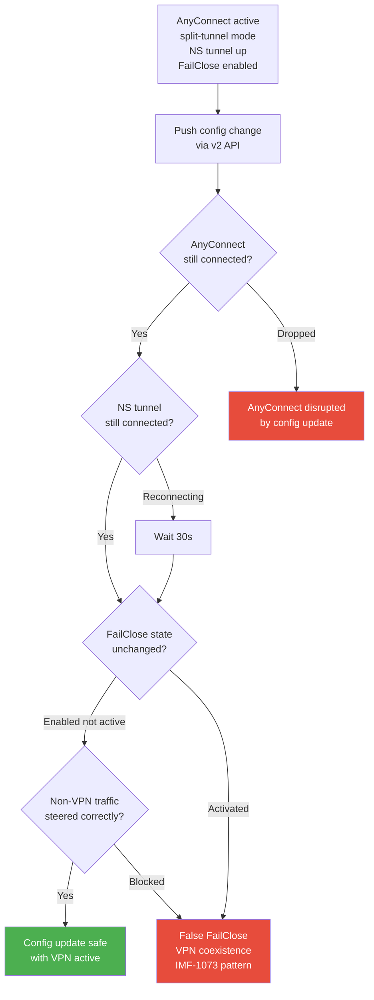
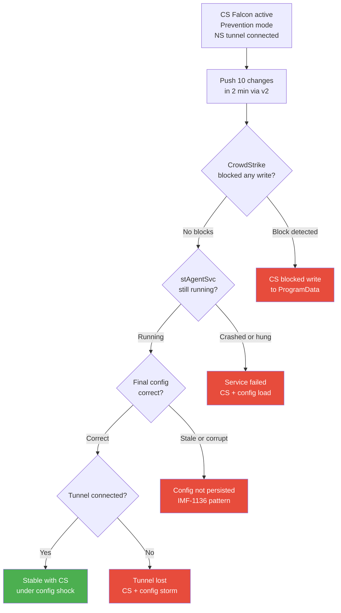
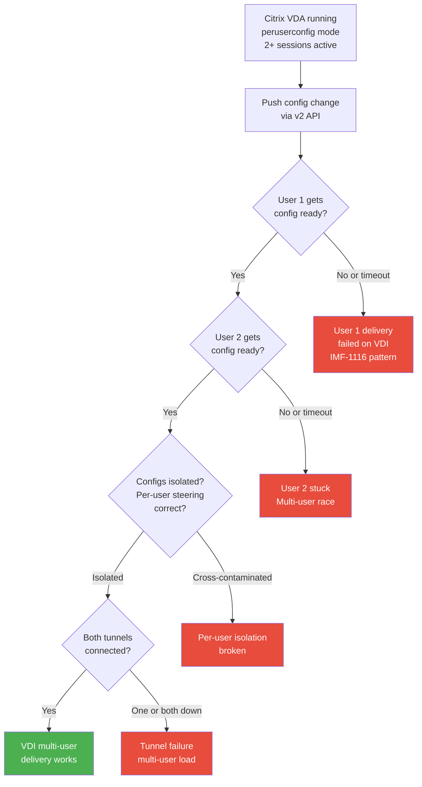
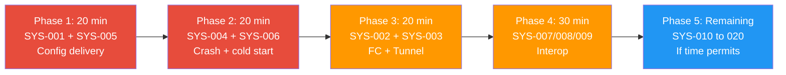

# SYSPLAN-4534-v4: System Test — NPLAN-4534 — REST APIv2 Client Configuration

## Source
- Parent test plan: [Test Plan — NPLAN-4534](../test_plans/nplan-4534.md)
- SOP: [SYSTEST-01](systest-01.md)
- Architecture reference: endpoint_system_test_plan/chapters/04_config_download.md
- Interop reference: [plan-9002-interop-test.md](../test_plans/plan-9002-interop-test.md)
- Reliability patterns: [plan-reliability.md](../test_plans/plan-reliability.md)
- IMF data: [IMFs](../doc/bug_20260609/imfs_overall.md)
- Escalation bugs: [Escalations](../doc/bug_20260609/escalation_bugs_overall.md)
- Date created: 2026-06-08
- Date refined (v2): 2026-06-09
- Date refined (v3): 2026-06-09
- Date refined (v4): 2026-06-09

---

## System Test Objective

Validate that the migration from legacy PHP to the new `client-oppy-configuration` microservice
(REST API v2 behind API Gateway, backed by MariaDB + Kafka events) does NOT introduce systemic
failures in the endpoint client's config download lifecycle, steering activation, tunnel
establishment, FailClose state machine, or service stability — including when **P0 interop
products** (Cisco AnyConnect, CrowdStrike, Citrix VDI) are active on the endpoint.

**Focus**: Cross-component chain reactions proven by **real IMF incidents**, validated under
**stress patterns** (STRESS-04/05/06/07), and tested with **P0 third-party coexistence**.

---

## IMF-Informed Risk Profile

The config path has caused **12 production IMFs** (5 Critical/High). This migration replaces
the backend serving that exact path. Each test case below traces to at least one real incident.

| IMF | Severity | What Broke | Root Cause | Our Test |
|-----|----------|-----------|------------|----------|
| **IMF-1073** | Critical | SJC2 clients unable to update config, clients disabled | provisioner-clientservices failure | SYS-001, SYS-002, SYS-003, SYS-007 |
| **IMF-1136** | High | FR4 ~74 tenants config update failures, disabled clients | Config service regional failure | SYS-001, SYS-006, SYS-008 |
| **IMF-1112** | High | SJC2 unable to update configs, onboard, or login | Config + auth service interaction | SYS-001, SYS-005 |
| **IMF-1116** | High | AM2 unable to download config for new users | Config download for new users failed | SYS-006, SYS-009 |
| **IMF-1118** | High | SJC1 unable to download client configs | Config download infrastructure failure | SYS-001 |
| **IMF-878** | Middle | Config API spike — pycore-clientservices unresponsive | Versioned steering enabled for 164 tenants caused spike | SYS-004, SYS-008 |
| **IMF-874** | Low | Config API latency spike — health check failures | 40-50% traffic increase overwhelmed pods | SYS-004, SYS-008 |
| **IMF-906** | Low | Config errors from Redis KEYS command | Blocking Redis command caused latency | SYS-004 |
| **IMF-919** | High | Windows upgrade aborted (ERROR_SERVICE_CANNOT_ACCEPT_CTRL) | Windows Installer timing issue during service stop | SYS-012 |
| **IMF-824** | High | Clients disabled/enabled surge after incident | Client status call surge overwhelmed provisioner | SYS-004 |
| **IMF-1033** | High | AM2 unable to make client changes, sync policies | Addonman failure | SYS-001 |
| **IMF-1184** | High | SJC2 unable to update configs, provision new users | Config service failure | SYS-001 |

---

## Scope

### In Scope (System-Level)
- Config download flow: version check -> download -> validate -> persist -> callback cascade
- `onConfigUpdate()` chain: CConfig -> stAgentSvc -> TunnelMgr -> NPA -> FailCloseMgr -> UI
- Steering config reload (nssteering.json, nsexception.json)
- Tunnel continuity during/after config changes
- FailClose state machine integrity during config transitions
- Service lifecycle (cold start, restart) with new API
- Config encryption (encryptClientConfig) compatibility
- Backoff/retry behavior (exponential 3-60 min + 0-15 min jitter)
- Upgrade path with new API active
- **Interop coexistence**: Config operations while Cisco AnyConnect / CrowdStrike / Citrix VDI active
- **Stress resilience**: Rapid config push (STRESS-04), service chaos (STRESS-05), network transition (STRESS-06)

### Out of Scope
- WebUI CRUD operations (functional test plan)
- API payload/schema validation (backend test plan)
- NPA/BWAN specific flows (other team)
- Mobile platforms (Android/iOS/ChromeOS)
- P1/P2 interop products (GlobalProtect, FortiClient, SentinelOne, etc.)

## Platforms
- Windows 10/11 (x64) — primary
- macOS 13+ (Intel/Apple Silicon)
- Linux Ubuntu 22.04+

## Prerequisites
- Tenant with `nplan4184_client_config_ngweb_enabled` = ON
- NSClient enrolled, tunnel connected (SWG), steering active
- nsdiag available for forced sync
- Access to nsconfig.json, nsinternal.json, nsdebuglog.log
- Crash dump directories monitored
- **For SYS-007**: Cisco AnyConnect VPN installed, split-tunnel profile configured
- **For SYS-008**: CrowdStrike Falcon sensor installed and active (prevention mode)
- **For SYS-009**: Citrix VDA on Windows Server 2019, multi-user mode, per-user config

---

## Test Cases — P0 (MUST HAVE) — 9 Cases

### SYS-001: Config Download Integrity — Full Artifact Set
- **Priority**: P0
- **Platforms**: Windows, macOS, Linux
- **IMF Link**: **IMF-1073** (Critical: clients disabled when config update failed), **IMF-1136** (74 tenants), **IMF-1112**, **IMF-1118**, **IMF-1033**, **IMF-1184**
- **Related Bugs**: ENG-664964 (405 error), ENG-795746 (100+ clients stuck)
- **Stress Pattern**: STRESS-20 (Configuration Download Stability)
- **Objective**: Verify client receives ALL config artifacts from new v2 API with correct content
- **Risk**: 6 IMFs caused by config download failures — new service must not repeat them



- **Steps**:
  1. Flag OFF: capture nsconfig.json baseline (all fields)
  2. Enable `nplan4184_client_config_ngweb_enabled`
  3. `nsdiag -u`, wait 30s
  4. Read nsconfig.json — diff critical fields:
     - `nsgw.host`, `clientConfig.configurationName`, `clientConfig.failClose`
     - Steering mode, cert associations, feature flags
  5. Verify artifacts: nssteering.json, nsexception.json, nscacert.pem, nstenantcert.pem
  6. Verify nsinternal.json digest = SHA-256(clientConfig)
- **Expected**: Zero field deltas. All mandatory artifacts present. Digest valid.
- **Failure indicators**: `"Client config validation failed"`, `"download steering config failed"`
- **Interop consideration**: Test with CrowdStrike active — Falcon sensor may interfere with file writes to ProgramData

---

### SYS-002: Config Update Callback Cascade — No False FailClose
- **Priority**: P0
- **Platforms**: Windows
- **IMF Link**: **IMF-1073** (Critical: clients disabled — FailClose falsely activated during config failure)
- **Related Bugs**: ENG-384041 (FailClose during Dynamic Steering), ENG-422599 (FailClose after config update), ENG-561500 (DNS not steered after FailClose recovery)
- **Stress Pattern**: STRESS-07 (Fail-Close Enforcement)
- **Objective**: Verify `onConfigUpdate()` cascade does NOT trigger transient FailClose
- **Risk**: Non-atomic cascade: tunnel disconnect before FailClose reads new config = false block



- **Steps**:
  1. FailClose enabled, tunnel connected, continuous HTTPS traffic test running
  2. Push non-FailClose config change via v2 API (e.g., add steering exception)
  3. Monitor: traffic blocked? Log `"fail close activated"`?
  4. Wait 60s — verify no transient block
  5. Verify tunnel connected, FailClose still enabled-but-not-active
- **Expected**: ZERO traffic interruption. No false FailClose activation.
- **Failure indicators**: Log `"fail close activated"`, traffic timeout, tunnel state flap
- **Interop consideration**: Test with Cisco AnyConnect in split-tunnel mode — VPN subnet bypass + FailClose creates additional state complexity

---

### SYS-003: Tunnel Continuity Under Config Push
- **Priority**: P0
- **Platforms**: Windows, macOS, Linux
- **IMF Link**: **IMF-1073** (clients disabled = tunnel lost after config failure)
- **Related Bugs**: ENG-591725 (tunnel not established after mode change), ENG-918451 (no reconnect after switch)
- **Stress Pattern**: STRESS-03 (Tunnel Flapping)
- **Objective**: Verify SWG tunnel survives config changes from new API
- **Risk**: Config push triggers tunnel reconnect; if reconnect fails, user loses all connectivity



- **Steps**:
  1. Tunnel connected, start continuous HTTPS traffic test (curl loop)
  2. Push config change via v2 API (add steering exception)
  3. Monitor 60s — any interruption > 5s?
  4. Push second change (remove exception)
  5. Verify tunnel still connected via `nsdiag -s`
- **Expected**: Tunnel survives OR reconnects within 30s. Traffic gap < 5s.
- **Failure indicators**: `"tunnel disconnected"` without reconnect, nsdiag shows Disconnected
- **Interop consideration**: Test with Cisco AnyConnect active — tunnel swap timing is more complex

---

### SYS-004: Service Crash Stability — Rapid Config Push (Configuration Shock)
- **Priority**: P0
- **Platforms**: Windows, macOS, Linux
- **IMF Link**: **IMF-878** (config API spike from enabling feature for 164 tenants), **IMF-874** (40-50% traffic increase overwhelmed pods), **IMF-824** (surge of calls after incident)
- **Related Bugs**: ENG-747635 (crash under rapid connections), ENG-948106 (Linux crash large config)
- **Stress Pattern**: **STRESS-04 (Configuration Shock)** — rapid config changes to force race conditions
- **Objective**: Verify stAgentSvc does not crash under rapid config changes from v2 API
- **Risk**: Config API migration may change response timing; rapid pushes expose race conditions in callback cascade



- **Steps**:
  1. Baseline: zero crash dumps, record handle count
  2. Push 10 rapid config changes via v2 API within 2 min (vary: add/remove exceptions, toggle flags)
  3. Wait 60s for stabilization
  4. Check crash dumps (Windows: `C:\dump\`, macOS: `~/Library/Logs/DiagnosticReports/`, Linux: `/var/crash/`)
  5. Verify service RUNNING, handle count within 10% of baseline
  6. Verify nsconfig.json = final pushed state
- **Expected**: Zero crashes. Service running. Final config correct. No handle leak.
- **Failure indicators**: New .dmp/.ips/core files, service state != RUNNING, stale config
- **Interop consideration**: Test with CrowdStrike active — Falcon may throttle rapid file I/O to ProgramData

---

### SYS-005: Config Version Detection — Polling Cycle Works
- **Priority**: P0
- **Platforms**: Windows
- **IMF Link**: **IMF-1112** (unable to update configs), **IMF-1136** (config update failures for 74 tenants)
- **Related Bugs**: ENG-608191 (V7/V5 mismatch breaks version check)
- **Stress Pattern**: STRESS-20 (Configuration Download Stability)
- **Objective**: Verify `checkAndDownloadConfig()` detects version change from new v2 API response format
- **Risk**: If version detection breaks, client NEVER updates — silent security drift



- **Steps**:
  1. Read current config version from log (`"Current config version"`)
  2. Push config change via v2 API (modify any field)
  3. Force sync (`nsdiag -u`) or wait for 60s poll cycle
  4. Grep log: `"New config version"` — versions should differ
  5. Grep log: `"full config update"` — download triggered
  6. Verify nsconfig.json contains new content
- **Expected**: Version change detected -> download triggered -> config applied within one cycle.
- **Failure indicators**: `"config version.*same"` despite change, no `"full config update"` log entry

---

### SYS-006: Cold Start — Config Fetch from New API
- **Priority**: P0
- **Platforms**: Windows, macOS, Linux
- **IMF Link**: **IMF-1116** (unable to download config for new users), **IMF-1136** (disabled clients after config failure)
- **Related Bugs**: ENG-895081 (FailClose not working after reboot)
- **Stress Pattern**: STRESS-05 (Service Chaos — restart/kill)
- **Objective**: Verify cold-start init sequence works with new v2 API backend
- **Risk**: Cold start is the most critical path — if new API fails here, every rebooted device breaks



- **Steps**:
  1. Stop service (`sc stop stAgentSvc` / `launchctl bootout` / `systemctl stop stagentd`)
  2. Wait 10s, start service
  3. Monitor log sequence: `"config thread started"` -> `"starting config/data download"` -> `"Notify for config ready"`
  4. Wait up to 90s for tunnel
  5. Test traffic steering (curl to steered domain)
- **Expected**: Config downloaded < 60s. Tunnel connected < 90s. Steering active.
- **Failure indicators**: `"config update failed, retry in X minutes"` on first attempt after start
- **Interop consideration**: Test with CrowdStrike active — Falcon boot-time scanning may delay stAgentSvc init

---

### SYS-007: Interop — Config Update with Cisco AnyConnect VPN Active
- **Priority**: P0
- **Platforms**: Windows
- **IMF Link**: **IMF-1073** (Critical: clients disabled during config failure — FailClose + VPN swap is highest risk)
- **Related Bugs**: ENG-991833 (enableFCOnNetworkDisconnect — FailClose + IPSec/VPN swap), ENG-591725 (tunnel not established after mode change)
- **Stress Pattern**: STRESS-06 (Network Transition Storm) + STRESS-07 (Fail-Close Enforcement)
- **Objective**: Verify config update via v2 API does NOT trigger false FailClose when AnyConnect VPN is active
- **Risk**: AnyConnect split-tunnel creates dual-path routing. Config update may trigger tunnel reconnect, which triggers FailClose swap logic (ENG-991833). If FailClose activates while AnyConnect holds the route, user loses all non-VPN connectivity.



- **Steps**:
  1. Connect Cisco AnyConnect (split-tunnel profile)
  2. Verify NS tunnel connected alongside AnyConnect
  3. Enable FailClose, verify `enableFCOnNetworkDisconnect` = true
  4. Push config change via v2 API (add steering exception)
  5. Monitor: AnyConnect still connected? NS tunnel stable? FailClose state?
  6. Test non-VPN traffic steered through NS tunnel
  7. Test VPN traffic bypasses NS as expected
- **Expected**: Both tunnels stable. FailClose NOT activated. Traffic routed correctly.
- **Failure indicators**: `"fail close activated"`, AnyConnect disconnect event, traffic blackhole

---

### SYS-008: Interop — CrowdStrike Coexistence Under Config Shock
- **Priority**: P0
- **Platforms**: Windows
- **IMF Link**: **IMF-878** (config API spike from mass enablement), **IMF-874** (traffic increase overwhelmed pods), **IMF-1136** (config failures disabled clients)
- **Related Bugs**: CrowdStrike prevention policies may block Netskope process I/O during rapid file writes
- **Stress Pattern**: **STRESS-04 (Configuration Shock)** — rapid config push with kernel security sensor active
- **Objective**: Verify rapid config push via v2 API does not conflict with CrowdStrike file monitoring
- **Risk**: CrowdStrike Falcon intercepts all file I/O to ProgramData. Rapid config writes (10 in 2 min) may trigger Falcon throttling or access denial, causing config write failure or stAgentSvc timeout.



- **Steps**:
  1. CrowdStrike Falcon active in prevention mode, NS tunnel connected
  2. Verify CrowdStrike exclusions for Netskope processes (per interop guidance)
  3. Push 10 rapid config changes via v2 API within 2 min
  4. Check CrowdStrike console for any Netskope process blocks
  5. Verify stAgentSvc running, no crash dumps
  6. Verify nsconfig.json matches final pushed state
  7. Verify tunnel connected
- **Expected**: Zero CrowdStrike blocks. Service stable. Config correct. Tunnel up.
- **Failure indicators**: CS block event, service hang, stale config, crash dump

---

### SYS-009: Interop — Citrix VDI Multi-User Config Delivery
- **Priority**: P0
- **Platforms**: Windows Server 2019 (Citrix VDA)
- **IMF Link**: **IMF-1116** (unable to download config for new users — multi-user VDI amplifies this)
- **Related Bugs**: ENG-466704 (secure enrollment failing on Citrix), ENG-420917 (devices missing from Devices page)
- **Stress Pattern**: STRESS-20 (Configuration Download Stability) under multi-session load
- **Objective**: Verify per-user config delivery via v2 API works under Citrix VDI multi-user sessions
- **Risk**: Citrix VDA with per-user config (`mode=peruserconfig`) creates N concurrent config download requests. If v2 API handles per-user differently than legacy, multiple users may get wrong config or no config.



- **Steps**:
  1. Citrix VDA running with `mode=peruserconfig`, 2+ concurrent user sessions
  2. Push config change via v2 API
  3. Monitor per-user logs: `"Notify for config ready for sessId"` for each user
  4. Verify config isolation: each user has their own steering/exception config
  5. Verify both user tunnels connected (`nsdiag -s` per session)
  6. Test traffic steering per-user (different policies applied correctly)
- **Expected**: All users receive config within 60s. Per-user isolation maintained. Tunnels stable.
- **Failure indicators**: Missing `"config ready for sessId"` for any user, cross-user config leak, tunnel timeout

---

## Test Cases — P1 (SHOULD HAVE)

### SYS-010: Steering Exception Reload After Config Push
- **Priority**: P1
- **Platforms**: Windows, macOS, Linux
- **Related Bugs**: ENG-739968 (nsexception.json race condition), ENG-855335 (wildcard bypass)
- **Objective**: Verify steering rules reload correctly after config push via new v2 API
- **Steps**:
  1. Verify domain X is steered (traffic goes through tunnel)
  2. Add domain X as exception via v2 API config change
  3. Wait for sync — test traffic to domain X -> should bypass
  4. Remove exception, sync
  5. Test traffic -> should steer again
- **Expected**: Exception effective within one polling cycle. No stale rules.
- **Failure indicators**: Traffic still tunneled after exception added, `"Steering Exception"` log

---

### SYS-011: Config Encryption Compatibility
- **Priority**: P1
- **Platforms**: Windows, macOS
- **Related Bugs**: ENG-795746 (100+ clients stuck after enabling Secure Config)
- **Objective**: Verify new v2 API works when `encryptClientConfig` = true
- **Steps**:
  1. Verify .enc files exist (nsconfig.json.enc, nssteering.json.enc)
  2. Push config change via v2 API
  3. Verify .enc files updated, no plaintext leak
  4. Verify client still operational (tunnel connected)
- **Expected**: Encrypted config updated correctly. No plaintext files.
- **Failure indicators**: Plaintext config alongside .enc, `"Client config validation failed"`

---

### SYS-012: Config Update During Auto-Upgrade
- **Priority**: P1
- **Platforms**: Windows
- **IMF Link**: **IMF-919** (upgrade aborted due to Windows Installer timing issue)
- **Related Bugs**: ENG-487939 (upgrade fails with Self-Protection), ENG-533221 (disabled after upgrade)
- **Stress Pattern**: STRESS-18 (Upgrade Stability)
- **Objective**: Verify upgrade completes cleanly with new v2 API active
- **Steps**:
  1. Flag ON, tunnel active, config fresh
  2. Trigger auto-upgrade (set `clientConfig.clientUpdate.allowAutoUpdate` = true, push newer version)
  3. After upgrade: verify config valid, tunnel reconnects
  4. Check no crash dumps, no re-enrollment required
  5. Verify UpgradeInProgress registry = 0 after completion
- **Expected**: Upgrade succeeds. Config intact. Tunnel reconnects.
- **Failure indicators**: Service stuck after upgrade, config corrupt, re-enrollment prompt

---

### SYS-013: Backoff/Retry When API Temporarily Unavailable
- **Priority**: P1
- **Platforms**: Windows
- **IMF Link**: **IMF-874** (config API latency spike), **IMF-906** (Redis KEYS command)
- **Objective**: Verify exponential backoff and graceful degradation during API outage
- **Steps**:
  1. Client connected with valid cached config
  2. Block connectivity to config API (hosts file or firewall rule)
  3. Monitor logs: `"config update failed, retry in X minutes"`
  4. Verify intervals increase (3 -> 6 -> 12 -> ... -> 60 min + random jitter 0-15 min)
  5. Verify tunnel/steering remain active on cached config
  6. Unblock API: verify client picks up new config on next cycle
- **Expected**: Exponential backoff. No API hammering. Client operational on cache.
- **Failure indicators**: Rapid retry (< 3 min intervals), tunnel drop during outage

---

### SYS-014: Feature Flag Toggle — Seamless Transition
- **Priority**: P1
- **Platforms**: Windows
- **IMF Link**: **IMF-878** (enabling versioned steering for tenants caused spike)
- **Objective**: Verify ON->OFF->ON transitions of `nplan4184_client_config_ngweb_enabled` dont disrupt client
- **Steps**:
  1. Flag OFF -> verify connected, capture config
  2. Flag ON -> sync -> verify config valid, tunnel stable, same content
  3. Flag OFF -> sync -> verify config valid, tunnel stable
  4. Flag ON -> verify recovery
- **Expected**: Each transition seamless. No missing fields. No re-enrollment.

---

### SYS-015: Network Transition During Config Download
- **Priority**: P1
- **Platforms**: Windows
- **Stress Pattern**: **STRESS-06 (Network Transition Storm)**
- **Related Bugs**: ENG-918451 (no reconnect after switch)
- **Objective**: Verify config download survives network switch (Wi-Fi to Ethernet) mid-download
- **Steps**:
  1. Start config sync (`nsdiag -u`)
  2. Immediately switch from Wi-Fi to Ethernet (or vice versa)
  3. Wait for config download to complete or retry
  4. Verify config is valid and complete (no partial write)
  5. Verify tunnel reconnects within 30s
- **Expected**: Config download retries successfully. No corrupt partial config.
- **Failure indicators**: Partial nsconfig.json, `"Client config validation failed"`, tunnel stuck

---

## Test Cases — P2 (GOOD TO HAVE)

### SYS-016: Cross-Platform Config Parity
- **Priority**: P2
- **Platforms**: Windows, macOS, Linux
- **Objective**: Verify all platforms receive identical config from new v2 API
- **Steps**: Same tenant config on 3 platforms -> diff critical fields
- **Expected**: Identical content (modulo platform-specific paths)

### SYS-017: Kafka Propagation Timing
- **Priority**: P2
- **Platforms**: Windows
- **IMF Link**: **IMF-946** (Kafka lag causing delays)
- **Objective**: Baseline latency from v2 API save to client receipt
- **Steps**: Record T1 (push) -> T2 (client receives) -> measure delta
- **Expected**: Forced sync < 30s. Natural poll within configUpdateInterval.

### SYS-018: DTLS Session Persistence
- **Priority**: P2
- **Platforms**: Windows
- **Objective**: Verify DTLS session not torn down by non-tunnel config changes
- **Steps**: DTLS active -> push non-tunnel change -> check no DTLS reconnect
- **Expected**: No tunnel state transitions in log. DTLS session ID unchanged.

### SYS-019: FailClose Reboot Persistence
- **Priority**: P2 (elevated if time allows)
- **Platforms**: Windows
- **Related Bugs**: ENG-895081 (FailClose not blocking after reboot)
- **Objective**: Verify FailClose configured via new API persists across reboot
- **Steps**: FailClose enabled via v2 API -> reboot -> block gateway -> verify traffic blocked
- **Expected**: FailClose active after reboot. Recovery when gateway available.

### SYS-020: Bulk Delete — Client Graceful Handling
- **Priority**: P2
- **Platforms**: Windows
- **Objective**: Verify client does not crash when its config is deleted via bulkdelete endpoint
- **Steps**: Delete config via `POST /api/v2/clientconfiguration/client/config/bulkdelete` -> monitor client 10 min
- **Expected**: No crash. Client enters graceful error state or retries.

---

## Priority Rationale

| Test | Priority | Reason |
|------|----------|--------|
| SYS-001 | **P0** | 6 IMFs (2 Critical) directly caused by config download failures |
| SYS-002 | **P0** | IMF-1073 (Critical) + 3 escalation bugs: false FailClose = complete traffic block |
| SYS-003 | **P0** | IMF-1073 + 2 escalation bugs: tunnel loss = user has no connectivity |
| SYS-004 | **P0** | IMF-878 + IMF-874 + IMF-824: rapid changes crashed production systems |
| SYS-005 | **P0** | IMF-1112 + IMF-1136: if version detection breaks, client NEVER updates |
| SYS-006 | **P0** | IMF-1116 + IMF-1136: cold start failure = all new/rebooted clients broken |
| SYS-007 | **P0** | IMF-1073 + ENG-991833: VPN+FailClose+config = highest interop risk combo |
| SYS-008 | **P0** | IMF-878 + IMF-874 + IMF-1136: CrowdStrike kernel sensor + rapid I/O = file contention |
| SYS-009 | **P0** | IMF-1116: multi-user VDI amplifies per-user config delivery failure |
| SYS-010 | P1 | No IMF directly, but 2 escalation bugs (race condition in exception reload) |
| SYS-011 | P1 | No IMF directly, but ENG-795746 (100+ clients stuck with encryption) |
| SYS-012 | **P1** | IMF-919 (High): upgrade path is known fragile on Windows |
| SYS-013 | **P1** | IMF-874 + IMF-906: backoff logic prevents API hammering during outage |
| SYS-014 | P1 | IMF-878: feature flag rollout caused production spike |
| SYS-015 | P1 | STRESS-06 pattern: network switch during download = partial config risk |
| SYS-016 | P2 | No IMF link — cross-platform comparison |
| SYS-017 | P2 | IMF-946 (Middle): Kafka lag is known but non-critical |
| SYS-018 | P2 | No IMF link — DTLS session optimization |
| SYS-019 | P2 | No IMF link (but escalation bug ENG-895081) |
| SYS-020 | P2 | No IMF link — defensive edge case |

---

## Execution Approach

### Time-Limited Priority Order



| Phase | Tests | Time | Gate | Equipment |
|-------|-------|------|------|-----------|
| 1 | SYS-001, SYS-005 | 20 min | If FAIL -> stop, file IMF-class defect | Standard |
| 2 | SYS-004, SYS-006 | 20 min | If crash -> stop, file defect | Standard |
| 3 | SYS-002, SYS-003 | 20 min | FailClose + tunnel must pass | Standard |
| 4 | SYS-007, SYS-008, SYS-009 | 30 min | Interop requires pre-configured machines | AnyConnect, CrowdStrike, Citrix VDA |
| 5 | SYS-010 -> SYS-020 | Remaining | Best effort — P1/P2 | Standard |

### Evidence Collection (Every Test)

| Evidence | Method |
|----------|--------|
| nsconfig.json | Copy before/after |
| nsinternal.json | Verify SHA-256 digest |
| Service state | `sc query stAgentSvc` / `systemctl status stagentd` / `launchctl list` |
| Tunnel state | `nsdiag -s` |
| Crash dumps | Platform-specific directories |
| Log keywords | Grep nsdebuglog.log |
| Timestamps | T0 (action) -> T1 (effect) |
| Handle count | Windows: Process Explorer / `handle.exe` |
| Interop state | AnyConnect status / CS Falcon console / Citrix session list |

### Critical Log Keywords

| Pattern | Meaning | Validates |
|---------|---------|-----------|
| `"New config version X, Current config version Y"` | Version change detected | SYS-005 |
| `"full config update"` | Download triggered | SYS-005 |
| `"Notify for config updates"` | Download succeeded | SYS-001 |
| `"Notify for config ready for sessId"` | Per-user ready | SYS-006, SYS-009 |
| `"config update failed, retry in X minutes"` | Download failed | SYS-001/006 fail |
| `"Client config validation failed"` | Digest mismatch | SYS-001 fail |
| `"fail close activated"` | FailClose blocking | SYS-002/007 fail (if unexpected) |
| `"tunnel disconnected"` / `"tunnel connected"` | Tunnel state change | SYS-003/007 monitor |
| `"config thread started"` | Worker initialized | SYS-006 |

---

## Exit Criteria

- **All 9 P0 PASS on Windows** (primary platform)
- **SYS-001 through SYS-006 PASS on at least one additional platform** (macOS or Linux)
- **SYS-007/008/009 PASS** on their required interop environments
- No new crash dumps from config operations
- No false FailClose activation (SYS-002 and SYS-007 are critical gates)
- Config version detection works (SYS-005 — without this, nothing else matters)
- No CrowdStrike process blocks during config operations
- Citrix VDI per-user isolation maintained
- Any P0 failure -> file as potential IMF-class defect with full evidence

---

## Defect Filing Template (per SYSTEST-01 Section 9)

```markdown
**Problem**: [What happened — specific config download failure mode]
**Customer Impact**: [Blast radius — reference IMF-1073/1136 pattern if similar]
**Platform**: [OS, NSClient version, tenant config, interop products active]
**Code Location**: CConfig (lib/nsConfig/config.cpp), CAddonManApi (lib/nsRestApi/addonmanapi.cpp)
**Repro Steps**: [Exact sequence with timing]
**Evidence**: [Log excerpt, nsconfig.json diff, crash dump, nsdiag output]
**Interop State**: [CrowdStrike version, AnyConnect config, Citrix VDA mode if applicable]
**Root Cause**: [If known]
**IMF Pattern Match**: [Which IMF does this resemble?]
**Suggested Fix**: [If known]
```

---

## Changelog

| Version | Date | Changes |
|---------|------|---------|
| v1 | 2026-06-08 | Initial system test plan |
| v2 | 2026-06-09 | Added IMF links, Mermaid flowcharts, priority rationale |
| v3 | 2026-06-09 | Added 3 interop P0 cases (SYS-007/008/009), stress pattern references, handle leak check, network transition P1, expanded evidence collection, phased execution with interop equipment |
| v4 | 2026-06-09 | Fixed Mermaid node label truncation — all labels kept under 22 chars per line using line breaks |
