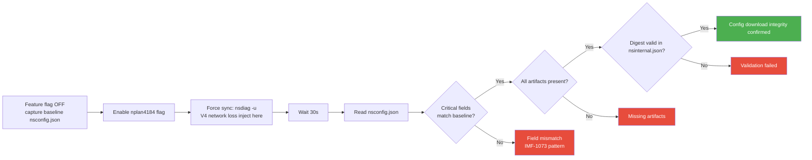
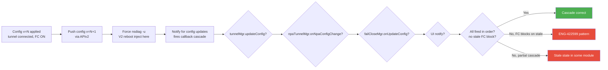
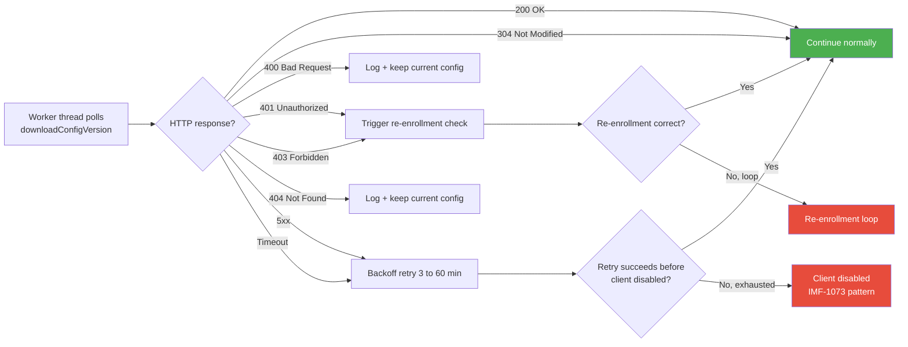
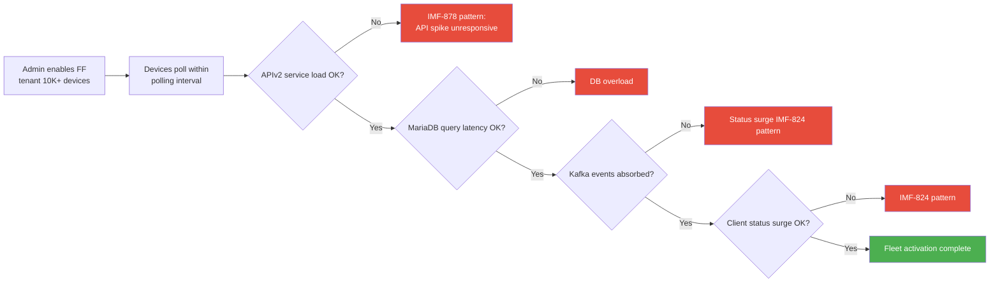
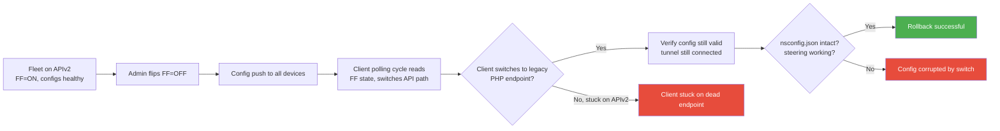
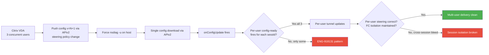
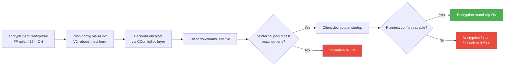
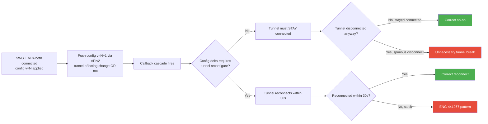
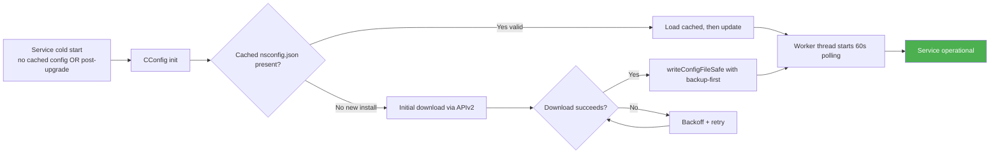

# SYSPLAN-4534: System Test — NPLAN-4534 — REST APIv2 Client Configuration

## Source
- Parent test plan: [nplan-4534.md](../test_plans/nplan-4534.md)
- SOP: [SYSTEST-01](systest-01.md)
- IMF data: [IMFs](../doc/bug_20260609/imfs_overall.md) (date: 2026-06-09)
- Date created: 2026-06-16

---

## System Test Objective

Validate that migration from legacy PHP to the `client-oppy-configuration` microservice (REST API v2 behind API Gateway, backed by MariaDB + Kafka) does NOT introduce systemic failures in the endpoint client's config download lifecycle, callback cascade, tunnel establishment, FailClose state machine, or service stability. The config path has caused 12 production IMFs (5 Critical/High); this migration replaces the backend serving that exact path.

---

## IMF-Informed Risk Profile

| IMF | Severity | What Broke | Root Cause | Our Test |
|-----|----------|-----------|------------|----------|
| **IMF-1073** | Critical | SJC2 clients unable to update config, disabled | provisioner-clientservices failure | SYS-001 |
| **IMF-1136** | High | FR4 ~74 tenants config update failures | Config service regional failure | SYS-001 |
| **IMF-1112** | High | SJC2 unable to update configs, onboard, or login | Config + auth service interaction | SYS-002 |
| **IMF-1116** | High | AM2 unable to download config for new users | New-user config download failure | SYS-006 |
| **IMF-1118** | High | SJC1 unable to download client configs | Config download infrastructure failure | SYS-001 |
| **IMF-878** | Middle | Config API spike, pycore unresponsive | Versioned steering rollout for 164 tenants | SYS-004 |
| **IMF-874** | Low | Config API latency spike | 40-50% traffic increase overwhelmed pods | SYS-004 |
| **IMF-906** | Low | Redis KEYS blocking command caused latency | Operational error on production cluster | SYS-004 |
| **IMF-1033** | High | AM2 unable to make client changes | Addonman failure | SYS-001 |
| **IMF-1184** | High | SJC2 unable to update configs | Config service failure | SYS-001 |
| **IMF-824** | High | Clients disabled/enabled surge | Client status call surge | SYS-004 |
| **IMF-1043** | Critical | NPA connectivity lost | NPA tunnel break | SYS-008 |

---

## Scope

### In Scope (System-Level)
- Config download flow via APIv2 (version check → download → validate → persist → callback cascade)
- `onConfigUpdate()` callback cascade ordering: tunnel, NPA, FailClose, UI
- Steering config reload through new API path
- Tunnel continuity during config changes via APIv2
- FailClose state machine integrity under config push
- Service lifecycle (cold start, restart) reading config via APIv2
- Config encryption (encryptClientConfig) compatibility through new backend
- Backoff/retry behavior with new HTTP error codes
- Per-user config delivery in multi-user (VDI) sessions
- Fleet-scale APIv2 backend load (FF rollout pattern)

### Out of Scope
- WebUI CRUD operations (parent NPLAN test plan; covered by WebUI testing)
- API payload/schema validation (backend QE owns)
- Steering APIs migration (covered by NPLAN-4535)
- NPA & BWAN specific flows (other team)
- Mobile platforms (Android/iOS/ChromeOS)

## Platforms
- Windows 10/11 (x64) — primary
- macOS 13+ (Intel/Apple Silicon)
- Linux Ubuntu 22.04+
- Windows Server 2019 (Citrix VDA)

## Prerequisites
- Tenant with `nplan4184_client_config_ngweb_enabled` = ON
- NSClient enrolled, tunnel connected (SWG), steering active
- nsdiag available for forced sync
- Access to nsconfig.json, nsinternal.json, nsdebuglog.log
- Crash dump directories monitored
- VM-based environments for V2 reboot disruption variants
- Citrix VDA for V6
- SCCM/Intune for V8
- Cisco AnyConnect for V9

---

## Test Cases — P0 (MUST HAVE) — Maximum 10 cases, 1-4 variants each

### SYS-001: Config Download Integrity via APIv2 — Full Artifact Set
- **Priority**: P0
- **Platforms**: Windows, macOS, Linux
- **IMF Link**: **IMF-1073** (Critical: SJC2 disabled), **IMF-1136**, **IMF-1118**, **IMF-1033**, **IMF-1184**
- **Related Bugs**: ENG-664964 (config 405 error), ENG-795746 (100+ stuck on config download)
- **Objective**: Verify client receives ALL config artifacts from new v2 API with correct content; new HTTP error semantics handled
- **Risk**: 6 IMFs caused by config download failures. New service must serve full artifact set (nsconfig, steering, exceptions, certs, bypass) without regression.

#### Variant V1 — Clean Baseline
- **Steps**: With FF OFF, capture baseline nsconfig.json + all artifacts → flip FF ON for tenant → force `nsdiag -u` → wait 30s → read nsconfig.json → verify critical fields match (nsgw.host, configurationName, feature flags) → verify all artifacts present (nssteering.json, nsexception.json, nsbypass.json, nsoverlap.json, nsdeviceid.json, nsinternal.json, certs) → verify nsinternal.json digest valid against nsconfig.json → verify config worker thread continues 60s polling cycle without errors
- **Expected**: All artifacts byte-for-byte match (or version-bumped equivalent); digest valid; no `config update failed` log
- **Failure indicators**: `Client config validation failed` (digest mismatch); missing artifacts; `config update failed, retry in X minutes` recurring

#### Variant V4 — Network Loss During Download
- **Injection**: Disable network at the moment APIv2 starts streaming the artifact set
- **Steps delta**: V1 setup → start `nsdiag -u` → disable network 2s after request initiated → re-enable after 5 min → verify client recovers via backoff retry
- **Expected delta**: Client retries with documented backoff (3-60 min); eventually completes; no permanent corruption of nsconfig.json
- **Additional failure indicators**: nsconfig.json half-written (would corrupt); worker thread crashes on partial read; permanent backoff state never recovers

### SYS-002: onConfigUpdate Callback Cascade Ordering
- **Priority**: P0
- **Platforms**: Windows, macOS, Linux
- **IMF Link**: **IMF-1112** (config + auth service interaction)
- **Related Bugs**: ENG-422599 (FailClose after config update — cascade race), ENG-595031 (incorrect cert-pinned config applied), ENG-739968 (config update race)
- **Objective**: Verify callback cascade fires in correct order with no stale state across all subscribers (tunnelMgr, npaTunnelMgr, failCloseMgr, UI)
- **Risk**: Callback cascade is sequential and NON-ATOMIC. If APIv2 changes timing of any callback, FailClose may activate on stale policy (false block) or tunnel may use stale steering.

#### Variant V1 — Clean Baseline
- **Steps**: Tunnel connected, FC ON, config version N captured → start continuous external ping → push config v=N+1 via APIv2 (steering change OR FC policy change) → force `nsdiag -u` → grep nsdebuglog.log for cascade order: `Notify for config updates` → tunnel state change → NPA config change → FailClose update → UI notify → verify ping never blocked by stale FC policy → verify tunnel reconnect (if needed) within 30s → verify no `Steering Exception`
- **Expected**: All callbacks fire in documented order; no false-block; no `Steering Exception`; tunnel and FC state consistent post-cascade
- **Failure indicators**: `fail close activated` while tunnel was correctly connected (false-block); cascade order inverted (FC reads new config before tunnel reconfigures); tunnel using stale steering after cascade

#### Variant V2 — Reboot During Cascade
- **Injection**: Hard reboot mid-cascade (after tunnel update fires, before FC update)
- **Steps delta**: V1 setup → push config → reboot when log shows `tunnel disconnected/connected` but BEFORE `failCloseMgr.onUpdateConfig` → on boot, verify both modules end at consistent state matching new config
- **Expected delta**: Post-boot tunnel + FC state match new config v=N+1 (not stale v=N); cascade restarts cleanly on init
- **Additional failure indicators**: Tunnel uses new config but FC stuck on old policy → false-block / leak; both modules stuck on stale state; client status reports v=N when actually using v=N+1

### SYS-003: APIv2 HTTP Error Code Handling and Backoff
- **Priority**: P0
- **Platforms**: Windows, macOS, Linux
- **IMF Link**: **IMF-1073** (Critical — clients disabled when config service down)
- **Related Bugs**: ENG-664964 (405 error caused stuck state), ENG-1017704 (nsconfig failing), ENG-795746 (100+ clients stuck)
- **Objective**: Verify client correctly handles new APIv2 HTTP error semantics — 4xx stays at current config, 5xx triggers backoff retry, 401/403 triggers re-enrollment evaluation
- **Risk**: APIv2 error responses differ from legacy PHP error responses. Wrong handling causes clients to either spin in retry loops (provisioner overload) or fall to "disabled" state.

#### Variant V1 — Clean Baseline (Each Error Code in Sequence)
- **Steps**: Set up test proxy that mocks APIv2 responses → trigger config sync against each response code (200, 304, 400, 401, 403, 404, 500, 502, 503, 504, timeout) → for each response, verify: log shows correct error classification, current nsconfig.json preserved (no corruption), worker thread continues polling, client status remains "enabled" → verify backoff timing for 5xx matches documented pattern (start 3 min, double up to 60 min cap)
- **Expected**: All error codes handled per spec; no nsconfig.json corruption; no permanent disable from transient 5xx; no retry storm
- **Failure indicators**: nsconfig.json corrupted on any error path; client transitions to "disabled" on transient 5xx; retry storm without backoff respect; 401/403 doesn't trigger re-enrollment evaluation

#### Variant V4 — Network Loss / Timeout Storm
- **Injection**: Continuous network drops (5-second drops every 30s for 10 min) during config polling
- **Steps delta**: V1 setup with real APIv2 backend → injection: every 30s, drop network for 5s → verify worker thread recovers each cycle without crash → verify total `config update failed, retry in X minutes` count stays bounded → verify final config matches latest backend state
- **Expected delta**: 10-min storm yields functional client with up-to-date config; worker thread alive and polling; no thread leak from timeout handling
- **Additional failure indicators**: Worker thread crashes on cascading timeouts; HTTP connection pool exhaustion; thread leak (handle count grows monotonically across the storm)

### SYS-004: Fleet-Scale APIv2 Backend Load (FF Rollout)
- **Priority**: P0
- **Platforms**: Backend infrastructure (endpoint impact)
- **IMF Link**: **IMF-878** (Critical: 164-tenant rollout caused config API spike), **IMF-874**, **IMF-906**, **IMF-824** (status surge)
- **Related Bugs**: None direct
- **Objective**: Verify enabling `nplan4184_client_config_ngweb_enabled` for a large tenant doesn't cause provisioner / addonman / Redis overload — pattern that caused IMF-878 directly
- **Risk**: IMF-878 was caused by the EXACT shape of this rollout (FF flip → many tenants migrate at once → config API spike). New service must handle the load profile that broke the old one.

#### Variant V1 — Clean Baseline (50-device wave or 10K simulation)
- **Steps**: Set up tenant with 50+ test devices (or load gen for 10K) on legacy PHP path → capture baseline backend metrics: APIv2 p95 latency, MariaDB query latency, Kafka producer lag, addonman pod CPU → T0: enable `nplan4184_client_config_ngweb_enabled` → monitor 30 min: APIv2 5xx rate (< 0.1%), latency p95 (< 5s), DB connection pool, Kafka lag → verify zero clients in disabled state during rollout → sample 10 endpoints: verify config picked up via APIv2 (verify access log on backend)
- **Expected**: Backend metrics within 20% of baseline; no addonman pod restart; no client disable; APIv2 access log shows successful requests for all sampled clients
- **Failure indicators**: APIv2 latency spike > 5s (IMF-878 reproduction); 5xx rate spike; clients fall to "disabled" state; Kafka producer lag grows monotonically; DB connection pool saturation

#### Variant V8 — Ring Deployment via SCCM/Intune
- **Injection**: Coordinated rollout via SCCM/Intune deployment ring instead of FF flip
- **Steps delta**: Configure ring 1 (10 devices), monitor → expand to ring 2 (40 devices) over 30 min → compare backend load profile against V1 (FF flip should be more spike-like; ring should be smoother)
- **Expected delta**: Ring deployment yields smoother backend load curve; no overload at ring boundaries; recommended rollout strategy validated
- **Additional failure indicators**: Ring boundary causes mini-spike that exceeds APIv2 capacity; SCCM-deployed clients have stale config FF state vs auto-applied

### SYS-005: FF Rollback (APIv2 → legacy PHP) — Cutover Reversibility
- **Priority**: P0
- **Platforms**: Windows, macOS, Linux
- **IMF Link**: **IMF-1112** (related — when both services are involved)
- **Related Bugs**: ENG-961429 (FF disable after enable caused issues)
- **Objective**: Verify FF rollback (`nplan4184_client_config_ngweb_enabled` ON → OFF) returns clients to legacy PHP path cleanly with no config corruption
- **Risk**: If APIv2 has a critical bug at fleet scale, FF rollback to legacy PHP is the only mitigation. Must work end-to-end without leaving clients in stuck state.

#### Variant V1 — Clean Baseline
- **Steps**: Devices on APIv2 (FF=ON), tunnel connected, configs healthy → capture baseline nsconfig.json + backend access logs → flip FF=OFF for tenant → wait 2 polling cycles (~2 min) → verify backend access logs show client requests now hitting legacy PHP endpoint (NOT APIv2) → verify nsconfig.json still valid, no corruption from path switch → verify tunnel and steering remain functional → verify no `Client config validation failed` → re-flip FF=ON, verify clean transition back
- **Expected**: Bidirectional FF flip works cleanly; no config corruption; no stuck clients; tunnel and steering continuous
- **Failure indicators**: Client continues hitting APIv2 endpoint after FF=OFF (didn't pick up FF change); config corruption from path switch; clients fall to "disabled" during transition

### SYS-006: Per-User Config Delivery in Multi-User VDI Sessions
- **Priority**: P0
- **Platforms**: Windows Server 2019 (Citrix VDA — P0 interop)
- **IMF Link**: **IMF-1116** (AM2 unable to download config for new users — multi-user pattern)
- **Related Bugs**: **ENG-624953 (Day-1: VDI DaaS terminating connections)**, ENG-918131 (Multi-Session VDI SWG broken), ENG-570306 (multi-user FailClose)
- **Objective**: Verify per-user `Notify for config ready for sessId` callback fires correctly for each VDI session under APIv2 backend
- **Risk**: APIv2 may serialize per-user config delivery differently than legacy PHP. Multi-session VDA exposes race conditions that single-user tests miss.

#### Variant V1 — Clean Baseline
- **Steps**: Citrix VDA on Windows Server 2019, FF=ON for tenant → spawn 3 concurrent VDI sessions (UserA, UserB, UserC) with active tunnels and traffic → push config v=N+1 via WebUI → grep nsdebuglog.log for `Notify for config ready for sessId` — must fire 3 times (one per session) → verify per-user steering decisions update correctly → verify per-user FailClose isolation (activate FC for UserA only, verify UserB and UserC unaffected) → verify backend access log shows single download (host-level) but client correctly applies to all sessions
- **Expected**: 3 per-session `config ready` notifications; per-user steering correctly updated; FC isolation preserved; existing connections not terminated
- **Failure indicators**: Only 1 or 2 per-session notifications (some users miss config); cross-session FC bleed; existing connections terminated (ENG-624953); ENG-918131 pattern (multi-session SWG broken intermittently); IMF-1116 pattern (new user can't get config)

### SYS-007: Config Encryption Compatibility (encryptClientConfig via APIv2)
- **Priority**: P0
- **Platforms**: Windows, macOS, Linux
- **IMF Link**: **IMF-1112** (config service interaction breaks)
- **Related Bugs**: ENG-873979 (config corruption with encryption), ENG-1014125 (config corruption during re-enrollment with encrypted), ENG-842447 (NSC crashing — config encryption + cert delete)
- **Objective**: Verify `encryptClientConfig=true` produces valid `.enc` files when APIv2 backend serves the config, and decryption works correctly at client startup
- **Risk**: APIv2 may format encryption metadata differently than legacy PHP. Wrong format causes decryption failure → client treats config as absent → fall to defaults → potentially disabled.

#### Variant V1 — Clean Baseline
- **Steps**: Tenant with `encryptClientConfig=true` and FF nplan4184=ON → trigger config sync via APIv2 → verify nsconfig.json.enc file written to disk → verify nsinternal.json digest valid against .enc → reboot client to force decryption-at-startup path → verify service starts with decrypted config → verify all config-dependent modules (tunnel, FC, steering) function correctly
- **Expected**: Encryption round-trip clean; decryption at startup succeeds; no fallback to default config; no `Client config validation failed`
- **Failure indicators**: nsinternal.json digest mismatch; decryption fails (corrupted .enc format); ENG-873979 pattern (config corruption); ENG-1014125 pattern (corruption during re-enrollment); client falls to default config

#### Variant V2 — Reboot During Encryption Round-Trip
- **Injection**: Reboot client mid-write of .enc file
- **Steps delta**: V1 setup → trigger config sync → reboot when nsdebuglog shows `full config update` but BEFORE `Notify for config updates` → on boot verify .enc file integrity (either old or new version, never half-written)
- **Expected delta**: Atomic write protects against half-written .enc; client recovers to either old or new version on boot; never falls to default
- **Additional failure indicators**: Half-written .enc causes decryption failure on next start; backup-first write protocol violated; client falls to default config

### SYS-008: Tunnel + NPA Continuity Through APIv2 Config Update
- **Priority**: P0
- **Platforms**: Windows, macOS, Linux
- **IMF Link**: **IMF-1043** (Critical: NPA tunnel break)
- **Related Bugs**: ENG-441957 (NPA disconnect after switch), ENG-987566 (traffic mode change race condition), ENG-503501 (DTLS fallback regression)
- **Objective**: Verify SWG and NPA tunnels remain connected through APIv2-served config update with NO unnecessary disconnects
- **Risk**: Callback cascade through APIv2 must not trigger spurious tunnel disconnect. IMF-1043 was NPA-specific; ENG-987566 was traffic mode race.

#### Variant V1 — Clean Baseline (No-Tunnel-Change Push)
- **Steps**: SWG + NPA both connected, config v=N → push config v=N+1 with no tunnel-affecting delta (e.g., add/remove a steering exception URL, no gateway/proxy change) → force `nsdiag -u` → grep nsdebuglog.log for `tunnel disconnected/connected` — must NOT appear → verify SWG and NPA stayed connected throughout cascade → verify steering picked up new exception
- **Expected**: Tunnel stays connected (no spurious disconnect); steering picks up new config; cascade completes
- **Failure indicators**: `tunnel disconnected/connected` log appears for non-tunnel-affecting config push (spurious break); IMF-1043 pattern (NPA break); ENG-987566 pattern (traffic mode race)

#### Variant V9 — Cisco AnyConnect VPN Co-Active
- **Injection**: V1 with Cisco AnyConnect connected (split-tunnel mode)
- **Steps delta**: AnyConnect VPN active → push config v=N+1 via APIv2 → verify NSC SWG tunnel + AnyConnect VPN both stay connected → verify FC distinguishes the two tunnels correctly
- **Expected delta**: Both tunnels survive cascade; FC doesn't false-block VPN traffic; NSC tunnel state correct
- **Additional failure indicators**: AnyConnect VPN disconnects when NSC config push triggers cascade; FC false-blocks VPN traffic; ENG-991833 pattern (FC + VPN swap)

### SYS-009: Service Cold Start with APIv2 Config Path
- **Priority**: P0
- **Platforms**: Windows, macOS, Linux
- **IMF Link**: **IMF-1116** (AM2 unable to download config for new users — cold start failure)
- **Related Bugs**: ENG-601667 (service not starting after upgrade), ENG-1017704 (nsconfig failing on upgrade)
- **Objective**: Verify service cold start (no cached config OR after upgrade) successfully retrieves initial config via APIv2
- **Risk**: New user enrollment AND post-upgrade restart both trigger cold-start config download. IMF-1116 was specifically a new-user cold-start failure. APIv2 must serve cold-start case correctly.

#### Variant V1 — Clean Baseline (Fresh Install)
- **Steps**: Fresh install (no prior nsconfig.json) on test device → enroll via IDP → verify initial config download via APIv2 (backend access log shows request) → verify nsconfig.json + all artifacts written → verify worker thread `config thread started` log appears → verify tunnel connects, steering active → verify subsequent polling cycles continue successfully
- **Expected**: Cold start completes within 60s of enrollment; config + artifacts present; worker thread polling; tunnel connected
- **Failure indicators**: Initial download fails (IMF-1116 reproduction); nsconfig.json missing; worker thread doesn't start; tunnel never connects; client status stays "enrolling"

#### Variant V2 — Reboot After Cold Start, Before First Successful Poll
- **Injection**: Fresh install → reboot during initial download
- **Steps delta**: V1 setup → reboot when service has just started but before initial download completes → on boot verify retry path triggers fresh download → verify final state has functional config + tunnel
- **Expected delta**: Reboot doesn't strand client without config; retry path picks up clean download; final state functional
- **Additional failure indicators**: Half-written nsconfig.json from interrupted initial download; client stuck in retry loop after reboot; permanent disabled state

#### Variant V8 — Cold Start via SCCM/Intune Push Install
- **Injection**: Cold start via MDM-deployed install (SYSTEM context, not interactive)
- **Steps delta**: SCCM/Intune deploys NSC + applies enrollment params (token + tenant) → verify SYSTEM-context service can hit APIv2 endpoint → verify initial config download succeeds in MDM context → verify subsequent per-user enrollment proceeds
- **Expected delta**: MDM-deployed install reaches APIv2 endpoint correctly; auth context preserved; subsequent user logins use the cached config
- **Additional failure indicators**: SYSTEM context lacks auth credentials for APIv2; MDM-deployed install can't reach APIv2 (proxy/auth path issue); per-user enrollment fails post-MDM-install

---

## Test Cases — P1 (SHOULD HAVE)

(P1 cases get V1 baseline only; no variants required)

### SYS-010: Large Steering Config via APIv2 (30K+ Domains Boundary)
- Platforms: Windows, macOS, Linux
- Related Bugs: ENG-872456 (NS Client crash with 30K+ domains), ENG-948106 (Linux crash with long domains)
- Objective: Verify APIv2 can serve 30K+ domain steering config without truncation, and client can parse + apply it without crash
- Steps: Push tenant config with 35,000+ domains including 230-255 character names → force sync → verify nsconfig.json complete (no truncation) → verify steering applies correctly → verify no crash, no OOM
- Expected: Full config served; client parses; steering correct
- Failure indicators: Config truncated by APIv2 response size limit; client crash on parse; OOM

### SYS-011: Proxy / Captive Portal Path Through APIv2
- Platforms: Windows, macOS
- Related Bugs: ENG-487256 (proxy break after fix), ENG-405439 (proxy stale after restart), ENG-505439 (EPoC port)
- Objective: Verify APIv2 client path traverses corporate proxy correctly (NTLM/Kerberos auth), handles captive portal redirect
- Steps: Put device behind explicit proxy (NTLM auth) → trigger config sync → verify APIv2 request reaches backend through proxy → repeat with PAC/WPAD → repeat with captive portal redirect (HTTP 302)
- Expected: APIv2 reachable through all proxy variants; captive portal correctly detected and resolved
- Failure indicators: APIv2 request fails through NTLM proxy (auth not propagated); captive portal not detected (config stays stale)

### SYS-012: Post-Upgrade Config Re-Sync (NPLAN-3211 × NPLAN-4534 Interaction)
- Platforms: Windows
- Related Bugs: ENG-781465 (gray out — registry mismatch), ENG-988826 (R135 auto-upgrade failure)
- Objective: Verify after a Windows upgrade (32→64 or general MSI upgrade), client re-syncs config via APIv2 cleanly
- Steps: Trigger MSI upgrade with FF=ON → after upgrade, verify config worker thread starts and hits APIv2 → verify config + steering identical to pre-upgrade state
- Expected: Post-upgrade config re-sync succeeds; no client gray-out; backend recognizes same device
- Failure indicators: ENG-781465 reproduction (gray-out post-upgrade); config sync fails post-upgrade; client treated as new device on backend

### SYS-013: AOAC / Modern Standby Wake — Config Sync Recovery
- Platforms: Windows 11 AOAC hardware
- Related Bugs: ENG-754190, ENG-830275, ENG-746099 (12+ AOAC bugs)
- Objective: Verify config worker thread resumes correctly after AOAC sleep/wake; APIv2 path doesn't have wake-specific bugs
- Steps: AOAC device with FF=ON, healthy config → 10 sleep/wake cycles → after each wake verify worker thread resumes polling within next cycle (60s) → verify no `Disabled due to error` from APIv2 timeout during wake
- Expected: Worker thread survives all wake cycles; APIv2 path resumes cleanly; no client disable
- Failure indicators: Worker thread crashes on wake; APIv2 retry loop drains battery; client disabled post-wake

### SYS-014: Linux Long-Domain Steering on 802.1x Network
- Platforms: Ubuntu 22.04+, RHEL
- Related Bugs: ENG-948106 (Linux crash with long domains 230-255 chars), ENG-774714 (802.1x compatibility)
- Objective: Verify Linux client receives APIv2 steering config with long domains and operates on 802.1x WPA Enterprise
- Steps: Linux device on WPA Enterprise → tenant with 35K long domains → trigger config sync → verify nsconfig.json valid, TUN doesn't break authentication
- Expected: Linux client functional with long domains on 802.1x
- Failure indicators: ENG-948106 reproduction (crash); 802.1x auth breaks after TUN setup

### SYS-015: macOS Network Extension Continuity Through APIv2 Config Update
- Platforms: macOS 13+ (Intel + Apple Silicon)
- Related Bugs: ENG-773191 (NPA after upgrade), ENG-680208 (compat issues), ENG-979110 (configd crash)
- Objective: Verify macOS NetworkExtension survives APIv2 config push without re-installation
- Steps: macOS with active NetworkExtension → push config v=N+1 via APIv2 → verify NetworkExtension stays active, traffic still tunneled, no re-prompt for system extension approval
- Expected: NetworkExtension continuity preserved; no re-prompt; no traffic interruption
- Failure indicators: System extension prompt re-appears after config push; NetworkExtension disabled and not re-enabled; macOS traffic stops being tunneled

---

## Test Cases — P2 (GOOD TO HAVE)

### SYS-016: APIv2 Pagination Boundaries (List Endpoint)
Verify GET /api/v2/clientconfiguration/client/config pagination at boundaries (1, 100, 1000+ items).

### SYS-017: APIv2 Bulk Delete Race
Verify bulk-delete endpoint doesn't trigger Kafka event storm at boundaries.

### SYS-018: API Gateway RBAC Context Propagation
Verify x-netskope-rbac-context header propagation through full call chain.

### SYS-019: Audit Trail Visibility After APIv2 Mutations
Verify create/edit/delete via APIv2 produce correct audit log entries.

### SYS-020: Performance Baseline (APIv2 vs Legacy PHP)
Side-by-side latency/throughput comparison for headline endpoints.

---

## Variant Coverage Summary

Legend: `Y` = covered as variant; `(P1)` = covered in P1; `-` = not picked

| Case | V1 | V2 Reboot | V3 Power | V4 Network | V5 AV | V6 VDI | V7 AOAC | V8 MDM | V9 VPN | V10 EDR |
|---|---|---|---|---|---|---|---|---|---|---|
| SYS-001 (Config download) | Y | - | - | Y | - | - | - | - | - | - |
| SYS-002 (Cascade ordering) | Y | Y | - | - | - | - | - | - | - | - |
| SYS-003 (HTTP error handling) | Y | - | - | Y | - | - | - | - | - | - |
| SYS-004 (Fleet load) | Y | - | - | - | - | - | - | Y | - | - |
| SYS-005 (FF rollback) | Y | - | - | - | - | - | - | - | - | - |
| SYS-006 (VDI per-user delivery) | Y | - | - | - | - | (covered as primary) | - | - | - | - |
| SYS-007 (Encryption round-trip) | Y | Y | - | - | - | - | - | - | - | - |
| SYS-008 (Tunnel + NPA continuity) | Y | - | - | - | - | - | - | - | Y | - |
| SYS-009 (Cold start) | Y | Y | - | - | - | - | - | Y | - | - |

**Variant counts per case** (all within 1-4 cap):
- SYS-001: 2 (V1 + 1) — V4 (network loss matters most for download path)
- SYS-002: 2 (V1 + 1) — V2 (mid-cascade reboot is the strongest race signal)
- SYS-003: 2 (V1 + 1) — V4 (timeout storm is the main stress)
- SYS-004: 2 (V1 + 1) — V8 (ring deployment vs FF flip is the comparison)
- SYS-005: 1 (V1 only) — bidirectional FF flip is itself the test
- SYS-006: 1 (V1 only — VDI is primary case, no further variants needed)
- SYS-007: 2 (V1 + 1) — V2 (mid-write reboot is the only meaningful race)
- SYS-008: 2 (V1 + 1) — V9 (Cisco AnyConnect is the strongest tunnel-coexistence test)
- SYS-009: 3 (V1 + 2) — V2 (mid-cold-start reboot), V8 (MDM cold start)

**Total**: ~17 distinct test orchestrations across 9 P0 cases.

**V5 (AV) intentionally omitted from all P0 cases** — APIv2 is a backend HTTP migration; doesn't change client binaries, drivers, or steering for AV processes. AV interop is not a per-case variant per narrow criteria.
**V10 (EDR) intentionally omitted from all P0 cases** — APIv2 doesn't touch WFP driver or kernel callouts.
**V3 (power loss) intentionally omitted** — config worker has atomic writeConfigFileSafe with backup-first protocol; reboot variant (V2) covers same race surface; power loss adds no new failure mode beyond V2.
**V7 (AOAC) covered at P1 (SYS-013)** — relevant but lower IMF strength than the V1/V2/V4 disruptions chosen for P0 cases.

---

## Priority Rationale

| Case | Priority | IMF Link | Justification |
|---|---|---|---|
| SYS-001 | P0 | IMF-1073 (Critical), 1136, 1118, 1033, 1184 | Config download is the foundation; 5 of 6 config IMFs trace here |
| SYS-002 | P0 | IMF-1112 | Cascade ordering bug = false FC-block / stale tunnel; new APIv2 timing must not regress |
| SYS-003 | P0 | IMF-1073 | Wrong error handling = clients disabled at fleet scale (IMF-1073 pattern) |
| SYS-004 | P0 | IMF-878, 874, 906, 824 | Fleet activation = exact IMF-878 reproduction surface |
| SYS-005 | P0 | IMF-1112 | Rollback path must work; if APIv2 has critical bug, FF flip back is only mitigation |
| SYS-006 | P0 | IMF-1116 | Per-user delivery is a distinct code path; IMF-1116 was specifically multi-user/new-user |
| SYS-007 | P0 | IMF-1112 | Encrypted config support is mandatory in many environments |
| SYS-008 | P0 | IMF-1043 (Critical) | NPA tunnel break = lost connectivity; spurious tunnel disconnect from cascade is high blast radius |
| SYS-009 | P0 | IMF-1116 | Cold start is the new-user / post-upgrade case; IMF-1116 was specifically new-user cold start |
| SYS-010..015 | P1 | none | Boundary, proxy, AOAC, platform-specific — important but lower blast radius |
| SYS-016..020 | P2 | none | API surface details, pagination, audit, performance — not systemic |

---

## Execution Approach

**Time budget**: 5 days

### Phase 1 — Core Config Path (Day 1-2)
- SYS-001 V1 (config download integrity)
- SYS-002 V1 (cascade ordering)
- SYS-003 V1 (HTTP error handling)
- SYS-009 V1 (cold start, fresh install)
- **Gate**: Foundation verified — no IMF-1073/1112/1116 reproductions

### Phase 2 — Disruption Variants (Day 2-3)
- SYS-001 V4 (network loss during download)
- SYS-002 V2 (reboot during cascade)
- SYS-003 V4 (timeout storm)
- SYS-007 V1 + V2 (encryption + reboot during write)
- SYS-009 V2 (reboot during cold start)
- **Gate**: No corruption from disruption; backoff retry recovers cleanly

### Phase 3 — Scale and Backend (Day 3)
- SYS-004 V1 + V8 (fleet load, ring vs flip)
- SYS-005 V1 (FF rollback)
- **Gate**: Backend metrics within 20% baseline; FF rollback works

### Phase 4 — Multi-User and Cross-Tunnel (Day 4)
- SYS-006 V1 (Citrix VDI multi-user delivery)
- SYS-008 V1 + V9 (tunnel + NPA continuity, with AnyConnect)
- SYS-009 V8 (MDM cold start)
- **Gate**: Multi-user clean; tunnel continuity preserved; MDM context works

### Phase 5 — P1 + P2 (parallel, Day 4-5)
- SYS-010 to SYS-015 in parallel; SYS-016 to SYS-020 if time allows

---

## Exit Criteria

- All 9 P0 V1 baselines PASS on Windows + macOS + Linux
- SYS-001 V4 (network loss): backoff retry recovers cleanly in 5/5 attempts; no nsconfig.json corruption
- SYS-002 V2 (reboot during cascade): post-reboot tunnel + FC state match new config in 5/5 attempts (no stale state)
- SYS-003: all error codes (200, 304, 400, 401, 403, 404, 500, 502, 503, 504, timeout) handled per spec
- SYS-004: 50-device fleet activation completes with backend metrics within 20% baseline; ring deployment validated as smoother
- SYS-005: bidirectional FF flip succeeds; legacy PHP path remains intact when FF=OFF
- SYS-006 (VDI): 3 concurrent users each receive per-session config-ready notification; FC isolation maintained
- SYS-007 V2: encryption round-trip survives mid-write reboot; .enc file integrity preserved
- SYS-008 V9: SWG + NPA + AnyConnect all stay connected through APIv2 cascade
- SYS-009 V8: MDM-deployed cold start successfully fetches initial config via APIv2
- Variant Coverage Summary table shows zero unintended gaps
- All findings filed per SYSTEST-01 Section 9 standard
