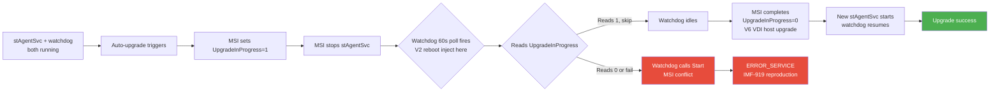
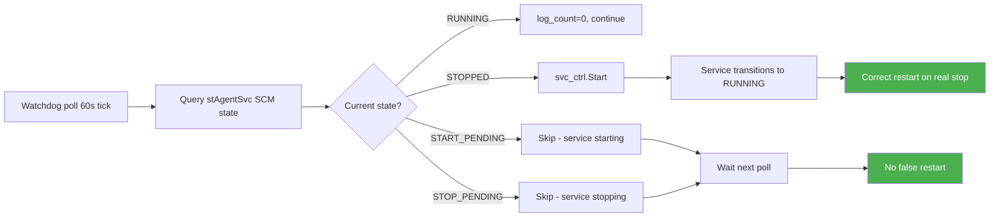
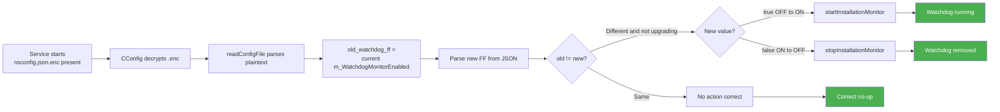
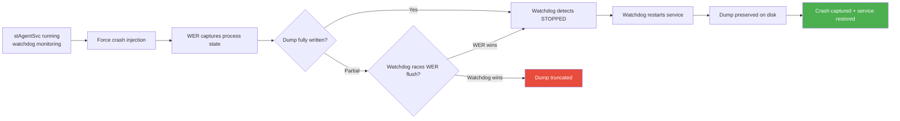
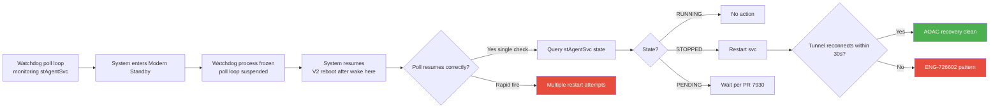
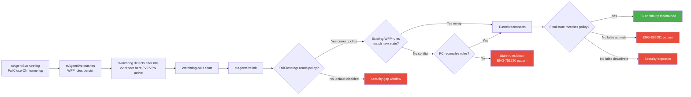
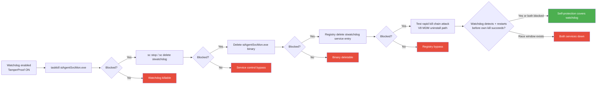
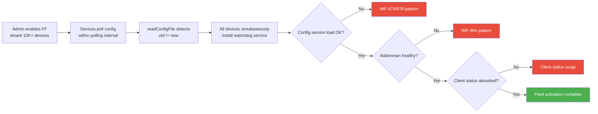
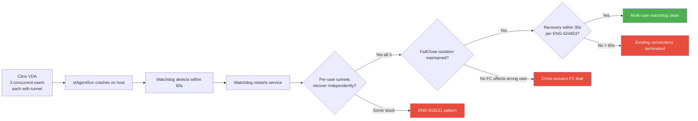

# SYSPLAN-WATCHDOG: System Test — NPLAN-Watchdog — Service-Based Watchdog (stWatchdog)

## Source
- Parent test plan: [nplan-watchdog.md](../test_plans/nplan-watchdog.md)
- SOP: [SYSTEST-01](systest-01.md)
- PRs: [#7878](../doc/pr/pr7878-watchdog.md) (main), [#7930](../doc/pr/pr7930-watchdog.md) (SCM PENDING fix), [#7935](../doc/pr/pr7935-watchdog.md) (R135 cherry-pick), [#7957](../doc/pr/pr7957-watchdog.md) (secure config startup)
- IMF data: [IMFs](../doc/bug_20260609/imfs_overall.md) (date: 2026-06-09)
- Date created: 2026-06-16

---

## System Test Objective

The watchdog feature introduces `stWatchdog` (binary `stAgentSvcMon.exe -watchdog`) that polls `stAgentSvc` every 60 seconds and restarts it on abnormal exit. It introduces four system-level dependencies: MSI installer race via `UpgradeInProgress` registry guard, secure config startup race (PR #7957), SCM PENDING state handling (PR #7930), and watchdog-triggered restart impact on FailClose / tunnel callback cascade. Each P0 enumerates V1 (clean) plus 1-3 disruption variants of the SAME failure mode.

---

## IMF-Informed Risk Profile

| IMF / Bug | Severity | What Broke | Root Cause | Our Test |
|---|---|---|---|---|
| **IMF-919** | High | Upgrade aborted, ERROR_SERVICE_CANNOT_ACCEPT_CTRL | Windows Installer + service stop timing | SYS-001, SYS-003, SYS-004 |
| **IMF-1335*** | (user-supplied) | Watchdog enabled + auto-upgrade + reboot mid-upgrade → nsclient removed | UpgradeInProgress survival across reboot | SYS-001 V2 (primary target) |
| **ENG-898484** | Medium | Watchdog restarts during PENDING states | Missing IsServiceStopped check (PR #7930) | SYS-002 |
| **ENG-905482** | Medium | Watchdog fails to start with secure config | FF read before .enc decrypted (PR #7957) | SYS-003 |
| **ENG-538602** | High | Client crash while stopping services | Race between service stop and dump | SYS-004 |
| **ENG-561570** | Medium | NSC service unable to restart | AOAC sequence interfered | SYS-005 |
| **ENG-895081** | Day-1 Critical | FailClose not blocking after reboot | FailClose state not persisted | SYS-006 |
| **IMF-1075** | High | Downloader unable to serve installers | Backend overload | SYS-008 |
| **ENG-624953** | Day-1 | VDI DaaS terminating connections | Multi-user race | SYS-009 |
| **ENG-991833** | Day-1 | FailClose not working with IPSec/VPN swap | enableFCOnNetworkDisconnect | SYS-006 V9 |

\* User-supplied; not in current dataset (highest dataset IMF = IMF-1184). Treated as first-class evidence.

---

## Scope

### In Scope (System-Level)
- Watchdog ↔ MSI installer (UpgradeInProgress registry guard, including reboot-mid-upgrade per IMF-1335)
- Watchdog ↔ SCM transitional states (PR #7930 regression guard)
- Watchdog ↔ secure config startup (PR #7957 regression guard)
- Watchdog-triggered restart → callback cascade impact on FailClose and tunnel
- Crash dump preservation when watchdog restarts crashed stAgentSvc
- AOAC sleep/wake interaction with poll loop
- Self-protection / TamperProof on new watchdog service
- Fleet-scale watchdog activation (FF flip)
- Citrix VDI multi-user behavior

### Out of Scope
- Functional install/uninstall, FF on/off (covered by parent NPLAN test plan)
- Service description localization (cosmetic)
- macOS / Linux (Windows-only feature)

## Platforms
- Windows 10 22H2 x64
- Windows 11 23H2 / 24H2 x64
- Windows 11 ARM64 (V1 only)
- Windows Server 2019 (Citrix VDA)

## Prerequisites
- Tenant with `nsclient_watchdog_monitor = "true"` (string per CLAUDE.md, not JSON bool)
- Client build R135+ with all four watchdog PRs
- Test build with `encryptClientConfig=true` for SYS-003
- AOAC hardware for SYS-005
- Citrix VDA for SYS-009
- SCCM/Intune for SYS-008
- Cisco AnyConnect for SYS-006 V9 coverage

---

## Test Cases — P0 (MUST HAVE) — Maximum 10 cases, 1-4 variants each

### SYS-001: Watchdog Non-Interference During MSI Upgrade — UpgradeInProgress Guard
- **Priority**: P0
- **Platforms**: Windows 10, Windows 11
- **IMF Link**: **IMF-919** (Windows Installer + service stop timing race) ; variant V2 cites **IMF-1335** (user-supplied)
- **Related Bugs**: ENG-733657, ENG-988826, ENG-601667, ENG-960369
- **Objective**: Verify watchdog reads `HKLM\SOFTWARE\Netskope\UpgradeInProgress` before restart and skips when value is non-zero — across orchestration variants including the IMF-1335 reboot-mid-upgrade scenario
- **Risk**: Watchdog restart mid-upgrade causes ERROR_SERVICE conflict (IMF-919). Reboot variant (V2) is the primary IMF-1335 reproduction target — UpgradeInProgress survival across power cycle determines whether nsclient gets permanently removed.

#### Variant V1 — Clean Baseline
- **Steps**: stAgentSvc + watchdog running, FF on, version N → trigger auto-upgrade to N+1 → during upgrade window capture `HKLM\SOFTWARE\Netskope\UpgradeInProgress` registry → capture watchdog log filtered by stWatchdog module → search log for `AgentService is stopped. restart it.` (must NOT appear during upgrade) → post-upgrade verify UpgradeInProgress=0, single stAgentSvc instance, both services on N+1 → repeat 5x
- **Expected**: 5/5 success, 0 watchdog restart attempts during upgrade, no ERROR_SERVICE in Event Log
- **Failure indicators**: `restart it.` during upgrade window; Event Log error 0x425; two stAgentSvc.exe processes; UpgradeInProgress stuck at 1

#### Variant V2 — Reboot Mid-Upgrade (IMF-1335 Primary Target)
- **IMF Link** (variant-specific): **IMF-1335** (user-supplied: watchdog enabled + auto-upgrade + reboot during upgrade → nsclient removed accidentally)
- **Injection**: Hard reboot (`shutdown /r /f /t 0`) AFTER `RemoveExistingProducts` line appears in nsInstallation.log but BEFORE PostInstallSuccess runs
- **Steps delta**: Run V1 setup → trigger upgrade → watch nsInstallation.log for `RemoveExistingProducts` → force reboot at that exact moment → on boot, IMMEDIATELY (within 30s, before watchdog poll) capture: UpgradeInProgress key value, `Program Files\Netskope` directory, `Program Files (x86)\Netskope` directory, `sc query stAgentSvc`, `sc query stwatchdog` → wait 90s for watchdog poll + Windows Installer recovery → re-capture all → verify FINAL state has nsclient functional
- **Expected delta**: System recovers to either old or new version; nsclient NEVER permanently absent; UpgradeInProgress key state allows watchdog to skip OR is gone (in which case there's no service to conflict with anyway)
- **Additional failure indicators** (IMF-1335 reproduction signals):
  - **PRIMARY**: nsclient binaries missing from BOTH `Program Files\Netskope` AND `Program Files (x86)\Netskope`
  - Service entries in registry but no executable on disk
  - Watchdog service registered but stAgentSvc service entry deleted
  - `msiexec /fa` cannot recover (source MSI deleted from `C:\Windows\Installer\`)

#### Variant V6 — Citrix VDI Multi-User Host Upgrade
- **Injection**: V1 on Citrix VDA host with 3 active user sessions
- **Steps delta**: VDA host with 32-bit + watchdog, 3 active sessions with tunnels → trigger auto-upgrade on host → verify per-user tunnels recover after host service restart → verify watchdog correctly monitors single shared host service
- **Expected delta**: Per-user tunnels reconnect within 30s; no cross-session interference; watchdog state correct on host
- **Additional failure indicators**: ENG-624953 pattern (sessions terminated by upgrade); watchdog confused by multi-session SCM state

### SYS-002: Watchdog SCM Transitional State Handling (PR #7930 Regression Guard)
- **Priority**: P0
- **Platforms**: Windows 10, Windows 11
- **IMF Link**: **IMF-919** (PENDING states are part of upgrade timing window)
- **Related Bugs**: ENG-898484 (PR #7930 fix — direct regression guard), ENG-733657
- **Objective**: Verify watchdog uses `IsServiceStopped()` not `!IsServiceRunning()` and skips START_PENDING / STOP_PENDING
- **Risk**: Pre-PR-#7930 logic restarted on `!IsServiceRunning()` — true for both transitional pending states. Service spends 5-30s in pending states; 60s watchdog poll could land there and force-restart a service that was already starting. PR #7930 must not regress.

#### Variant V1 — Clean Baseline (PR #7930 100x Stress)
- **Steps**: Enable verbose watchdog logging → kill stAgentSvc 100x sequentially (per PR #7930 QE pattern) → after each kill, verify watchdog detects + restarts within 60s → search log for any restart attempt during PENDING states (must be zero) → verify all 100 cycles result in successful restart, no service flap
- **Expected**: 100/100 cycles produce exactly one restart each; zero PENDING-state restarts
- **Failure indicators**: Restart during state 2 (START_PENDING) or state 3 (STOP_PENDING); restart loop; multiple Start() calls per kill cycle

#### Variant V7 — AOAC Wake Triggers SCM State Burst
- **Injection**: Sleep/wake the device while stAgentSvc is in STOP_PENDING (force-killed just before sleep)
- **Steps delta**: Kill stAgentSvc → immediately sleep the device (before watchdog poll) → wake after 30s → verify watchdog handles wake correctly: detects STOPPED state, restarts service exactly once
- **Expected delta**: Watchdog poll resumes correctly after wake; service restarts; no rapid-fire from accumulated wake events
- **Additional failure indicators**: ENG-561570 pattern (NSC service unable to restart post-wake); rapid-fire restart attempts immediately after wake; missed wake event leaves service stopped

### SYS-003: Secure Config Startup Race (PR #7957 Regression Guard)
- **Priority**: P0
- **Platforms**: Windows 10, Windows 11
- **IMF Link**: **IMF-919** (config-related upgrade timing)
- **Related Bugs**: ENG-905482 (PR #7957 fix — direct regression guard), ENG-873979 (config corruption with encryption)
- **Objective**: Verify watchdog correctly starts/stops based on FF when nsconfig.json is encrypted (.enc) and FF is read post-decryption
- **Risk**: Pre-PR-#7957, `main.cpp` read FF before .enc decryption — for encrypted config this returned default (false), watchdog never started even with FF=true. After PR #7957, FF is read inside `CConfig::readConfigFile()` after decryption with `old_watchdog_ff != m_WatchdogMonitorEnabled` start/stop trigger. Must hold for cold start, runtime FF flip, and rapid flip.

#### Variant V1 — Clean Baseline (Cold Start + Runtime Flip + Rapid Flip)
- **Steps**: Enable `encryptClientConfig=true` → install client, enroll, verify nsconfig.json.enc exists → reboot, verify watchdog starts (was failing pre-PR-#7957) → verify log shows `watchdog flag changed to (1). try to start/stop it.` → runtime FF flip OFF→ON via WebUI, verify watchdog installs and starts → runtime FF flip ON→OFF, verify watchdog stops → rapid flip 4x in 5 minutes (STRESS-04 Configuration Shock), verify final state consistent
- **Expected**: Watchdog state always matches FF after each transition; cold start with .enc works; no stale instances after rapid flip
- **Failure indicators**: Cold start watchdog absent despite FF=true; runtime flip mismatch; log shows `read m_WatchdogMonitorEnabled current=>(0), from file=>(1)` but no start action follows; two watchdog instances after rapid flip

#### Variant V2 — Reboot During FF Transition
- **Injection**: Push FF=true via WebUI, immediately reboot before client config polling cycle completes
- **Steps delta**: Trigger FF flip → reboot within 30s → verify post-boot client correctly applies new FF state → verify watchdog state matches FF (no orphan service from interrupted transition)
- **Expected delta**: Post-boot watchdog state matches FF; no orphan service registered-but-not-started
- **Additional failure indicators**: Watchdog half-installed (registered but service entry incomplete); both FF states partially applied

#### Variant V4 — Network Loss During FF Read
- **Injection**: Push FF, immediately disable network so config download fails mid-stream
- **Steps delta**: FF push + network disable → verify client retries on backoff → eventually applies correct state when network restored
- **Expected delta**: Backoff retry succeeds when network restored; final FF state correct
- **Additional failure indicators**: Stuck on stale FF state indefinitely; partial config download leaves config corrupted

### SYS-004: Crash Dump Generation During Watchdog-Triggered Restart
- **Priority**: P0
- **Platforms**: Windows 10, Windows 11
- **IMF Link**: **IMF-919** (related — service crash during upgrade window)
- **Related Bugs**: ENG-538602 (client crash while stopping), ENG-747635 (crash under massive connections)
- **Objective**: Verify dump file is written to disk BEFORE watchdog restarts the service
- **Risk**: If watchdog races and restarts before WER flush, crash evidence is lost — customer reports "client keeps crashing" but support has zero dumps to RCA. Per parent plan TC-10/TC-11, both stAgentSvc and stAgentSvcMon must produce dumps.

#### Variant V1 — Clean Baseline
- **Steps**: Configure WER user-mode dumps for stAgentSvc.exe (registry: `HKLM\SOFTWARE\Microsoft\Windows\Windows Error Reporting\LocalDumps`) → inject crash via test hook → verify watchdog detects within 60s (per `timeout = 60 * 1000` in PR #7878) → verify dump exists at `C:\dump\stAgentSvc.exe\*.dmp` OR `C:\ProgramData\netskope\stagent\logs\*.dmp` → verify dump complete (open in WinDbg, stack readable) → verify stAgentSvc restarted, tunnel reconnects → repeat for stAgentSvcMon (watchdog) crash → verify watchdog self-restart within 1 minute (parent TC-29)
- **Expected**: Complete dump preserved; service restarted within 60-90s; watchdog log shows restart event; watchdog self-restart works
- **Failure indicators**: Dump file missing or zero bytes; truncated WinDbg-unloadable; watchdog doesn't detect crash; restart fails

### SYS-005: AOAC Sleep/Wake Interaction with Watchdog Poll Loop
- **Priority**: P0
- **Platforms**: Windows 11 AOAC hardware (Surface Pro)
- **IMF Link**: **IMF-919** (timing-related)
- **Related Bugs**: ENG-561570 (NSC unable to restart on AOAC), ENG-726602, ENG-754190, ENG-783149, ENG-766069, ENG-830275, ENG-746099 (12+ AOAC bugs — highest-risk feature category per review_stats.md)
- **Objective**: Verify watchdog `WaitForSingleObject(svc->m_exitEvent, timeout)` poll loop survives Modern Standby
- **Risk**: AOAC freezes processes during connected standby. On wake, the 60s timer may fire immediately (rapid-fire restart attempts) OR miss wake transitions (never check service state). With 12 AOAC escalation bugs, this is the highest-risk feature category.

#### Variant V1 — Clean Baseline (10 Sleep/Wake Cycles)
- **Steps**: Surface Pro / AOAC hardware with watchdog enabled → tunnel connected → 10 sleep/wake cycles via `powercfg /requestsoverride` or lid close → after each wake verify exactly ONE watchdog poll fires within 60s (not rapid-fire) → tunnel reconnects within 30s → no `Disabled due to error` state
- **Expected**: 10/10 wake cycles clean; no rapid-fire; tunnel recovery < 30s
- **Failure indicators**: Multiple `restart it.` log entries clustered immediately after wake; `Disabled due to error` in client status; tunnel doesn't reconnect within 30s; service flapping post-wake

#### Variant V2 — Kill stAgentSvc Just Before Sleep
- **Injection**: Force-kill stAgentSvc just before sleep, observe behavior on wake
- **Steps delta**: Kill stAgentSvc → immediately sleep within 10s → wake after 60s → verify watchdog detects stopped state on wake and restarts service exactly once
- **Expected delta**: Post-wake watchdog re-evaluates state correctly; restarts service if needed; no double-restart from queued pre-sleep intent
- **Additional failure indicators**: Watchdog "remembers" pre-sleep intent and double-restarts; service flapping post-wake; missed restart leaves service stopped

### SYS-006: FailClose State Continuity Across Watchdog-Triggered Restart
- **Priority**: P0
- **Platforms**: Windows 10, Windows 11
- **IMF Link**: ENG-895081 (Day-1 Critical: FailClose not blocking after reboot — escalation-elevated to P0)
- **Related Bugs**: ENG-895081, ENG-751720, ENG-422599, ENG-752117, ENG-570306, ENG-928461, **ENG-991833** (FailClose + IPSec/VPN swap, Day-1)
- **Objective**: Verify watchdog-triggered restart preserves FailClose policy correctness
- **Risk**: ENG-895081 shows FailClose persistence is a Day-1 fragile area. Watchdog restart is a NEW trigger that doesn't go through normal shutdown. WFP rules may persist (false block) or be cleared without re-applying (security gap).

#### Variant V1 — Clean Baseline
- **Steps**: FailClose ON, tunnel connected → capture WFP rules `netsh wfp show filters > before.xml` → continuous external ping → force-kill stAgentSvc → watch for watchdog detection within 60s → capture WFP rules during gap and after restart → verify ping behavior: blocked during gap (FC enforced), restored when tunnel reconnects → test inverse: FailClose OFF in policy, force restart, verify no false-activation
- **Expected**: FC state matches policy; no false-activate; no false-deactivate; gap window < 90s
- **Failure indicators**: Ping succeeds during gap when policy=block (false deactivate / leak); permanent block when policy=open (false activate, ENG-895081 pattern); WFP rules diverge between before/during/after

#### Variant V2 — Reboot During Watchdog Restart Window
- **Injection**: Kill stAgentSvc, force reboot before watchdog has chance to restart (within 30s)
- **Steps delta**: Kill stAgentSvc → immediate `shutdown /r /f /t 0` → on boot verify FailClose state correct (matches policy) regardless of pre-reboot mid-restart state
- **Expected delta**: Post-boot FC state matches policy; no orphan WFP rules; clean reconciliation
- **Additional failure indicators**: WFP rules orphaned without managing service; FC stuck in inconsistent state across boot; ENG-895081 reproduction (FC not blocking after reboot)

#### Variant V9 — Cisco AnyConnect VPN Co-Active
- **IMF Link** (variant-specific): ENG-991833 (Day-1: FailClose + IPSec/VPN swap)
- **Injection**: AnyConnect VPN connected during V1
- **Steps delta**: AnyConnect connected, NSC FC ON → kill stAgentSvc → observe FC behavior across watchdog restart while VPN tunnel is active → verify FC distinguishes VPN tunnel from NSC tunnel
- **Expected delta**: FC correctly distinguishes VPN from NSC tunnel; no false-block of VPN traffic; no false-allow during NSC gap; VPN tunnel survives NSC restart
- **Additional failure indicators**: ENG-991833 reproduction (FC misbehavior with VPN swap); VPN disconnects when NSC restarts

### SYS-007: Self-Protection / TamperProof — Watchdog Service Cannot Be Stopped or Removed
- **Priority**: P0
- **Platforms**: Windows 10, Windows 11
- **IMF Link**: None direct (security regression risk)
- **Related Bugs**: ENG-487939 (unable to upgrade with self-protection), ENG-457109, ENG-986514 (CCleaner bypasses tamperproof), ENG-718773 (tamperproof bypass via Save Logs), ENG-925885 (PSIRT), ENG-925887 (PSIRT)
- **Objective**: Verify the new stwatchdog service is fully covered by TamperProof — can't be stopped, deleted, killed, or its binary tampered with
- **Risk**: Watchdog adds new attack surface (new service, new binary, new registry path). If killable, attacker disables watchdog → kills stAgentSvc → traffic leaks. Existing self-protection rules were written for stAgentSvc only.

#### Variant V1 — Clean Baseline
- **Steps**: Enable TamperProof, watchdog FF on → as local admin: `taskkill /f /im stAgentSvcMon.exe` (must fail) → `sc stop stwatchdog`, `sc delete stwatchdog` (must fail) → delete `stAgentSvcMon.exe` from install dir (must fail) → registry delete `HKLM\SYSTEM\CurrentControlSet\Services\stwatchdog` (must fail) → rapid sequential kill of stAgentSvc + stwatchdog (verify at least one survives or both blocked) → 3rd party tool (CCleaner) on watchdog uninstall path → verify uninstaller WITH valid TamperProof password CAN remove watchdog (positive test)
- **Expected**: All bypass attempts blocked; valid uninstall path works
- **Failure indicators**: Any operation succeeds without password; rapid attack chain leaves both services down; ENG-986514 pattern (3rd party bypass)

#### Variant V8 — MDM-Initiated Uninstall (Positive + Negative Path)
- **Injection**: SCCM/Intune-issued uninstall command, both with and without TamperProof password
- **Steps delta**: Configure MDM uninstall command WITHOUT password → must fail; configure WITH valid password → must succeed (positive test)
- **Expected delta**: MDM with password succeeds; without password fails; MDM context doesn't bypass TamperProof password validation
- **Additional failure indicators**: MDM context bypasses TamperProof; password not validated in MDM path

### SYS-008: Fleet-Scale Watchdog Activation — Provisioner Load
- **Priority**: P0
- **Platforms**: Backend (endpoint impact)
- **IMF Link**: **IMF-1075** (downloader serving installers), **IMF-874** (config API spike), **IMF-878** (config spike from FF rollout to 164 tenants), **IMF-964** (addonman overload)
- **Related Bugs**: None direct
- **Objective**: Verify enabling `nsclient_watchdog_monitor=true` for a large tenant doesn't cause provisioner / addonman overload from synchronized config polls + service installations
- **Risk**: PR #7878 installs watchdog at runtime when FF flips OFF→ON via `startInstallationMonitorService(true, false)`. Every device installs a NEW Windows service simultaneously — pattern matches IMF-878 (versioned steering rollout for 164 tenants caused config API spike).

#### Variant V1 — Clean Baseline
- **Steps**: Tenant with 50+ test devices (or simulate 10K via load gen) → capture baseline backend metrics: provisioner-clientservices p95 latency, addonman pod CPU, config API request rate → T0 enable `nsclient_watchdog_monitor=true` for tenant → monitor 30 min: config API latency, addonman restarts, downloader 5xx → sample 10 endpoints: verify watchdog installed within next polling cycle, log shows `watchdog flag changed to (1)` → verify zero clients in disabled state → all 50 devices have stwatchdog service running → inverse test: flip FF OFF, verify all watchdogs uninstall cleanly
- **Expected**: Backend metrics within 20% of baseline; no addonman restart; no client disable; 50/50 endpoints have functional watchdog post-rollout
- **Failure indicators**: Backend latency spike > 5s; addonman pod CPU saturation; multiple `disabled` events; endpoint log shows `config update failed, retry in X minutes` cluster

#### Variant V8 — Ring Deployment via SCCM/Intune
- **Injection**: Coordinated rollout through SCCM/Intune deployment rings instead of FF flip
- **Steps delta**: Configure ring 1 (10 devices), monitor backend metrics → expand to ring 2 (40 devices) over 30 min → compare backend load profile vs V1 (FF flip should be more spike-like; ring should be smoother)
- **Expected delta**: Ring deployment produces smoother backend load curve; no overload at any ring boundary; SCCM deployment status accurate
- **Additional failure indicators**: SCCM-deployed clients have wrong watchdog state vs auto-applied; deployment status misreporting; ring boundary causes mini-spike

### SYS-009: Citrix VDI Multi-User Watchdog Behavior
- **Priority**: P0
- **Platforms**: Windows Server 2019 (Citrix VDA — P0 interop)
- **IMF Link**: None direct
- **Related Bugs**: **ENG-624953 (Day-1: VDI DaaS terminating connections)**, ENG-710784, ENG-918131, ENG-570306, ENG-466704, ENG-928461
- **Objective**: Verify watchdog does not interfere with Citrix multi-user sessions — service restart in shared session host environment
- **Risk**: VDI shared sessions have N concurrent users. Watchdog-triggered restart of stAgentSvc terminates ALL user tunnels simultaneously (matches ENG-624953 pattern: "must not terminate existing connections"). Per parent plan TC-32 (this case was UNTESTED in parent).

#### Variant V1 — Clean Baseline
- **Steps**: Citrix VDA on Windows Server 2019, watchdog FF on → spawn 3 concurrent VDI sessions (UserA, UserB, UserC), each with active tunnel and traffic → force crash stAgentSvc on host → verify watchdog restarts service within 60s → verify all 3 users' tunnels reconnect independently within 30s of service restart (per ENG-624953 SLO) → verify per-user FailClose isolation: activate FC for UserA only, verify UserB and UserC unaffected → test enrollment scenario per parent plan TC-29: VDI user logs in during watchdog cycle, verify enrollment proceeds → 4-hour soak with periodic stAgentSvc kills, verify fleet stability
- **Expected**: All 3 tunnels recover within 30s; FailClose isolation maintained; no cross-session interference; enrollment works during watchdog cycle
- **Failure indicators**: One or more user tunnels stuck disconnected; FailClose activated by UserA affects UserB; existing connections terminated (ENG-624953 pattern); enrollment fails on logon during watchdog cycle

---

## Test Cases — P1 (SHOULD HAVE)

(P1 cases get V1 baseline only; no variants required)

### SYS-010: Watchdog Self-Recovery (parent TC-29)
- Per parent TC-29: kill stAgentSvcMon (watchdog), verify it self-restarts within 1 minute via SCM service recovery configuration
- Steps: force-kill watchdog process, observe SCM auto-restart per service recovery config, verify within 60s, verify it resumes monitoring stAgentSvc correctly
- Expected: Watchdog restarts within 60s; resumes monitoring functionally
- Failure indicators: Watchdog stays dead; stAgentSvc unmonitored

### SYS-011: AV Real-Time Scan Interop (parent TC-31)
- Platforms: Windows 10/11 with CrowdStrike, Defender, McAfee
- Justification: P1 interop concern — generic AV co-load. Does NOT meet narrow V5 criteria for per-case variant (watchdog is service-layer, not driver/binary-signature feature).
- Steps: Enable AV real-time scan, run watchdog restart cycles, verify no quarantine of stAgentSvcMon.exe, no restart blocking, no performance degradation
- Expected: No quarantine; restart timing unaffected
- Failure indicators: Binary quarantined; restart > 60s due to scan

### SYS-012: SCCM / MDM Deployment Test (parent TC-32 — was UNTESTED)
- Platforms: Windows 10/11 + SCCM or Intune
- Related Bugs: ENG-543228 (MDM script issues), ENG-456732 (SCCM-related)
- Objective: Per parent plan TC-32 was not tested — verify watchdog installs correctly via enterprise deployment
- Steps: Deploy via SCCM with watchdog FF on, verify both services install, verify enrollment via MDM secure tokens, verify watchdog restart behavior in managed environment
- Expected: Clean install; watchdog functional under MDM management
- Failure indicators: Service install fails silently; watchdog absent post-deploy

### SYS-013: Battery Mode Watchdog Behavior (parent TC-29 second variant)
- Platforms: Laptop on battery
- Related Bugs: ENG-559121 (battery drain pattern)
- Objective: Verify watchdog 60s poll loop does not drain battery unnecessarily
- Steps: Run laptop on battery for 4 hours with watchdog enabled vs disabled, measure battery drain delta, verify stAgentSvc restart works on battery
- Expected: Battery drain delta < 2%; restart functional on low power
- Failure indicators: Significant drain from polling; restart fails on low power

### SYS-014: Aborted Upgrade Recovery (parent TC-23)
- Platforms: Windows 10, Windows 11
- Related Bugs: ENG-601667, ENG-960369
- Objective: Per parent TC-23, verify both services run original version after MSI install abort, watchdog correctly handles UpgradeInProgress=1 stuck state
- Steps: Trigger upgrade, kill msiexec mid-stream, verify rollback, verify UpgradeInProgress key state, verify watchdog resumes normal monitoring
- Expected: Original version restored; UpgradeInProgress cleared; watchdog functional
- Failure indicators: UpgradeInProgress stuck at 1; watchdog never resumes restart capability

### SYS-015: Watchdog During Network Storm (STRESS-06 Variant)
- Related Bugs: ENG-441957 (network switch disconnect), ENG-450735 (regression after switch fix)
- Objective: Verify watchdog handles stAgentSvc-triggered tunnel disconnects during network transitions without false restarts
- Steps: Run STRESS-06 (Network Transition Storm), observe whether stAgentSvc state ever appears STOPPED briefly, verify watchdog doesn't restart on transient states (per PR #7930)
- Expected: No spurious watchdog restarts during network storm
- Failure indicators: Service flapping pattern correlated with network changes

---

## Test Cases — P2 (GOOD TO HAVE)

### SYS-016: NPA + EPDLP Integration During Watchdog Restart (parent TC-21)
Verify NPA tunnel and EPDLP recover correctly when watchdog restarts stAgentSvc.

### SYS-017: Service Description Localization (parent TC-19)
Verify watchdog service description NOT localized in French / German Windows.

### SYS-018: CConfig Worker Thread Absence (parent TC-18)
Per parent plan TC-18 — verify stWatchdog process has no CConfig worker thread.

### SYS-019: Manual Watchdog Start Brings Up Client Service (parent TC-13, TC-17)
Sanity: stop both services, start only watchdog, verify it brings up stAgentSvc and stAgentUI.

### SYS-020: Watchdog FF=OFF, Crash stAgentSvc — No Restart (parent TC-26)
Per parent TC-26: with FF off, verify watchdog thread does NOT restart stAgentSvc on crash.

---

## Variant Coverage Summary

Legend: `Y` = covered as variant; `Y*` = primary IMF-1335 target; `(P1)` = covered in P1; `-` = not picked

| Case | V1 | V2 Reboot | V3 Power | V4 Network | V5 AV | V6 VDI | V7 AOAC | V8 MDM | V9 VPN | V10 EDR |
|---|---|---|---|---|---|---|---|---|---|---|
| SYS-001 (Upgrade guard) | Y | **Y\*** | - | - | - | Y | - | - | - | - |
| SYS-002 (SCM PENDING) | Y | - | - | - | - | - | Y | - | - | - |
| SYS-003 (Secure config) | Y | Y | - | Y | - | - | - | - | - | - |
| SYS-004 (Crash dumps) | Y | - | - | - | - | - | - | - | - | - |
| SYS-005 (AOAC poll loop) | Y | Y | - | - | - | - | - | - | - | - |
| SYS-006 (FailClose continuity) | Y | Y | - | - | - | - | - | - | Y | - |
| SYS-007 (Self-protection) | Y | - | - | - | - | - | - | Y | - | - |
| SYS-008 (Fleet activation) | Y | - | - | - | - | - | - | Y | - | - |
| SYS-009 (Citrix multi-user) | Y | - | - | - | - | (covered as primary) | - | - | - | - |

**Variant counts per case** (all within 1-4 cap):
- SYS-001: 3 (V1 + 2) — V2 (IMF-1335 primary), V6
- SYS-002: 2 (V1 + 1) — V7
- SYS-003: 3 (V1 + 2) — V2, V4
- SYS-004: 1 (V1 only) — single-shot crash injection sufficient
- SYS-005: 2 (V1 + 1) — V2 (kill-then-sleep)
- SYS-006: 3 (V1 + 2) — V2, V9
- SYS-007: 2 (V1 + 1) — V8
- SYS-008: 2 (V1 + 1) — V8
- SYS-009: 1 (V1 only — Citrix VDI is itself the variant being tested as primary)

**Total**: ~19 distinct test orchestrations across 9 P0 cases.

**V5 (AV) intentionally omitted from all P0 cases** per narrow criteria — watchdog is service-layer, not driver/binary-signature. AV interop coverage moved to P1 SYS-011.
**V10 (EDR) intentionally omitted from all P0 cases** — watchdog doesn't touch WFP driver/kernel callouts. EDR isn't relevant per narrow criteria.

---

## Priority Rationale

| Case | Priority | IMF Link | Justification |
|---|---|---|---|
| SYS-001 | P0 | IMF-919 + IMF-1335 (V2) | Core upgrade-time race + IMF-1335 reproduction target on V2 |
| SYS-002 | P0 | IMF-919-related | PR #7930 explicit regression guard, must not regress |
| SYS-003 | P0 | IMF-919-related | PR #7957 explicit regression guard; secure config mandatory in many envs |
| SYS-004 | P0 | IMF-919-related | Crash dump preservation = only RCA path for fleet-wide crashes |
| SYS-005 | P0 | IMF-919-related | 12+ AOAC bugs make this highest-risk feature category |
| SYS-006 | P0 | ENG-895081 Day-1 Critical, ENG-991833 Day-1 | New restart trigger must not break FailClose; V9 closes VPN swap gap |
| SYS-007 | P0 | none direct (security) | Self-protection bypass = security incident; new attack surface |
| SYS-008 | P0 | IMF-1075, 874, 878, 964 | Fleet activation = exact pattern that caused multiple IMFs |
| SYS-009 | P0 | none direct | Citrix is P0 interop; multi-user crash = customer-wide outage; parent TC-32 was untested |
| SYS-010..015 | P1 | none | Self-recovery, AV, MDM, battery, aborted-upgrade, network storm — recoverable / lower blast radius |
| SYS-016..020 | P2 | none | Sanity / cosmetic / integration confirmations |

---

## Execution Approach

**Time budget**: 5 days (1 sprint week)

### Phase 1 — PR Regression Guards (Day 1-2)
- SYS-001 V1 (5x repeat for timing race)
- SYS-002 V1 (100x kill cycles per PR #7930 QE pattern)
- SYS-003 V1 (cold start + runtime flip + rapid flip)
- **Gate**: All three V1 baselines pass — these directly verify the four merged PRs

### Phase 2 — IMF-1335 Reproduction Day (Day 2)
- SYS-001 V2 in isolation, 10x across timing windows on Win10 + Win11
- This is the user-flagged gap; must be cleared before any beta exposure
- **Gate**: IMF-1335 does NOT reproduce; if it does, halt and file as P0 release-blocker

### Phase 3 — Service Lifecycle Resilience (Day 3)
- SYS-004 (crash dumps), SYS-005 V1 (10 sleep/wake cycles, 24h soak in background), SYS-005 V2
- SYS-006 V1 (FailClose continuity), V2 (reboot during restart)
- **Gate**: No `Disabled due to error`; dumps captured; FC intact across restart

### Phase 4 — Security and Scale (Day 4)
- SYS-007 V1 + V8 (TamperProof on watchdog — must run before any beta exposure)
- SYS-008 V1 + V8 (fleet activation — coordinate with backend SRE)
- SYS-009 (Citrix multi-user)
- **Gate**: No security gaps, backend metrics healthy, multi-user clean

### Phase 5 — Disruption + Environment Variants (Day 4-5)
- SYS-001 V6 (Citrix host upgrade)
- SYS-002 V7 (AOAC × SCM PENDING)
- SYS-003 V2 + V4 (reboot during FF flip + network loss)
- SYS-006 V9 (FailClose × Cisco AnyConnect)

### Phase 6 — P1 + P2 (parallel, Day 4-5)
- SYS-010 to SYS-015 in parallel as time allows; SYS-012 closes parent TC-32 untested gap

---

## Exit Criteria

- All 9 P0 cases V1 baselines PASS on Windows 10 + Windows 11
- **SYS-001 V2 (IMF-1335 reproduction): does NOT result in nsclient permanently removed in any of 10 attempts across timing windows**
- SYS-002 V1: 100/100 kill cycles produce exactly one restart each, zero PENDING-state restarts
- SYS-003 V1: secure config cold start successfully starts watchdog in 5/5 attempts
- SYS-004: crash dumps captured complete in 5/5 forced-crash attempts
- SYS-005 V1 + 24h soak: no `Disabled due to error`, no rapid-fire watchdog restarts
- SYS-006: FC state matches policy in 100% of post-restart states across V1 + V2 + V9
- SYS-007: 0 successful TamperProof bypass attempts on watchdog
- SYS-008: 50-device fleet activation, 0 clients disabled, backend within 20% of baseline
- SYS-009: Citrix 3-user concurrent — tunnel recovery < 30s for all users post-restart
- Variant Coverage Summary table shows zero unintended gaps
- All findings filed per SYSTEST-01 Section 9 standard
