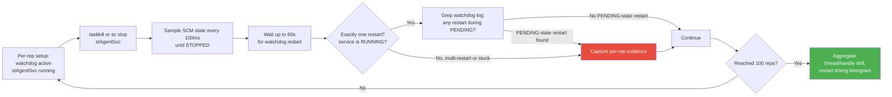
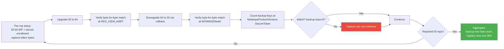
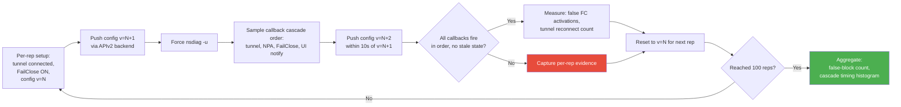
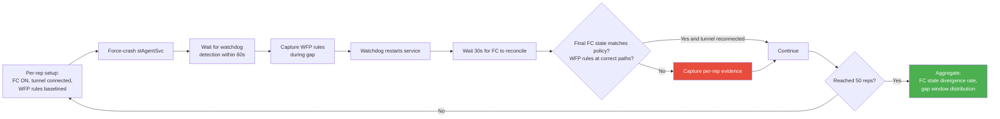

# ARES-R138: Agentic Resilience Endpoint Systest — Release R138

## Source
- Workflow: [ares_workflow.md](ares_workflow.md)
- SOP: [SYSTEST-01](../systest_plans/systest-01.md)
- Reliability baseline: [plan-reliability.md](../test_plans/plan-reliability.md) (STRESS-01..20)
- IMF data: [IMFs](../doc/bug_20260609/imfs_overall.md) (date: 2026-06-09)
- Escalation bugs: [Escalations](../doc/bug_20260609/escalation_bugs_overall.md)
- Date created: 2026-06-16
- Generated by: system-res-test-gen

## Release Scope

| Input | Type | Brief description |
|---|---|---|
| NPLAN-3211 | Feature | Windows 64-bit client cross-bitness MSI upgrade (32→64) |
| NPLAN-watchdog | Feature | Service-based watchdog (`stWatchdog`) monitoring stAgentSvc, restarts on abnormal exit |
| NPLAN-4534 | Feature | REST API v2 client configuration migration (legacy PHP → `client-oppy-configuration` microservice) |

User-supplied additional evidence in scope: **IMF-1335** (watchdog enabled + auto-upgrade + reboot during upgrade → nsclient removed accidentally) — outside current dataset (highest = IMF-1184), treated as first-class evidence.

## Stability Properties Under Verification

This plan verifies these 7 properties hold under release-combined stress:

| # | Property | What "broken" looks like |
|---|---|---|
| P-STAB | Stability under load | Service degradation, increasing error rate over time |
| P-RES | Resource usage (handle/thread/RSS/CPU) | Monotonic growth across reps; > 10% drift end vs start |
| P-DEAD | No deadlock | Two threads blocked on each other's locks; service unresponsive but not crashed |
| P-HANG | No hang | SCM `STOP_PENDING` or `START_PENDING` > 60s; `nsdiag -s` timeout |
| P-CRASH | No user-mode crash | `*.dmp` generated in `C:\dump\` or `C:\ProgramData\netskope\stagent\logs\` |
| P-BSOD | No kernel crash | Kernel dump generated; Event Viewer System log shows BugCheck |
| P-NET | Client network connection stable | Continuous external ping fails > documented gap window |

Each case below declares which properties it primarily probes. UI behavior is out of scope for resilience testing — UI symptoms (gray-out, unresponsive icon) are downstream manifestations of P-STAB / status-reporting violations and are covered by functional system testing.

## Priority Banner — Top 5 Cases

1. **SYSTEST-STRESS-21** — Cross-bitness upgrade × watchdog × reboot soak (P0, 100 reps, IMF-1335 + IMF-919)
2. **SYSTEST-STRESS-22** — Watchdog restart loop under SCM PENDING storm (P0, 100 reps, IMF-919 + ENG-898484)
3. **SYSTEST-STRESS-23** — Token preservation across 32→64→32 churn (P0, 50 reps, IMF-919 + ENG-466704)
4. **SYSTEST-STRESS-24** — Config callback cascade under shock with REST APIv2 (P0, 100 reps, IMF-1073 + IMF-1136)
5. **SYSTEST-STRESS-25** — FailClose persistence across watchdog-triggered restart (P0, 50 reps, ENG-895081 Day-1 Critical)

## Case Summary Table

Single scannable view of all 12 cases. Reviewers can audit scope and priority without reading individual case bodies.

| Case ID | Pri | Reps | Test Summary | Pass / Fail Condition | Stability Properties |
|---|---|---|---|---|---|
| SYSTEST-STRESS-21 | P0 | 100 | Cross-bitness 32→64 upgrade × watchdog FF on × reboot mid-RemoveExistingProducts; IMF-1335 reproduction target | Pass: 100/100 cycles end with nsclient functional (old or new). Fail: any cycle leaves nsclient binaries missing from BOTH `Program Files\Netskope` AND `Program Files (x86)\Netskope` | P-STAB, P-RES, P-CRASH, P-NET |
| SYSTEST-STRESS-22 | P0 | 100 | Kill stAgentSvc 100x; verify watchdog uses `IsServiceStopped()` not `!IsServiceRunning()` (PR #7930 regression guard) | Pass: 100/100 cycles produce exactly one restart, zero PENDING-state restart attempts. Fail: any restart during START_PENDING / STOP_PENDING; restart loop; SCM API deadlock | P-STAB, P-RES, P-DEAD |
| SYSTEST-STRESS-23 | P0 | 50 | 32→64→32 cross-bitness churn; verify PR #8105 token backup/restore preserves AuthToken + EncToken byte-for-byte across cycles | Pass: 50/50 cycles preserve tokens byte-for-byte; 0 leaked backup keys; 0 re-enrollment prompts; registry hive drift < 1%. Fail: token mismatch, backup keys persist, re-enrollment forced | P-STAB, P-RES, P-CRASH |
| SYSTEST-STRESS-24 | P0 | 100 | Rapid config push v=N+1 / v=N+2 within 10s via REST APIv2; observe callback cascade order under FC ON | Pass: 100/100 cycles complete cascade with no stale-state false-block; ping never interrupted > 5s. Fail: false-block; cascade order inverted; cascade deadlock (`nsdiag -s` hang) | P-STAB, P-DEAD, P-NET |
| SYSTEST-STRESS-25 | P0 | 50 | Force-crash stAgentSvc with FC ON; verify watchdog-triggered restart preserves FailClose policy correctness | Pass: 50/50 cycles preserve FC policy; 0 permanent blocks; 0 stale-rule leaks; gap < 90s. Fail: FC false-activate (ENG-895081 pattern) or false-deactivate (security leak) | P-STAB, P-CRASH, P-NET |
| SYSTEST-STRESS-26 | P1 | 50 | Cross-bitness upgrade with concurrent heavy traffic (100 HTTPS); measure CPU/RSS drift across 50 cycles | Pass: 50/50 with no crash; RSS drift < 5%; no MSI cache pile-up. Fail: crash dump; monotonic RSS growth; disk fills with cached MSIs | P-STAB, P-RES, P-CRASH |
| SYSTEST-STRESS-27 | P1 | 100 | Force-kill stwatchdog 100x; SCM auto-restart; soak watchdog process metrics across cycles | Pass: 100/100 self-restarts; watchdog RSS drift < 5%; thread count stable. Fail: watchdog stays dead; RSS or thread leak > 5%; SCM-call deadlock | P-RES, P-DEAD |
| SYSTEST-STRESS-28 | P1 | 100 | 100 rapid config syncs (30s interval) via REST APIv2; observe HTTP connection pool lifecycle and latency | Pass: 100/100 syncs succeed; max latency < 10s; no `nsdiag` hang; clean connection-state lifecycle. Fail: connection pool exhausted; hang; handle leak | P-RES, P-HANG, P-NET |
| SYSTEST-STRESS-29 | P1 | 50 | Config push with `encryptClientConfig=true` over APIv2; verify JWT validation + `.enc` write race | Pass: 50/50 with no `Client config validation failed`; no crash dump; no `.enc` corruption. Fail: digest mismatch; decryption failure; crash | P-STAB, P-CRASH |
| SYSTEST-STRESS-30 | P1 | 50 | 32→64 upgrade × APIv2 config re-sync; verify ProductID and registry consistency across 50 cycles | Pass: 50/50 post-upgrade syncs succeed; ProductID always matches MSI ProductCode; registry hive drift < 1%. Fail: ProductID mismatch (ENG-781465); backend `client config validation failed` events | P-STAB, P-RES |
| SYSTEST-STRESS-31 | P1 | ~50 wakes / 24h | Watchdog × AOAC sleep/wake soak over 24 hours (~50 wake events) | Pass: 24h soak completes with 0 `Disabled due to error`; 0 rapid-fire restart clusters; tunnel reconnects within 30s after every wake; RSS drift < 5%. Fail: any of those metrics violated | P-STAB, P-RES, P-NET |
| SYSTEST-STRESS-32 | P1 | 50 | Triple-feature interaction: 32→64 upgrade with watchdog FF on AND APIv2 config push mid-upgrade | Pass: 50/50 cycles complete with all three features functional post-upgrade; no crash; no deadlock. Fail: any feature broken post-upgrade; crash; cascade deadlock | P-STAB, P-CRASH, P-DEAD, P-NET |

Stability property codes: **P-STAB** stability under load, **P-RES** resource usage, **P-DEAD** no deadlock, **P-HANG** no hang, **P-CRASH** no user-mode crash, **P-BSOD** no kernel crash, **P-NET** network connection stable. Property definitions in `## Stability Properties Under Verification` above.

## Input → Case Mapping

| Input | Maps to case(s) |
|---|---|
| NPLAN-3211 | STRESS-21, STRESS-23, STRESS-26, STRESS-30 |
| NPLAN-watchdog | STRESS-21 (merged), STRESS-22, STRESS-25, STRESS-27, STRESS-31 |
| NPLAN-4534 | STRESS-24, STRESS-28, STRESS-29 |
| Cross-cutting (interactions) | STRESS-25 (watchdog × FailClose), STRESS-30 (3211 × 4534), STRESS-32 (3211 × watchdog × 4534) |

Merge note: STRESS-21 combines NPLAN-3211 + NPLAN-watchdog + IMF-1335 because the failure mode (cross-bitness upgrade × watchdog interference × reboot survival) is one combined orchestration, not three separate ones.

## Time and Compute Budget

- Total cases: **12** (within 10-20 sweet spot)
- Total reps: 5×100 + 7×50 = **850 runs**
- Avg ~5 min/rep → ~70 hours compute
- Phase split: Week 1 → 5 P0 cases (650 runs); Week 2 → 7 P1 cases (200 runs)

## Stream A — Gaps vs Existing plan-reliability.md

- STRESS-18 (Upgrade Stability) doesn't probe **watchdog active during upgrade** — STRESS-21 closes
- No STRESS case probes **config callback cascade ordering under shock with new APIv2 backend** — STRESS-24 closes
- No STRESS case combines **FailClose persistence × non-graceful service restart** (only graceful in STRESS-07) — STRESS-25 closes
- No STRESS case probes **resource leak across N upgrade cycles** — STRESS-23 closes
- STRESS-05 (Service Chaos) doesn't probe **watchdog poll loop survival across SCM state bursts** — STRESS-22 closes

## Stream B — Change-Driven Risk

- **NPLAN-3211**: cross-bitness `RemoveExistingProducts` is destructive registry op; repeated cycles create accumulator risk for token backup/restore (PR #8105) and registry hive
- **NPLAN-watchdog**: new `stWatchdog` service introduces a 60-second poll loop that runs forever — leak surface; SCM PENDING handling per PR #7930 is fragile; secure config startup race per PR #7957 must hold under repeated cold start
- **NPLAN-4534**: REST APIv2 swap means new HTTP client paths in CConfig — connection pool, retry, callback cascade are all new code under stress

---

## Test Cases — P0 (CRITICAL — IMF-Linked)

### SYSTEST-STRESS-21: Cross-bitness Upgrade × Watchdog × Reboot Soak (IMF-1335 reproduction)
- **Priority**: P0
- **Iterations**: 100
- **Source stream**: Both
- **IMF Link**: **IMF-1335** (user-supplied, primary), **IMF-919** (Critical: Windows Installer service stop timing)
- **Escalation bugs**: ENG-733657, ENG-988826, ENG-601667, ENG-960369
- **Mapped to existing STRESS-XX**: STRESS-18 (Upgrade Stability) — extended to combine with watchdog and reboot interrupt
- **Code under test**: `lib/nsConfig/config.cpp::readConfigFile` (PR #7878/#7957 watchdog FF + UpgradeInProgress logic), `stAgent/installer/win/.../CustomAction.cpp::PostInstallSuccess` (PR #8105), Windows Installer service stop sequence
- **Failure mode**: Reboot mid-upgrade with watchdog enabled leaves nsclient permanently absent. Repeated cycles surface the timing window where `UpgradeInProgress` is gone but watchdog still attempts to restart a soon-to-be-removed binary.
- **Stability properties probed**: P-STAB, P-RES (handle accumulation across cycles), P-CRASH, P-NET (gap window per cycle)

```mermaid
flowchart LR
    INIT[Per-rep setup:<br/>32-bit + watchdog FF on<br/>tunnel connected] --> TRIGGER[Trigger 32 to 64 upgrade]
    TRIGGER --> WATCH[Monitor nsInstallation.log for<br/>RemoveExistingProducts]
    WATCH --> INJECT[shutdown /r /f /t 0<br/>at injection point]
    INJECT --> BOOT[System boots]
    BOOT --> CAPTURE[Capture state:<br/>UpgradeInProgress key,<br/>binary dirs, services]
    CAPTURE --> WAIT90[Wait 90s for watchdog<br/>poll cycle and Windows Installer recovery]
    WAIT90 --> CHECK{nsclient functional?<br/>old or new version?}
    CHECK -->|Yes either version| RESET[Reset:<br/>uninstall, return to 32-bit]
    CHECK -->|No, binaries gone| FAIL_REP[IMF-1335 reproduction<br/>capture full evidence]
    FAIL_REP --> RESET
    RESET --> NEXT{Reached 100 reps?}
    NEXT -->|No| INIT
    NEXT -->|Yes| AGGREGATE[Aggregate:<br/>pass count, IMF-1335 hit count,<br/>handle leak trend]
    style AGGREGATE fill:#4CAF50,color:#fff
    style FAIL_REP fill:#e74c3c,color:#fff
```

- **Per-iteration steps**:
  1. Setup: 32-bit client enrolled with watchdog FF on, tunnel connected, baseline registry + binary state captured
  2. Trigger upgrade: set `updateWin64Bit=true`, force `nsdiag -u`
  3. Watch nsInstallation.log; force reboot when `RemoveExistingProducts` line appears
  4. On boot, immediately (within 30s, before watchdog poll fires) capture: UpgradeInProgress key value, binary dir listings, `sc query stAgentSvc` + `sc query stwatchdog`
  5. Wait 90s for Windows Installer auto-recovery + watchdog poll cycle
  6. Re-capture state; verify nsclient functional
  7. Reset: uninstall, restore 32-bit baseline
- **Pass criterion**: 100/100 reps result in functional nsclient (either rolled back to 32-bit OR completed 64-bit). 0 IMF-1335 reproductions.
- **Failure indicators**: nsclient binaries missing from BOTH Program Files locations (PRIMARY); service entries with no executable; `msiexec /fa` cannot recover; UpgradeInProgress stuck at 1 indefinitely
- **Per-rep evidence (failed reps only)**: nsInstallation.log slice, registry export, dir listings, Event Log dump, watchdog log
- **Aggregate evidence**: 100-rep timeline of UpgradeInProgress lifecycle, handle count drift in stAgentSvc + stwatchdog (P-RES), pass/fail histogram by injection-timing offset

### SYSTEST-STRESS-22: Watchdog Restart Loop Under SCM PENDING Storm
- **Priority**: P0
- **Iterations**: 100
- **Source stream**: Both
- **IMF Link**: **IMF-919** (related — PENDING states are part of upgrade timing window)
- **Escalation bugs**: ENG-898484 (PR #7930 fix — direct regression guard), ENG-733657
- **Mapped to existing STRESS-XX**: STRESS-05 (Service Chaos) — extended with SCM state-burst observation
- **Code under test**: `lib/nsWinSvc/nsWinSvcCtrl.cpp::IsServiceStopped` (PR #7930), `stAgent/stAgentSvc/stAgentSvcEx.cpp::ThreadWatchdog`
- **Failure mode**: Watchdog restarts service during transient START_PENDING / STOP_PENDING. Repeated stress surfaces the rare timing where SCM state read returns transient value at the moment watchdog polls.
- **Stability properties probed**: P-STAB, P-RES (thread leak across 100 kill/restart cycles), P-DEAD (kill during STOP_PENDING could deadlock SCM)

- **Per-iteration steps**:
  1. Setup: watchdog FF on, stAgentSvc RUNNING; capture initial handle + thread count of stAgentSvc and stwatchdog
  2. Kill stAgentSvc via `taskkill /f /im stAgentSvc.exe`
  3. Sample SCM state every 100ms via `sc query stAgentSvc` until STOPPED
  4. Wait up to 60s for watchdog restart
  5. Verify exactly ONE restart (no double-restart from PENDING-state reads)
  6. Grep watchdog log for any `restart it.` entry while state was START_PENDING or STOP_PENDING
  7. Reset: ensure stAgentSvc RUNNING for next rep
- **Pass criterion**: 100/100 cycles produce exactly ONE restart each; 0 PENDING-state restart attempts
- **Failure indicators**: Two `restart it.` log entries from one kill cycle; restart while state == 2 (START_PENDING) or 3 (STOP_PENDING); service stuck in restart loop > 5 minutes; SCM API call deadlock
- **Per-rep evidence (failed reps only)**: watchdog log slice, SCM state trace, process snapshot
- **Aggregate evidence**: handle count of stAgentSvc and stwatchdog at rep 0/25/50/75/100 (P-RES drift); thread count drift; per-rep restart latency histogram

### SYSTEST-STRESS-23: Token Preservation Across 32→64→32 Churn (Resource & Cycle Soak)
- **Priority**: P0
- **Iterations**: 50
- **Source stream**: Change
- **IMF Link**: **IMF-919** (timing leaves tokens in inconsistent state)
- **Escalation bugs**: **ENG-466704** (Day-1: secure enrollment failing on Citrix), ENG-951409, ENG-543428, ENG-873979
- **Mapped to existing STRESS-XX**: N/A — entirely new (PR #8105 introduced backup/restore code)
- **Code under test**: `stAgent/installer/win/.../CustomAction.cpp::BackupEnrollmentToken`, `RestoreEnrollmentToken`, `lib/nsUtils/osUtils.cpp::deleteRegistryEntriesForInstallerEvents`
- **Failure mode**: Repeated 32→64→32 cycles accumulate token corruption, registry-key leak, or cleanup failure that single-cycle tests miss
- **Stability properties probed**: P-STAB, P-RES (registry-key accumulation in `NetskopeProductVersions\SecureToken` backup path), P-CRASH (re-enrollment loops can OOM)

- **Per-iteration steps**:
  1. Setup: 32-bit client with IDP secure enrollment (both AuthToken + EncToken); capture baseline token bytes + registry hive size
  2. Trigger 32→64 upgrade
  3. Capture restored token bytes from REG_VIEW_64BIT, diff vs baseline
  4. Trigger 64→32 rollback (downloader-controlled)
  5. Capture restored token bytes from WOW6432Node view, diff vs baseline
  6. Enumerate `HKLM\SOFTWARE\NetskopeProductVersions\SecureToken\` — must be empty after both transitions
  7. Verify no re-enrollment screen appeared at any point
  8. Reset: confirm 32-bit operational state for next rep
- **Pass criterion**: 50/50 cycles preserve tokens byte-for-byte both directions; 0 leaked backup keys; 0 re-enrollment prompts; registry hive drift < 1%
- **Failure indicators**: Token byte mismatch; backup keys persist beyond cleanup (count > 0); re-enrollment screen; registry hive grows monotonically (P-RES violation)
- **Per-rep evidence (failed reps only)**: 4 registry exports (pre / backup / restored / cleanup), nsInstallation.log slice
- **Aggregate evidence**: registry hive size at every rep (trend chart for P-RES), backup-key count distribution, token-mismatch byte-position histogram if any

### SYSTEST-STRESS-24: Config Callback Cascade Under Shock With REST APIv2
- **Priority**: P0
- **Iterations**: 100
- **Source stream**: Change
- **IMF Link**: **IMF-1073** (Critical: SJC2 config update failure → clients disabled), **IMF-1136**, IMF-878
- **Escalation bugs**: ENG-795746, ENG-664964, ENG-422599 (FailClose after config update — cascade race)
- **Mapped to existing STRESS-XX**: STRESS-04 (Configuration Shock) — extended with REST APIv2 backend and callback cascade observation
- **Code under test**: `CConfig::onConfigUpdate` callback cascade, REST APIv2 client paths in `client-oppy-configuration` integration, `tunnelMgr.updateConfig` + `failCloseMgr.onUpdateConfig` ordering
- **Failure mode**: Rapid config push via APIv2 backend exposes non-atomic callback cascade. Tunnel updates before FailClose reads new config → false-block on stale policy.
- **Stability properties probed**: P-STAB, P-NET (FailClose stale-policy block = network outage), P-DEAD (callback cascade can deadlock if any callback blocks)

- **Per-iteration steps**:
  1. Setup: tunnel connected, FC ON, config version = N captured
  2. Push config v=N+1 via APIv2 backend (steering change OR FC policy change)
  3. Force `nsdiag -u`, start continuous external ping
  4. Watch nsdebuglog.log for callback order: `Notify for config updates` → `tunnel disconnected/connected` → `failCloseMgr.onUpdateConfig` → UI notify
  5. Push v=N+2 within 10s of v=N+1 (config shock)
  6. Verify ping never blocked by stale FC policy
  7. Verify no `Steering Exception`, no `Client config validation failed`
  8. Reset: revert to v=N for next rep
- **Pass criterion**: 100/100 cycles complete callback cascade with no stale-state false-block; ping never interrupted > 5s
- **Failure indicators**: `fail close activated` while tunnel was correctly connected (false-block); cascade order inverted; ping fails > 5s for non-FailClose reason; callback chain blocks (deadlock) — manifests as `nsdiag -s` hang
- **Per-rep evidence (failed reps only)**: nsdebuglog.log slice with cascade order timestamps, ping log, FC state from nsdiag, packet capture
- **Aggregate evidence**: cascade timing histogram across 100 reps, false-block count, max ping interruption duration

### SYSTEST-STRESS-25: FailClose Persistence Across Watchdog-Triggered Restart
- **Priority**: P0
- **Iterations**: 50
- **Source stream**: Both
- **IMF Link**: ENG-895081 (Day-1 Critical: FailClose not blocking after reboot — escalation-elevated to P0)
- **Escalation bugs**: ENG-895081, ENG-751720, ENG-422599, ENG-991833, ENG-928461
- **Mapped to existing STRESS-XX**: STRESS-07 (Fail-Close Enforcement) — extended with non-graceful restart trigger
- **Code under test**: `failCloseMgr` initialization sequence, WFP rule reconciliation logic, watchdog-triggered restart path
- **Failure mode**: Watchdog kills crashed stAgentSvc and restarts. WFP rules from killed service may persist (false block) OR be cleared without re-applying (security gap). Repeated reps surface intermittent failures.
- **Stability properties probed**: P-STAB, P-NET (false block = outage), P-CRASH

- **Per-iteration steps**:
  1. Setup: FC ON, tunnel connected; capture baseline WFP rules `netsh wfp show filters > before.xml`
  2. Continuous external ping running
  3. Force-crash stAgentSvc (test-hook crash injection)
  4. Watch for watchdog detection (must fire within 60s)
  5. During gap, capture WFP rules `during.xml`
  6. Watchdog restart → wait 30s for FC reconciliation
  7. Capture WFP rules `after.xml`
  8. Verify ping behavior: blocked during gap (FC enforced), restored when tunnel reconnects
  9. Verify FC state matches policy
- **Pass criterion**: 50/50 cycles preserve FC policy correctness; 0 permanent blocks; 0 stale-rule leaks
- **Failure indicators**: Ping succeeds during gap when policy=block (FC leak); permanent block when policy=open (false activate, ENG-895081 pattern); WFP rules diverge between before/during/after
- **Per-rep evidence**: 3 WFP filter XMLs, ping log timestamps, FC state log, watchdog log
- **Aggregate evidence**: gap-window distribution (50 samples), FC divergence count, post-restart reconciliation latency histogram

---

## Test Cases — P1 (IMPORTANT — Escalation-Linked)

(P1 cases share the canonical per-rep loop shape from STRESS-21..25 above. Compact format here — full Mermaid omitted.)

### SYSTEST-STRESS-26: Cross-bitness Upgrade × Heavy Traffic Soak (Resource Drift)
- **Priority**: P1
- **Iterations**: 50
- **Source stream**: Change
- **Escalation bugs**: ENG-747635 (crash under massive connections), ENG-729176 (high CPU SMB), ENG-446703 (MSI piling)
- **Mapped to STRESS**: STRESS-18 (Upgrade Stability) + STRESS-01 (Connection Storm) combined
- **Stability properties probed**: P-STAB, P-RES (CPU/RSS drift), P-CRASH
- **Failure mode**: 50 cycles of 32→64→32 with heavy concurrent traffic — surfaces handle leak in WFP driver + connection table during driver swap
- **Per-iteration**: Generate 100 concurrent HTTPS → trigger 32→64 → measure interruption + CPU spike → trigger 64→32 → repeat. Sample handle count + RSS + CPU at every rep boundary.
- **Pass**: 50/50 with no crash, RSS drift < 5%, no MSI cache files left in `download/` after each cycle
- **Failure indicators**: crash dump, monotonic RSS growth, disk fills with cached MSIs
- **Per-rep evidence**: process explorer snapshot, packet capture during interruption
- **Aggregate**: 50-rep handle count + RSS + CPU trend (P-RES)

### SYSTEST-STRESS-27: Watchdog Self-Recovery Loop (Resource Soak)
- **Priority**: P1
- **Iterations**: 100
- **Source stream**: Change
- **Escalation bugs**: ENG-561570 (NSC service unable to restart), ENG-538602 (crash while stopping)
- **Mapped to STRESS**: STRESS-05 (Service Chaos) — extended to watchdog itself
- **Stability properties probed**: P-RES (watchdog process handle/thread/RSS over 100 self-restart cycles), P-DEAD
- **Failure mode**: SCM service-recovery handler restarts stwatchdog after kill. 100 cycles surface accumulator bugs in watchdog initialization or SCM handle leaks.
- **Per-iteration**: Force-kill stwatchdog → SCM auto-restart within 60s (per service recovery config) → verify watchdog resumes monitoring stAgentSvc → reset
- **Pass**: 100/100 self-restarts, watchdog RSS drift < 5%, thread count stable
- **Failure indicators**: watchdog stays dead after one or more cycles; RSS or thread leak > 5%; SCM-call deadlock
- **Aggregate**: stwatchdog process metrics every 25 reps

### SYSTEST-STRESS-28: REST APIv2 Connection Pool Exhaustion
- **Priority**: P1
- **Iterations**: 100
- **Source stream**: Change
- **Escalation bugs**: ENG-664964 (config download 405 error), ENG-1017704 (nsconfig failing)
- **Mapped to STRESS**: STRESS-20 (Configuration download Stability) — extended with APIv2 connection observation
- **Stability properties probed**: P-RES (HTTP client handles in CConfig), P-NET, P-HANG
- **Failure mode**: 100 rapid config polls against APIv2 backend exhaust connection pool → fall back to slow path or hang
- **Per-iteration**: Force `nsdiag -u` → sample HTTP connection state (netstat) → measure config-download latency → repeat at 30s intervals (faster than normal 60s polling)
- **Pass**: 100/100 sync requests succeed; max latency < 10s; no `nsdiag` hang; netstat shows clean connection lifecycle
- **Failure indicators**: connection pool exhausted; `nsdiag` hang; handle count grows monotonically
- **Aggregate**: latency histogram, connection-state timeline, handle count drift

### SYSTEST-STRESS-29: Config Encryption × APIv2 Round-Trip Soak
- **Priority**: P1
- **Iterations**: 50
- **Source stream**: Change
- **Escalation bugs**: ENG-873979 (config corruption with encryption), ENG-1014125 (config corruption during re-enrollment), ENG-842447 (NSC crash deleting user cert)
- **Mapped to STRESS**: STRESS-04 (Config Shock) + encryption layer
- **Stability properties probed**: P-CRASH, P-STAB
- **Failure mode**: Repeated config push with `encryptClientConfig=true` over APIv2 surfaces JWT validation race or `.enc` file write race
- **Per-iteration**: push config v=N+1 via APIv2 with encryption enabled → force sync → verify nsconfig.json.enc digest valid → verify decrypted state propagates correctly
- **Pass**: 50/50 with no `Client config validation failed`, no crash dump, no `.enc` file corruption
- **Failure indicators**: digest mismatch, decryption failure, crash dump
- **Aggregate**: digest mismatch count, decryption time histogram

### SYSTEST-STRESS-30: 32→64 Cross-bitness × APIv2 Config Re-Sync Storm
- **Priority**: P1
- **Iterations**: 50
- **Source stream**: Change (NPLAN-3211 × NPLAN-4534 interaction)
- **Escalation bugs**: ENG-781465 (ProductID registry mismatch post-upgrade), ENG-961429 (Allow disabling FF flip)
- **Mapped to STRESS**: combinatorial — STRESS-18 + STRESS-20
- **Stability properties probed**: P-STAB, P-RES (registry hive growth across 50 cycles)
- **Failure mode**: After cross-bitness upgrade, client must re-sync config via APIv2. 50 cycles surface intermittent registry-view × HTTP-client interaction (wrong registry view at boot, ProductID mismatch, config sync drift).
- **Per-iteration**: 32-bit baseline → upgrade to 64-bit → force config sync via APIv2 → verify nsconfig.json valid + ProductID matches MSI ProductCode → verify backend access log shows successful APIv2 request → rollback to 32-bit → verify ProductID matches → next cycle
- **Pass**: 50/50 post-upgrade syncs succeed; ProductID always matches MSI ProductCode; registry hive drift < 1%; 0 backend `client config validation failed` events
- **Failure indicators**: ProductID mismatch (ENG-781465), backend validation failure events
- **Aggregate**: ProductID mismatch count, registry hive size trend (P-RES), backend APIv2 request success rate

### SYSTEST-STRESS-31: Watchdog × AOAC Sleep/Wake 24-Hour Soak
- **Priority**: P1
- **Iterations**: ~50 wake events over 24h (count varies by power policy)
- **Source stream**: Change
- **Escalation bugs**: ENG-754190, ENG-830275, ENG-783149, ENG-766069, ENG-746099, ENG-726488, ENG-561570 (12+ AOAC bugs)
- **Mapped to STRESS**: N/A — entirely new (watchdog poll loop × Modern Standby is uncovered)
- **Stability properties probed**: P-STAB, P-RES (24h memory/handle drift), P-NET (frequent disconnect)
- **Failure mode**: Watchdog `WaitForSingleObject(60s)` interaction with Modern Standby freeze. Across many wake events, the watchdog may rapid-fire restart attempts or miss wake transitions entirely.
- **Per-iteration (per-wake)**: After each wake → verify exactly ONE watchdog poll fires within 60s → tunnel reconnects within 30s → no `Disabled due to error` → no `restart it.` cluster
- **Pass**: 24h soak completes; 0 `Disabled due to error`; 0 rapid-fire restart clusters; tunnel reconnects within 30s after every wake; RSS drift < 5%
- **Failure indicators**: ENG-754190/ENG-830275 pattern (frequent disconnects post-24h); memory or handle leak in watchdog process
- **Aggregate**: per-wake recovery time, RSS/handle/thread trend across 24h

### SYSTEST-STRESS-32: Triple-Feature Interaction (3211 × watchdog × 4534) Smoke
- **Priority**: P1
- **Iterations**: 50
- **Source stream**: Both — combinatorial gap
- **Escalation bugs**: cross-cutting — IMF-919 + ENG-624953 + IMF-1073
- **Mapped to STRESS**: combinatorial of STRESS-04 + STRESS-05 + STRESS-18
- **Stability properties probed**: P-STAB, P-NET, P-CRASH, P-DEAD
- **Failure mode**: Cross-bitness upgrade with watchdog enabled AND active config push from APIv2 mid-upgrade — simulates realistic R138 fleet activation. Surfaces three-way race conditions.
- **Per-iteration**: 32-bit + watchdog FF on + APIv2 backend → trigger 32→64 upgrade → push config change via APIv2 mid-upgrade → verify upgrade completes, watchdog functional on 64-bit, config picked up
- **Pass**: 50/50 cycles complete with all three features functional post-upgrade; no crash; no deadlock
- **Failure indicators**: any feature broken post-upgrade; crash; cascade deadlock
- **Aggregate**: full timeline of upgrade phase × watchdog state × config version transitions

---

## Execution Order

Week 1 (P0 — IMF-linked, 5 cases × ~140 reps avg = 650 runs):
1. STRESS-21 (IMF-1335 reproduction — highest urgency)
2. STRESS-22 (PR #7930 regression guard)
3. STRESS-23 (token preservation soak)
4. STRESS-24 (APIv2 callback cascade)
5. STRESS-25 (FailClose × watchdog restart)

Week 2 (P1 — escalation-linked, 7 cases × ~50 reps avg = 350 runs; STRESS-31 runs as background process):
6. STRESS-26 (cross-bitness × heavy traffic)
7. STRESS-27 (watchdog self-recovery soak)
8. STRESS-28 (APIv2 connection pool)
9. STRESS-29 (config encryption × APIv2)
10. STRESS-30 (32→64 × APIv2 sync)
11. STRESS-31 (watchdog × AOAC 24h soak — runs in parallel background)
12. STRESS-32 (triple-feature smoke)

Each case's reps run consecutively (not interleaved) so failure clusters are visible in the per-case timeline.

## Stability Property Coverage (verification matrix)

| Case | P-STAB | P-RES | P-DEAD | P-HANG | P-CRASH | P-BSOD | P-NET |
|---|---|---|---|---|---|---|---|
| STRESS-21 | Y | Y | - | - | Y | - | Y |
| STRESS-22 | Y | Y | Y | - | - | - | - |
| STRESS-23 | Y | Y | - | - | Y | - | - |
| STRESS-24 | Y | - | Y | - | - | - | Y |
| STRESS-25 | Y | - | - | - | Y | - | Y |
| STRESS-26 | Y | Y | - | - | Y | - | - |
| STRESS-27 | - | Y | Y | - | - | - | - |
| STRESS-28 | - | Y | - | Y | - | - | Y |
| STRESS-29 | Y | - | - | - | Y | - | - |
| STRESS-30 | Y | Y | - | - | - | - | - |
| STRESS-31 | Y | Y | - | - | - | - | Y |
| STRESS-32 | Y | - | Y | - | Y | - | Y |

**Coverage gaps** (acknowledged, justified):
- **P-BSOD** is NOT covered by any case — kernel crash testing requires WFP driver fault injection that's outside R138's scope; recommend adding for R139 if PR #7878 driver changes get extended
- **P-HANG** only covered by STRESS-28 — CConfig HTTP path is the only new long-blocking call in R138; service-level hang would need a dedicated case if R139 adds new long-blocking IPC

UI symptoms (gray-out, unresponsive icon) intentionally excluded — UI gray-out is a downstream symptom of a backend bug (registry mismatch, status reporting, IPC fidelity), covered by P-STAB and functional system tests, not by this resilience plan.

## Exit Criteria

- All P0 cases (STRESS-21..25) reach N reps with 0 failures (or 100% of failures filed and triaged per SYSTEST-01 Section 9)
- All P1 cases (STRESS-26..32) reach N reps OR have time-out justification
- Stability Property Coverage matrix completed — every Y entry has aggregate evidence proving the property holds
- IMF-1335 reproduction attempts (STRESS-21) tally documented; if any reproduction → file as P0 release-blocker
- Aggregate evidence archived per case in `resilience_systest/r138-evidence/`

## Cases NOT in This Plan (and why)

| Candidate | Why dropped |
|---|---|
| Generic AV interop with stress | Generic install/upgrade × AV is a P1/P2 functional concern, not a resilience-property test. Covered in functional sysplan (sysplan-nplan-3211 SYS-013 P1). |
| ARM64 emulation soak | NPLAN-3211 V1 ARM coverage is a single-pass functional test; no IMF/escalation evidence to justify 50 reps. |
| Localization stress (FR/DE service descriptions) | Cosmetic — doesn't probe any of the 7 stability properties. |
| Single-NPLAN per-feature resilience plans | This release plan supersedes per-NPLAN by design (release-scoped per workflow doc). |
| BSOD-targeted driver fault injection | No driver-fault-injection harness available; would be P0 for R139 if added. |
| MDM uninstall path soak | Single-pass test in functional sysplan (sysplan-nplan-3211 SYS-006 V8). No stability accumulator concern. |
| NPA + EPDLP integration soak | Cross-functional area touched only tangentially by R138 inputs; out of release scope. |
| 30K+ domain config boundary soak | NPLAN-3211 doesn't change steering config size limits; covered by general systest plans. |

## Regression Suite Contributions

This release adds 8 cases to `resilience_systest/regression_suite.md` (at the per-release cap). Each runs at 30 reps in future releases.

| New Reg ID | Source NPLAN | Source SYS-XX | Selection Reason | Stability Properties |
|---|---|---|---|---|
| SYSTEST-REG-001 | NPLAN-3211 + NPLAN-watchdog (merged source) | sysplan-nplan-3211 SYS-001 V2 | IMF-1335 user-supplied + IMF-919 High + permanent-broken-state (nsclient binaries gone) | P-STAB, P-RES, P-CRASH, P-NET |
| SYSTEST-REG-002 | NPLAN-3211 | sysplan-nplan-3211 SYS-002 | ENG-466704 Day-1 + permanent-broken-state (re-enrollment storm at fleet scale) | P-STAB, P-CRASH |
| SYSTEST-REG-003 | NPLAN-3211 | sysplan-nplan-3211 SYS-003 | IMF-919 High + security boundary (WFP driver bitness swap) | P-STAB, P-NET |
| SYSTEST-REG-004 | NPLAN-watchdog | sysplan-nplan-watchdog SYS-006 | ENG-895081 Day-1 Critical + ENG-991833 Day-1 + security boundary (FailClose × non-graceful watchdog restart) | P-STAB, P-CRASH, P-NET |
| SYSTEST-REG-005 | NPLAN-watchdog | sysplan-nplan-watchdog SYS-007 | Security boundary (TamperProof on new stwatchdog service — new attack surface) | P-STAB |
| SYSTEST-REG-006 | NPLAN-watchdog | sysplan-nplan-watchdog SYS-002 | IMF-919-related + PR #7930 explicit regression guard (SCM PENDING handling) | P-STAB, P-DEAD |
| SYSTEST-REG-007 | NPLAN-4534 | sysplan-nplan-4534 SYS-001 | IMF-1073 Critical + IMF-1136 High (config download integrity — 5 of 6 config IMFs trace here) | P-STAB, P-NET |
| SYSTEST-REG-008 | NPLAN-4534 | sysplan-nplan-4534 SYS-008 | IMF-1043 Critical (NPA tunnel break from cascade-triggered spurious disconnect) | P-STAB, P-NET |

Allocation: NPLAN-3211 = 3, NPLAN-watchdog = 3, NPLAN-4534 = 2. NPLAN-4534 at 2 (below the 3-5 floor) because the per-release total cap of 8 was binding; both selections are IMF-Critical so evidence weight is preserved.

Note on REG-001 merge: cross-bitness reboot (NPLAN-3211 SYS-001 V2) and watchdog × MSI upgrade × reboot (NPLAN-watchdog SYS-001 V2) target the SAME failure mode (UpgradeInProgress survival across reboot when watchdog poll fires post-boot). Merged into one regression case with both NPLANs cited as source.

## Cases Considered for Regression but Not Added

7 worthy candidates were identified beyond the per-release total cap of 8 and are documented here for audit:

| Source NPLAN | Source SYS-XX | Selection reason that qualified | Why dropped |
|---|---|---|---|
| NPLAN-3211 | SYS-004 | IMF-919 + ENG-895081 Day-1 Critical + ENG-991833 Day-1 + security boundary (FC) | NPLAN-watchdog SYS-006 (REG-004) covers FC × non-graceful restart at higher evidence weight; FC × cross-bitness specifically is one degree less unique |
| NPLAN-3211 | SYS-006 | IMF-919 + security boundary (TamperProof on 64-bit) | NPLAN-watchdog SYS-007 (REG-005) covers TamperProof on the NEWER attack surface (stwatchdog); 64-bit TamperProof is largely existing rules at new path |
| NPLAN-3211 | SYS-008 | IMF-919 + ENG-781465 Day-1 + permanent-broken-state (deviceUid loss) | Below cap; deviceUid loss is partially mitigated by REG-002 token preservation cycle |
| NPLAN-3211 | SYS-009 | IMF-1073 Critical + IMF-1136 High | NPLAN-4534 SYS-001 (REG-007) covers config download at Critical level for the new APIv2 path; 3211's config download is NOT changed by 64-bit |
| NPLAN-3211 | SYS-010 | IMF-1075 + permanent-broken-state (rollback never end-to-end validated) | Rollback path is exotic; would only matter if 64-bit ships with critical bug; deferred |
| NPLAN-watchdog | SYS-003 | IMF-919-related + PR #7957 explicit regression guard (secure config startup) | Below cap; lower-weight than REG-006 (PR #7930) which exercises a more frequently-hit path (every kill cycle vs only encrypted-config startups) |
| NPLAN-4534 | SYS-002 | IMF-1112 High (cascade ordering) | NPLAN-4534 SYS-001 (REG-007) and SYS-008 (REG-008) both Critical and partially exercise cascade; SYS-002 alone is High not Critical |
| NPLAN-4534 | SYS-006 | IMF-1116 High + ENG-624953 Day-1 (VDI per-user delivery) | Below cap; VDI multi-user is also covered by per-release STRESS-32 in this plan at 50 reps |
