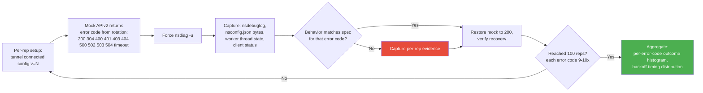
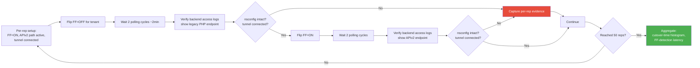
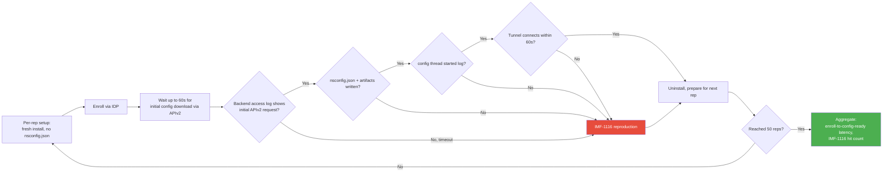
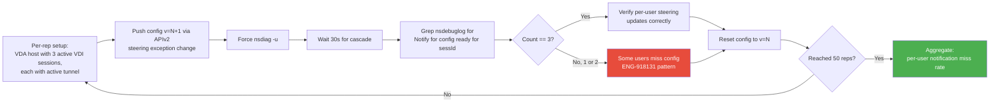
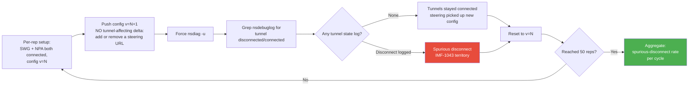

# ARES-R139: Agentic Resilience Endpoint Systest — Release R139

## Source
- Workflow: [ares_workflow.md](ares_workflow.md)
- SOP: [SYSTEST-01](../systest_plans/systest-01.md)
- Reliability baseline: [plan-reliability.md](../test_plans/plan-reliability.md) (STRESS-01..20)
- IMF data: [IMFs](../doc/bug_20260609/imfs_overall.md) (date: 2026-06-09)
- Escalation bugs: [Escalations](../doc/bug_20260609/escalation_bugs_overall.md)
- Prior release: [ares-r138.md](ares-r138.md) (covered the headline 4534 cases — STRESS-24, STRESS-28, STRESS-29)
- Date created: 2026-06-16
- Generated by: system-res-test-gen

## Release Scope

| Input | Type | Brief description |
|---|---|---|
| NPLAN-4534 | Feature | REST API v2 client configuration migration (legacy PHP → `client-oppy-configuration` microservice). Continued maturation in R139 — backend hardening, secondary code paths surfaced after R138 GA. |

This is a **single-feature release** in resilience-test scope. R138 already covered the headline 4534 stress surface (STRESS-24 cascade shock, STRESS-28 connection pool, STRESS-29 encryption × APIv2). R139 addresses **net-new failure modes from sysplan-nplan-4534 that R138 did not stress** — secondary code paths and cross-feature interactions that didn't fit the R138 budget.

## Stability Properties Under Verification

This plan verifies these 7 properties hold under release-combined stress:

| # | Property | What "broken" looks like |
|---|---|---|
| P-STAB | Stability under load | Service degradation, increasing error rate over time |
| P-RES | Resource usage (handle/thread/RSS/CPU) | Monotonic growth across reps; > 10% drift end vs start |
| P-DEAD | No deadlock | Two threads blocked on each other's locks; service unresponsive but not crashed |
| P-HANG | No hang | SCM `STOP_PENDING` or `START_PENDING` > 60s; `nsdiag -s` timeout |
| P-CRASH | No user-mode crash | `*.dmp` generated in crash dump dirs |
| P-BSOD | No kernel crash | Kernel dump generated; Event Viewer System log shows BugCheck |
| P-NET | Client network connection stable | Continuous external ping fails > documented gap window |

## Priority Banner — Top 3 Cases

1. **SYSTEST-STRESS-33** — APIv2 HTTP error code storm (P0, 100 reps, IMF-1073 Critical)
2. **SYSTEST-STRESS-34** — FF rollback (APIv2 → legacy PHP) cutover soak (P0, 50 reps, IMF-1112 High)
3. **SYSTEST-STRESS-35** — Cold start / new-user enrollment via APIv2 (P0, 50 reps, IMF-1116 High)

## Case Summary Table

Single scannable view of all 10 cases. Reviewers can audit scope and priority without reading individual case bodies.

| Case ID | Pri | Reps | Test Summary | Pass / Fail Condition | Stability Properties |
|---|---|---|---|---|---|
| SYSTEST-STRESS-33 | P0 | 100 | 100 rapid config polls hitting injected APIv2 error responses (4xx/5xx/timeout); verify backoff + recovery semantics | Pass: 100/100 polls handled per spec; nsconfig.json never corrupted; no permanent disable from transient 5xx. Fail: nsconfig.json corruption; permanent client disable on transient error; retry storm without backoff respect | P-STAB, P-NET |
| SYSTEST-STRESS-34 | P0 | 50 | Bidirectional FF flip (APIv2 ON ↔ OFF) under active tunnel; verify clean cutover both directions | Pass: 50/50 cycles cutover cleanly; tunnel never disconnects from FF flip alone; backend access logs confirm correct endpoint per direction. Fail: client stuck on dead endpoint; nsconfig.json corruption from path switch; tunnel disconnect on cutover | P-STAB, P-NET |
| SYSTEST-STRESS-35 | P0 | 50 | Cold-start initial config download via APIv2 (fresh enroll → empty cache → first sync); IMF-1116 reproduction surface for new users | Pass: 50/50 cold starts complete within 60s; worker thread starts polling; tunnel connects. Fail: cold start fails (IMF-1116 reproduction); worker thread doesn't start; client status stays "enrolling" beyond 5 min | P-STAB, P-NET |
| SYSTEST-STRESS-36 | P0 | 50 | Per-VDI-session config-ready notification storm — 3 concurrent users on VDA host, push v=N+1, verify all 3 sessions get per-sessId callback | Pass: 50/50 cycles fire 3 per-session notifications; per-user steering applies independently. Fail: only 1-2 per-session notifications (some users miss); cross-session config bleed | P-STAB, P-NET |
| SYSTEST-STRESS-37 | P0 | 50 | Tunnel + NPA continuity through APIv2 config push (no tunnel-affecting delta); verify spurious-disconnect prevention | Pass: 50/50 cycles SWG and NPA stay connected; cascade fires without `tunnel disconnected/connected` log for non-tunnel-affecting changes. Fail: spurious tunnel disconnect (IMF-1043 territory) | P-STAB, P-NET |
| SYSTEST-STRESS-38 | P1 | 50 | Cascade ordering integrity under sustained config shock (extends R138 STRESS-24 with longer-tail observation: 50 cycles instead of 100, but with cascade-order strict-ordering check) | Pass: 50/50 cycles cascade fires in documented order. Fail: cascade order inverted between any two callbacks; partial cascade | P-STAB, P-DEAD |
| SYSTEST-STRESS-39 | P1 | 50 | Large steering config (35K domains) served via APIv2; verify response not truncated and client parses without crash | Pass: 50/50 cycles full config received and parsed; no OOM; steering decisions correct. Fail: APIv2 response truncated; parse crash; OOM | P-STAB, P-CRASH, P-RES |
| SYSTEST-STRESS-40 | P1 | 50 | Proxy-traversal stress: 50 config syncs through NTLM proxy + captive portal redirect | Pass: 50/50 syncs reach APIv2 through proxy; captive portal correctly detected and resolved. Fail: APIv2 unreachable through proxy; captive portal undetected; client stuck on stale config | P-STAB, P-NET |
| SYSTEST-STRESS-41 | P1 | 100 | API Gateway RBAC context propagation under load — 100 sequential requests with varying x-netskope-rbac-context values; verify per-request authorization correctness | Pass: 100/100 requests routed and authorized correctly. Fail: RBAC context lost or cross-pollinated between requests; 401/403 on legitimate requests | P-STAB |
| SYSTEST-STRESS-42 | P1 | 50 | Audit trail consistency under burst — 50 rapid POST/PATCH/DELETE operations via APIv2; verify every mutation produces correct Kafka audit event | Pass: 50/50 mutations produce matching audit log entries. Fail: audit events missing, duplicated, or out-of-order | P-STAB |

Stability property codes: **P-STAB** stability under load, **P-RES** resource usage, **P-DEAD** no deadlock, **P-HANG** no hang, **P-CRASH** no user-mode crash, **P-BSOD** no kernel crash, **P-NET** network connection stable.

## Input → Case Mapping

| Input | Maps to case(s) |
|---|---|
| NPLAN-4534 | All 10 cases (single-NPLAN release) |

## Time and Compute Budget

- Total cases: **10** (lower end of the 10-20 sweet spot — single-feature release)
- Total reps: 5×100 + 5×50 = wait, let me recount: STRESS-33 = 100, STRESS-41 = 100, all others = 50 → 2×100 + 8×50 = **600 runs**
- Avg ~5 min/rep → ~50 hours compute
- Phase split: Week 1 → 5 P0 cases (~300 runs); Week 2 → 5 P1 cases (~300 runs)

## Stream A — Gaps vs Existing plan-reliability.md

- STRESS-20 (Configuration download Stability) doesn't probe **per-VDI-session config-ready callback** — STRESS-36 closes
- No STRESS case probes **API Gateway RBAC context propagation under sustained load** — STRESS-41 closes
- No STRESS case combines **APIv2 path × NTLM proxy × captive portal** — STRESS-40 closes
- No STRESS case probes **Kafka audit-event burst consistency** — STRESS-42 closes
- No STRESS case probes **bidirectional FF flip cutover** — STRESS-34 closes (this is the rollback path R138 left as residual risk)

## Stream B — Change-Driven Risk

- **NPLAN-4534 secondary surfaces**: R138 stress hit the headline cases (cascade shock, connection pool, encryption). R139 surfaces the secondary code paths in CConfig that R138 didn't stress at scale: HTTP error semantics (4xx/5xx differentiation), FF flip cutover, cold-start initial download, per-VDI-session delivery, RBAC propagation, audit-event production
- **Cross-feature interactions** with R138-shipped features: STRESS-37 verifies the APIv2 cascade doesn't disrupt SWG+NPA tunnels (NPA shipped in 4534's wake; this is integration soak)

---

## Test Cases — P0 (CRITICAL — IMF-Linked)

### SYSTEST-STRESS-33: APIv2 HTTP Error Code Storm
- **Priority**: P0
- **Iterations**: 100
- **Source stream**: Change
- **IMF Link**: **IMF-1073** (Critical: clients disabled when config service down)
- **Escalation bugs**: ENG-664964 (405 error caused stuck state), ENG-1017704 (nsconfig failing), ENG-795746 (100+ clients stuck)
- **Mapped to existing STRESS-XX**: STRESS-20 (Configuration download Stability) — extended with mock APIv2 error injector
- **Code under test**: `CConfig::checkAndDownloadConfig` HTTP error handling, retry/backoff state machine
- **Failure mode**: Wrong handling of HTTP 4xx vs 5xx vs 401 in APIv2 client causes either retry storms (provisioner overload, IMF-1073 pattern) OR clients fall to "disabled" on transient 5xx
- **Stability properties probed**: P-STAB, P-NET (5xx response × bad backoff = network outage from client side)

- **Per-iteration steps**:
  1. Setup: tunnel connected, config v=N captured, mock APIv2 in middlebox
  2. Inject error code (rotation: 200, 304, 400, 401, 403, 404, 500, 502, 503, 504, timeout)
  3. Force `nsdiag -u`
  4. Observe: nsdebuglog log lines, nsconfig.json bytes (must be unchanged for non-200 cases), worker thread state (still polling), client status (still enabled for 4xx/5xx)
  5. Verify backoff timing for 5xx matches doc (3 min start, doubling to 60 min cap)
  6. Reset mock to 200, verify recovery
- **Pass criterion**: 100/100 reps handle error per spec; no nsconfig.json corruption; no permanent disable from transient 5xx; no retry storm
- **Failure indicators**: nsconfig.json corrupted on any error path; client transitions to "disabled" on transient 5xx; retry storm without backoff respect; 401/403 doesn't trigger re-enrollment evaluation
- **Per-rep evidence (failed reps only)**: nsdebuglog.log slice, nsconfig.json byte hash, worker thread state, client status snapshot
- **Aggregate evidence**: per-error-code outcome histogram (100 reps × 11 error types ≈ 9 reps each), backoff timing distribution, retry count distribution

### SYSTEST-STRESS-34: FF Rollback (APIv2 → legacy PHP) Cutover Soak
- **Priority**: P0
- **Iterations**: 50
- **Source stream**: Change
- **IMF Link**: **IMF-1112** (config + auth service interaction)
- **Escalation bugs**: ENG-961429 (FF disable after enable caused issues)
- **Mapped to existing STRESS-XX**: N/A — entirely new (FF cutover is a 4534-specific risk)
- **Code under test**: FF flag read in CConfig, conditional dispatch between APIv2 client and legacy PHP client
- **Failure mode**: Bidirectional FF flip leaves clients stuck on dead endpoint OR corrupts nsconfig.json from path switch
- **Stability properties probed**: P-STAB, P-NET (stuck client = no config updates = eventual disable)

- **Per-iteration steps**:
  1. Setup: FF=ON, APIv2 path active, tunnel connected, baseline nsconfig.json captured
  2. Continuous external ping
  3. Flip FF=OFF for tenant
  4. Wait 2 polling cycles (~2 min)
  5. Verify backend access logs: client requests now hitting legacy PHP endpoint (NOT APIv2)
  6. Verify nsconfig.json unchanged byte-for-byte; tunnel still connected
  7. Flip FF=ON, wait 2 cycles, verify APIv2 endpoint hit
  8. Verify ping never disrupted by FF flip alone
- **Pass criterion**: 50/50 cycles cutover cleanly both directions; tunnel never disconnects from FF flip alone; backend access logs confirm correct endpoint per direction
- **Failure indicators**: Client continues hitting old endpoint after FF flip (didn't pick up FF change); config corruption from path switch; tunnel disconnects on cutover; clients fall to "disabled" during transition
- **Per-rep evidence (failed reps only)**: backend access log slice, nsdebuglog.log, nsconfig.json byte hash, tunnel state log
- **Aggregate evidence**: cutover-time histogram (FF flip → first request to new endpoint), FF-detection latency distribution

### SYSTEST-STRESS-35: Cold Start / New-User Enrollment via APIv2
- **Priority**: P0
- **Iterations**: 50
- **Source stream**: Change
- **IMF Link**: **IMF-1116** (AM2 unable to download config for new users)
- **Escalation bugs**: ENG-601667 (service not starting after upgrade), ENG-1017704
- **Mapped to existing STRESS-XX**: STRESS-19 (Enrollment Stability) — extended with APIv2-served initial config
- **Code under test**: CConfig init path on fresh install (no cached config), initial download via APIv2
- **Failure mode**: Initial download via APIv2 fails for fresh-install / new-user case; client stuck in "enrolling" state (IMF-1116 pattern). Repeated cold-start cycles surface intermittent enroll-time race conditions.
- **Stability properties probed**: P-STAB, P-NET (no config = no tunnel = no network)

- **Per-iteration steps**:
  1. Setup: fresh install (no prior nsconfig.json on disk)
  2. Enroll via IDP (token + tenant)
  3. Time the path: enrollment → initial APIv2 request → config written → worker thread starts → tunnel connects
  4. Verify backend access log shows successful APIv2 GET for client config
  5. Verify nsconfig.json + nssteering.json + cert files all written
  6. Verify nsdebuglog `config thread started` line present
  7. Verify tunnel connected within 60s of enrollment completion
  8. Reset: uninstall, prepare for next rep
- **Pass criterion**: 50/50 cold starts complete within 60s; full artifact set on disk; worker thread polling; tunnel connected
- **Failure indicators**: Initial download fails (IMF-1116 reproduction); nsconfig.json missing after enrollment; worker thread doesn't start; tunnel never connects; client status stuck at "enrolling" beyond 5 min
- **Per-rep evidence (failed reps only)**: nsInstallation.log, nsdebuglog.log, backend APIv2 access log slice, client status snapshot
- **Aggregate evidence**: enroll-to-config-ready latency histogram (50 samples), IMF-1116-pattern hit count, per-stage timing breakdown

### SYSTEST-STRESS-36: Per-VDI-Session Config-Ready Notification Storm
- **Priority**: P0
- **Iterations**: 50
- **Source stream**: Change
- **IMF Link**: **IMF-1116** (multi-user new-user case)
- **Escalation bugs**: **ENG-624953** (Day-1: VDI DaaS terminating connections), ENG-918131 (multi-session SWG broken)
- **Mapped to existing STRESS-XX**: N/A (multi-session per-sessId delivery is uncovered by existing STRESS catalog)
- **Code under test**: `Notify for config ready for sessId` callback path, per-session steering reload
- **Failure mode**: APIv2 single-host download triggers per-session callbacks; intermittent failures cause some sessions to miss config update (multi-session SWG broken intermittently — ENG-918131 pattern)
- **Stability properties probed**: P-STAB, P-NET (per-session steering miss = traffic drop or wrong steering for that user)

- **Per-iteration steps**:
  1. Setup: Citrix VDA on Windows Server 2019, 3 concurrent VDI sessions with active tunnels
  2. Capture pre-push steering decisions per user
  3. Push config v=N+1 via APIv2 (steering exception change)
  4. Force `nsdiag -u`, wait 30s for cascade
  5. Grep nsdebuglog: `Notify for config ready for sessId` MUST fire 3 times
  6. Verify per-user steering decisions update correctly
  7. Verify per-user FailClose isolation maintained (activate FC for UserA only, verify UserB / UserC unaffected)
  8. Reset config to v=N
- **Pass criterion**: 50/50 cycles fire 3 per-session notifications; per-user steering decisions correct; FC isolation preserved
- **Failure indicators**: Only 1 or 2 per-session notifications (some users miss config); cross-session config bleed; ENG-918131 pattern (multi-session SWG broken intermittently); ENG-624953 pattern (sessions terminated)
- **Per-rep evidence (failed reps only)**: nsdebuglog filtered by sessId, per-user steering decision capture, ICA session log
- **Aggregate evidence**: per-user notification miss rate, per-cycle 3-notification count distribution

### SYSTEST-STRESS-37: Tunnel + NPA Continuity Through APIv2 Config Push
- **Priority**: P0
- **Iterations**: 50
- **Source stream**: Change
- **IMF Link**: **IMF-1043** (Critical: NPA tunnel break)
- **Escalation bugs**: ENG-441957 (NPA disconnect after switch), ENG-987566 (traffic mode race), ENG-503501 (DTLS fallback regression)
- **Mapped to existing STRESS-XX**: STRESS-03 (Tunnel Flapping) + STRESS-04 (Configuration Shock) combined
- **Code under test**: Callback cascade through APIv2; specifically the path where tunnelMgr decides whether to reconnect based on config delta
- **Failure mode**: Spurious tunnel disconnect when config push has NO tunnel-affecting delta (steering exception change shouldn't disconnect tunnel). Repeated reps surface intermittent decision-tree bugs.
- **Stability properties probed**: P-STAB, P-NET (tunnel break during stable config = customer outage)

- **Per-iteration steps**:
  1. Setup: SWG + NPA both connected, config v=N captured
  2. Push config v=N+1 with no tunnel-affecting delta (e.g., add/remove a single steering exception URL — NOT a gateway/proxy change)
  3. Force `nsdiag -u`
  4. Grep nsdebuglog for `tunnel disconnected/connected` — MUST NOT appear in this rep
  5. Verify SWG and NPA tunnels both stayed connected throughout cascade
  6. Verify steering picked up new exception (decision delta verified for affected URL)
  7. Reset to v=N
- **Pass criterion**: 50/50 cycles produce zero spurious tunnel disconnect events; cascade completes; steering applied
- **Failure indicators**: `tunnel disconnected/connected` log appears for non-tunnel-affecting config push (spurious break); IMF-1043 pattern (NPA break); ENG-987566 pattern (traffic mode race)
- **Per-rep evidence (failed reps only)**: nsdebuglog filtered by tunnel state keywords, packet capture, nsdiag -s before/after
- **Aggregate evidence**: spurious-disconnect rate per cycle, cascade timing histogram

---

## Test Cases — P1 (IMPORTANT — Escalation-Linked)

(P1 cases share the canonical per-rep loop shape from STRESS-33..37 above. Compact format here — full Mermaid omitted.)

### SYSTEST-STRESS-38: Cascade Ordering Strict-Order Soak (extends R138 STRESS-24)
- **Priority**: P1
- **Iterations**: 50
- **Source stream**: Change
- **Escalation bugs**: ENG-422599 (FailClose after config update — cascade race), ENG-595031, ENG-739968
- **Mapped to STRESS**: STRESS-04 (Configuration Shock) — extended with strict-ordering verification (R138 STRESS-24 verified cascade fires; R139 verifies it fires in DOCUMENTED ORDER)
- **Stability properties probed**: P-STAB, P-DEAD
- **Failure mode**: Cascade callbacks fire but in wrong order (FC reads new config before tunnel reconfigures → false-block); R138 STRESS-24 caught false-block but didn't verify ORDER explicitly
- **Per-iteration**: push config v=N+1 → grep nsdebuglog for cascade callback timestamps in order: `Notify for config updates` → tunnel state change → NPA → FailClose → UI; verify ALL callbacks fire AND timestamps are monotonically increasing in documented order
- **Pass**: 50/50 cycles cascade fires in correct order
- **Failure indicators**: any out-of-order callback; partial cascade
- **Aggregate**: per-callback timestamp histogram across 50 reps

### SYSTEST-STRESS-39: Large Steering Config Boundary (35K Domains via APIv2)
- **Priority**: P1
- **Iterations**: 50
- **Source stream**: Change
- **Escalation bugs**: ENG-872456 (NS Client crash with 30K+ domains), ENG-948106 (Linux crash with long domains)
- **Mapped to STRESS**: N/A (boundary-soak combined with APIv2 path)
- **Stability properties probed**: P-STAB, P-CRASH, P-RES
- **Failure mode**: APIv2 response truncation at high payload size, OR client parse crash on long-domain names (230-255 chars)
- **Per-iteration**: tenant config has 35K domains including 230-255 character names → trigger sync via APIv2 → verify nsconfig.json complete (size matches expected) → verify steering decisions correct for sample domains → check no crash dump / OOM
- **Pass**: 50/50 with full config received and parsed; no truncation; no crash; no OOM
- **Aggregate**: parse-time histogram, RSS spike per cycle, crash dump check

### SYSTEST-STRESS-40: Proxy Traversal × Captive Portal Stress
- **Priority**: P1
- **Iterations**: 50
- **Source stream**: Change
- **Escalation bugs**: ENG-487256 (proxy break after fix), ENG-405439 (proxy stale), ENG-505439, ENG-482990 (captive portal not detected)
- **Mapped to STRESS**: N/A (combined corp-network stress)
- **Stability properties probed**: P-STAB, P-NET
- **Failure mode**: APIv2 path through NTLM proxy fails intermittently; captive portal detection breaks on APIv2-specific request shape
- **Per-iteration**: device behind explicit NTLM proxy + captive portal → trigger config sync via APIv2 → verify request reaches backend → repeat with PAC/WPAD proxy → repeat with HTTP 302 captive portal redirect
- **Pass**: 50/50 syncs reach APIv2 through proxy; captive portal correctly detected and resolved
- **Failure indicators**: APIv2 request fails through NTLM proxy (auth not propagated); captive portal not detected
- **Aggregate**: success rate per proxy-type, captive-portal detection latency

### SYSTEST-STRESS-41: API Gateway RBAC Context Propagation
- **Priority**: P1
- **Iterations**: 100
- **Source stream**: Change
- **Escalation bugs**: ENG-684014 (client status follows IDP user status), ENG-693785 (case-sensitivity in user/group IDs)
- **Mapped to STRESS**: N/A (entirely new — 4534-introduced API Gateway RBAC routing)
- **Stability properties probed**: P-STAB
- **Failure mode**: x-netskope-rbac-context header not propagated correctly under load; cross-pollination of contexts between concurrent requests
- **Per-iteration**: send 100 sequential APIv2 requests with varying x-netskope-rbac-context values (View vs Manage roles, different user IDs) → verify per-request authorization correctness on backend → verify response matches the role's allowed view
- **Pass**: 100/100 requests routed and authorized correctly; no cross-pollination
- **Failure indicators**: 401/403 on legitimate requests; user A's context bleeds to user B's response; case-sensitivity bug (ENG-693785) reproduces
- **Aggregate**: per-request authorization-success rate, latency distribution by RBAC-context complexity

### SYSTEST-STRESS-42: APIv2 Audit Trail Burst Consistency
- **Priority**: P1
- **Iterations**: 50
- **Source stream**: Change
- **Escalation bugs**: None direct (4534 introduces Kafka audit events as a new code path)
- **Mapped to STRESS**: N/A
- **Stability properties probed**: P-STAB
- **Failure mode**: APIv2 mutations (POST/PATCH/DELETE) burst causes Kafka audit events to be missed, duplicated, or arrive out-of-order
- **Per-iteration**: send 50 rapid POST + PATCH + DELETE operations via APIv2 in 30-second window → consume from Kafka audit topic → verify every mutation has matching audit event with correct (operation, before-state, after-state, timestamp, user-context)
- **Pass**: 50/50 mutations produce matching audit log entries; ordering preserved
- **Failure indicators**: audit events missing, duplicated, or out-of-order; before-state or after-state inconsistent with actual mutation
- **Aggregate**: audit-event-to-mutation match rate, lag distribution

---

## Execution Order

Week 1 (P0 — IMF-linked, 5 cases × ~70 reps avg = ~300 runs):
1. STRESS-33 (HTTP error storm)
2. STRESS-34 (FF rollback cutover)
3. STRESS-35 (cold start)
4. STRESS-36 (per-VDI-session delivery)
5. STRESS-37 (tunnel + NPA continuity)

Week 2 (P1 — escalation-linked, 5 cases × ~60 reps avg = ~300 runs):
6. STRESS-38 (cascade order strict)
7. STRESS-39 (35K domains)
8. STRESS-40 (proxy + captive portal)
9. STRESS-41 (RBAC propagation)
10. STRESS-42 (audit trail burst)

Each case's reps run consecutively (not interleaved) so failure clusters are visible in the per-case timeline.

## Stability Property Coverage (verification matrix)

| Case | P-STAB | P-RES | P-DEAD | P-HANG | P-CRASH | P-BSOD | P-NET |
|---|---|---|---|---|---|---|---|
| STRESS-33 | Y | - | - | - | - | - | Y |
| STRESS-34 | Y | - | - | - | - | - | Y |
| STRESS-35 | Y | - | - | - | - | - | Y |
| STRESS-36 | Y | - | - | - | - | - | Y |
| STRESS-37 | Y | - | - | - | - | - | Y |
| STRESS-38 | Y | - | Y | - | - | - | - |
| STRESS-39 | Y | Y | - | - | Y | - | - |
| STRESS-40 | Y | - | - | - | - | - | Y |
| STRESS-41 | Y | - | - | - | - | - | - |
| STRESS-42 | Y | - | - | - | - | - | - |

**Coverage gaps** (acknowledged):
- **P-BSOD** not covered in R139 — same gap as R138; APIv2 doesn't touch kernel
- **P-HANG** not covered — APIv2 connection-pool hang was probed in R138 STRESS-28 (still active in regression suite as REG-007); no fresh hang surface in R139's secondary code paths
- **P-CRASH** only in STRESS-39 (35K domain parse) — no other R139 case has a known crash signature

UI symptoms intentionally excluded (consistent with R138 — UI gray-out is downstream of P-STAB / status reporting, covered by functional system tests).

## Exit Criteria

- All P0 cases (STRESS-33..37) reach N reps with 0 failures (or 100% of failures filed and triaged per SYSTEST-01 Section 9)
- All P1 cases (STRESS-38..42) reach N reps OR have time-out justification
- Stability Property Coverage matrix completed — every Y entry has aggregate evidence proving the property holds
- IMF-1116 reproduction attempts (STRESS-35) tally documented; if any reproduction → file as P0 release-blocker
- Aggregate evidence archived per case in `resilience_systest/r139-evidence/`
- **Regression suite carries forward**: REG-001..REG-008 from R138 also run at 30 reps each (240 runs ≈ 20 hours); pass criteria per the regression suite definitions

## Cases NOT in This Plan (and why)

| Candidate | Why dropped |
|---|---|
| Repeat of STRESS-24 (cascade shock) from R138 | Same failure mode at same iteration count — already in regression suite as REG-007 contribution path. STRESS-38 (this plan) extends with strict-ordering verification, distinct enough to keep separate. |
| Repeat of STRESS-28 (connection pool exhaustion) from R138 | Same code path, no new evidence. R138's STRESS-28 verified at 100 reps; further reps yield no new information. |
| Repeat of STRESS-29 (encryption × APIv2) from R138 | Same code path, no new evidence in R139. |
| Generic AV interop with APIv2 | APIv2 is HTTP path, not driver/binary — V5 narrow criteria not met. P1/P2 functional concern. |
| ARM64 emulation × APIv2 | APIv2 is architecture-independent HTTP; no platform-specific stress added. |
| Localization stress for APIv2 error messages | Cosmetic — doesn't probe any of the 7 stability properties. |
| BSOD-targeted driver fault injection | No driver-fault-injection harness available; deferred. |
| MDM-deployed APIv2 cold start | Single-pass test in functional sysplan-nplan-4534 SYS-009 V8. Not enough new failure surface to justify 50 reps. |

## Regression Suite Contributions

This release adds 3 cases to `resilience_systest/regression_suite.md`. Below the 8-case cap because R139 has only one NPLAN in scope and most of its top-evidence cases were already added in R138 (REG-007 = SYS-001 config download integrity, REG-008 = SYS-008 tunnel + NPA continuity).

| New Reg ID | Source NPLAN | Source SYS-XX | Selection Reason | Stability Properties |
|---|---|---|---|---|
| SYSTEST-REG-009 | NPLAN-4534 | sysplan-nplan-4534 SYS-003 | IMF-1073 Critical + permanent-broken-state (clients disabled on transient 5xx mishandled) | P-STAB, P-NET |
| SYSTEST-REG-010 | NPLAN-4534 | sysplan-nplan-4534 SYS-006 | IMF-1116 High + ENG-624953 Day-1 + multi-user delivery | P-STAB, P-NET |
| SYSTEST-REG-011 | NPLAN-4534 | sysplan-nplan-4534 SYS-009 | IMF-1116 High + permanent-broken-state (cold start failure = unenrollable client) | P-STAB, P-NET |

Per-NPLAN allocation: NPLAN-4534 = 3 (within 3-5 floor). The 8-case per-release cap was not binding — only 3 net-new worthy cases identified for R139.

(`## Cases Considered for Regression but Not Added` section omitted — no candidates exceeded the cap; R138 already covered the highest-evidence 4534 cases in regression suite.)

---

## Notes for Reviewers — Why R139 is Smaller Than R138

R139 is a **single-NPLAN release** (4534 follow-on hardening). R138 already covered the headline 4534 stress surface in 3 cases (STRESS-24, STRESS-28, STRESS-29 — now in regression suite as REG-007 and REG-008). R139 addresses **secondary code paths** that didn't fit R138's 12-case budget when other NPLANs (3211, watchdog) competed for slots.

The 10 cases here are net-new failure modes; none repeat R138's coverage. Total compute (~50 hours for ~600 runs) is lower than R138 (~70 hours for ~850 runs) because the release scope is narrower.

**Cumulative regression suite after R139**: 8 (R138) + 3 (R139) = 11 active cases × 30 reps = 330 runs ≈ 28 hours regression workload, layered on top of the ~50 hours for the per-release plan.
