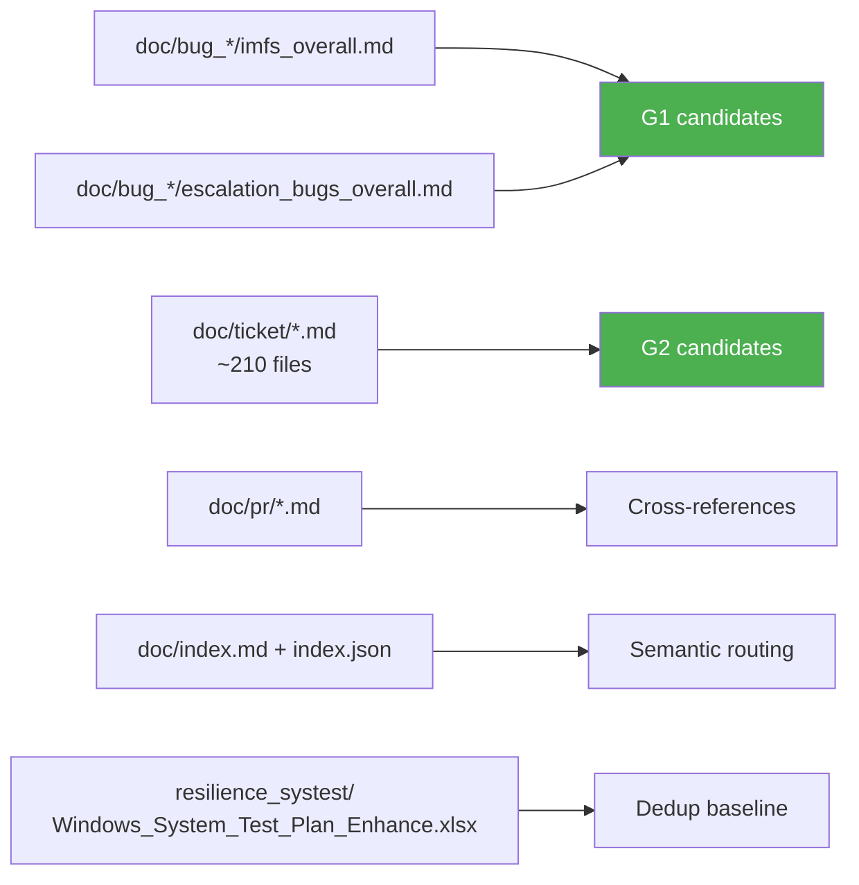
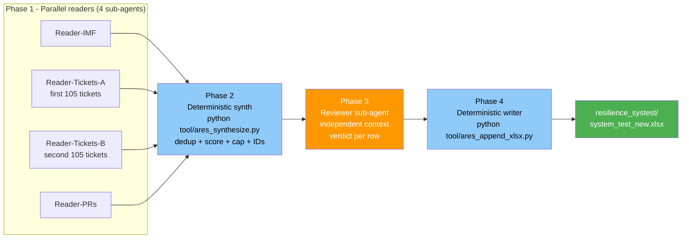

# Agentic Resilience Endpoint Systest — Workflow (v2)

How the `/system-res-test-gen` skill appends up to 50 new rows to the
canonical Windows system-test xlsx.

> **Scope of this document**: explainer for humans. The plan-generation rules
> (column schema, ID convention, dedup, scoring, cap) live inside the skill
> file itself (`skills/system-res-test-gen/skill.md`). This file is NOT
> consulted by the agent at generation time.

## Two goals (everything else is out of scope)

- **G1 — Prevent recurrence of IMF-class production failures**
- **G2 — Surface test gaps / corner cases discovered in past customer tickets**

A candidate test case must serve G1, G2, or both. Cases that don't cite at
least one IMF, escalation, or ticket reference are dropped.

## Doc index — refresh before running

`doc/index.md` and `doc/index.json` are the semantic-routing layer the
readers use. If `doc/` has gained or lost files since the last run, refresh
the index first:

```
python tool/gen_doc_index.py
```

The generator scans every `doc/**/*.md`, prefers YAML frontmatter, and
falls back to keyword heuristics for tickets without frontmatter (flagged
`source: heuristic` in the index).

## Inputs (fixed, no manifest)



## Four phases (parallel readers -> deterministic synth -> reviewer -> writer)



Blue = deterministic Python. Orange = LLM sub-agent. Phases 2 and 4 do not
use the agent harness because both are pure-mechanical work.

### Phase 1 — Parallel readers

Four sub-agents run concurrently. Each emits structured JSON candidates only;
no file writes. Splitting tickets across two readers keeps each agent's
context manageable (~100 files each instead of 210).

### Phase 2 — Synthesizer (deterministic Python, NOT an agent)

`tool/ares_synthesize.py` reads the four candidate lists plus the existing
23 rows. It dedups against existing rows (token-Jaccard ≥ 0.30), dedups
across readers (≥ 0.55 within the same category bucket), applies the
priority formula
`0.6 * severity + 0.4 * recurrence + 1.0 (if IMF ref) + 0.5 (if ticket ref)`,
sorts descending, caps at 50, and assigns Test IDs by continuing the per-
prefix numbering used in the source xlsx (STRESS-NN, UPGRADE-NN, NET-NN,
FC-NN, IPC-NN, STEER-NN, CERT-NN; new categories mint a fresh short prefix
— WD, AOAC, VDI, MAC, LIN, VPN, NPA, LOG).

This phase used to be an LLM agent but it kept timing out trying to author
50 rich xlsx rows in one context. The readers already produce the
open-ended drafts, so the merge step is pure mechanics.

### Phase 3 — Reviewer

An independent sub-agent (clean context, sees only finalized rows + existing
xlsx) verdicts each row: keep or drop. Rejection reasons: not actually serving
G1/G2, duplicate of existing row, contradicts another new row, untestable
steps/criteria, or false IMF/ticket citation. No backfill loop — dropped
rows are simply lost; the writer outputs whatever survives.

### Phase 4 — Writer

Deterministic Python (no agent): `tool/ares_append_xlsx.py`. Copies the
source xlsx, appends survivors, saves to
`resilience_systest/system_test_new.xlsx`. Preserves header style and column
widths. The source xlsx is never modified. Intermediate JSON inputs live
under `log/_ares_run/` (gitignored).

## Output schema

`system_test_new.xlsx` mirrors the source's 9 columns exactly:

| Test ID | Test Item | Category | Detailed Explanation | Execution Steps | Pass Criteria | Failure Impact | IMF/Escalation Correlation | Source |
|---|---|---|---|---|---|---|---|---|

The `Source` column for every appended row is set to
`system-res-test-gen (date YYYY-MM-DD)` so reviewers can spot agent-generated
rows at a glance.

## Caps and floors

- Hard cap: 50 appended rows.
- Soft floor: warn if fewer than 10 rows survive (input docs likely unchanged
  since the last run).
- No pad-to-cap behavior — write what survives.

## What this workflow does NOT do

- No `ares-rXXX.md` per-release plans.
- No `regression_suite.md` accumulator updates.
- No 50-100 rep iteration counts per case (that framing is retired; reps are
  managed at execution time, not in this plan).
- No release manifest parsing.
- No NPLAN-scope inputs.

## What changed from v1

| v1 (Stream A/B, release-scoped) | v2 (this doc) |
|---|---|
| Scope = monthly release manifest | Scope = fixed input doc set |
| Output = `ares-rXXX.md` per release | Output = `system_test_new.xlsx` appended rows |
| Two streams: gap vs plan-reliability, change-driven from PRs | Two goals: G1 IMF-avoidance, G2 ticket-gap |
| Stream A reads `plan-reliability.md` (STRESS-01..20) | Reads existing xlsx rows for dedup baseline |
| Maintains `regression_suite.md` (8 cases/release) | No regression suite |
| 10-20 cases per release, 50-100 reps each | <=50 rows per run, no rep count in plan |
| Single-agent flow | 4 parallel readers + synthesizer + reviewer |

## When to run

- Whenever `doc/bug_*/imfs_overall.md` gains new IMF entries.
- Whenever `doc/ticket/` gains new ticket RCAs likely to surface gaps.
- Periodically (e.g. monthly) as a refresh, even without new inputs.

If the soft-floor warning fires (fewer than 10 rows survive), the inputs
likely haven't shifted — skip the run and revisit later.
