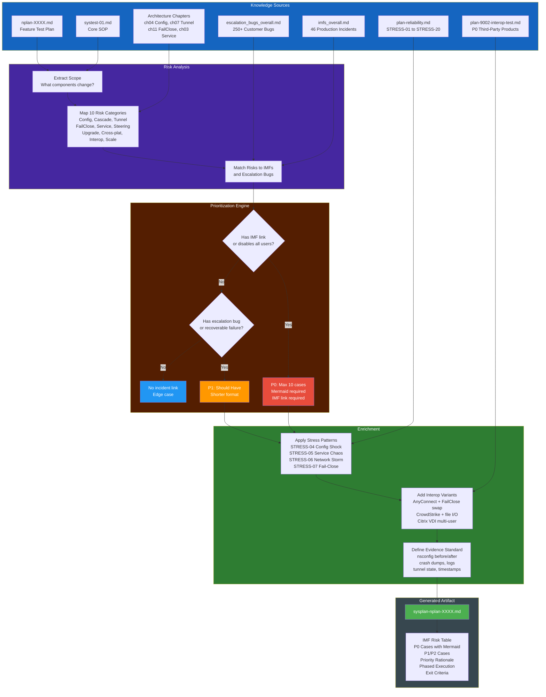

# System Test Plan Composition Flow

How a `sysplan-nplan-XXXX.md` is assembled from multiple knowledge sources.

## Summary

| Stage | Input | Output | Key Decision |
|-------|-------|--------|--------------|
| **Sources** | 7 document types | Raw knowledge | Which sources are accessible? |
| **Risk Analysis** | Feature scope + architecture | 10 risk categories mapped | Which components does this NPLAN touch? |
| **Prioritization** | Risks + IMFs + bugs | P0/P1/P2 classification | Does this risk have an IMF link? |
| **Enrichment** | Prioritized cases | Stress variants + interop combos | Would this also fail with a P0 product active? |
| **Output** | Enriched test cases | sysplan-nplan-XXXX.md | All P0 under cap of 10? |

## Source Contribution Map

| Source | Contributes To | Example |
|--------|---------------|---------|
| systest-01.md | Scope definition, evidence standard, defect template | Section 9 defect filing format |
| nplan-XXXX.md | Feature scope, affected components, out-of-scope boundary | Which APIs change, which platforms |
| plan-reliability.md | Stress injection methodology for P0 cases | STRESS-04 rapid config push pattern |
| imfs_overall.md | P0 justification, risk table, failure patterns | IMF-1073 clients disabled |
| escalation_bugs_overall.md | P1 justification, related bug references | ENG-591725 tunnel not established |
| plan-9002-interop-test.md | Interop P0 cases, coexistence risks | AnyConnect FailClose swap ENG-991833 |
| Architecture chapters | Callback cascade detail, state machines, code paths | Non-atomic onConfigUpdate sequence |
