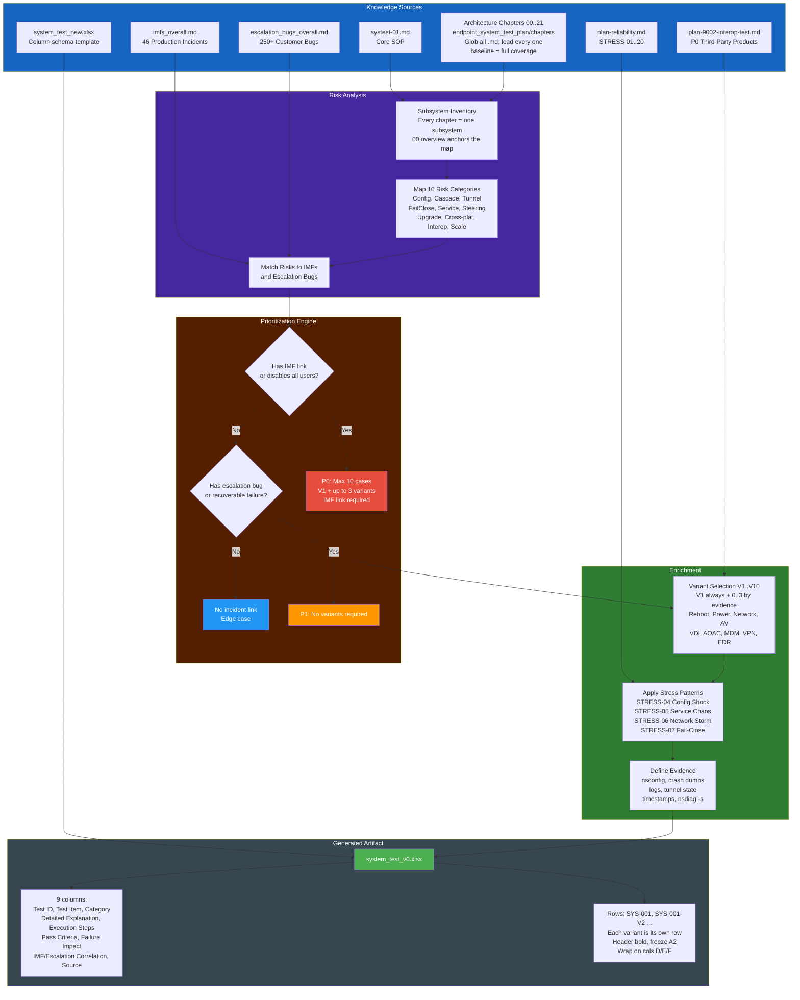

# System Test Plan Composition Flow

How `resilience_systest/system_test_v0.xlsx` — the **baseline endpoint resilience test suite** — is assembled. The suite is subsystem-scoped (not per-NPLAN/feature). Output is an Excel workbook matching the column schema of `resilience_systest/system_test_new.xlsx`. No NPLAN input.

## Summary

| Stage | Input | Output | Key Decision |
|-------|-------|--------|--------------|
| **Sources** | 7 document types | Raw knowledge | All chapters loaded? |
| **Risk Analysis** | Subsystem inventory (every chapter) | 10 risk categories mapped | Which subsystem owns this risk? |
| **Prioritization** | Risks + IMFs + bugs | P0/P1/P2 classification | Does this risk have an IMF link? |
| **Enrichment** | Prioritized cases | V1 + ≤3 variants per P0, stress patterns | Which variants have the strongest evidence? |
| **Output** | Enriched test cases | `system_test_v0.xlsx` | All P0 under cap of 10? Schema matches template? |

## Source Contribution Map

| Source | Contributes To | Example |
|--------|---------------|---------|
| systest-01.md | Scope definition, evidence standard, defect template | Section 9 defect filing format |
| plan-reliability.md | Stress injection methodology for P0 cases | STRESS-04 rapid config push |
| imfs_overall.md | P0 justification, risk table, failure patterns | IMF-1073 clients disabled |
| escalation_bugs_overall.md | P1 justification, related bug references | ENG-591725 tunnel not established |
| plan-9002-interop-test.md | Interop variants (V6/V8/V9/V10) | AnyConnect FailClose swap ENG-991833 |
| Architecture chapters 00..21 | Risk-category mapping, callback cascades, state machines, log keywords | ch04 non-atomic onConfigUpdate, ch07 22-state tunnel SM, ch11 7-state FailClose SM |
| system_test_new.xlsx | Column schema template (9 columns, wrap, freeze) | Headers + row format reference |

## Chapter Selection Rule

Baseline suite — load every chapter, always:

1. Glob `C:\git\endpoint_system_test_plan\chapters\*.md`
2. Read `00_overview.md` first to map subsystems
3. Include every other chapter — each defines a subsystem the baseline suite must cover

| Chapter | Component |
|---|---|
| 00 | Whole-stack map (always skim) |
| 01 | Installation / MSI / packages |
| 02 | Enrollment / tokens / IDP |
| 03 | Service lifecycle / AOAC / watchdog |
| 04 | Config download / digest / callback cascade |
| 05 | Steering config / exception priority |
| 06 | Client status / heartbeat / multi-user |
| 07 | Tunnel management (22-state SM) |
| 08 | Gateway / GSLB / POP selection |
| 09 | Traffic steering / per-flow |
| 10 | Bypass / cert-pinned apps |
| 11 | FailClose (7-state SM) |
| 12 | Device classification / vault |
| 13 | Certificate management |
| 14 | Proxy management / PAC |
| 15 | NPA integration |
| 16 | DEM / health |
| 17 | IPC / nscom2 / UI ↔ service |
| 18 | Security / self-protection |
| 19 | Integration architecture |
| 20 | Supportability / logs / nsdiag |
| 21 | Watchdog / restart policy |

## Output Schema (xlsx)

| # | Column | Notes |
|---|--------|-------|
| 1 | Test ID | `SYS-NNN`, variants `SYS-NNN-VN` |
| 2 | Test Item | Title ≤ 80 chars |
| 3 | Category | Tunneling / Stress, Config Path, FailClose, ... |
| 4 | Detailed Explanation | 2–4 sentences; wrap_text |
| 5 | Execution Steps | Numbered, newline-separated; wrap_text |
| 6 | Pass Criteria | At least one observable; wrap_text |
| 7 | Failure Impact | User-visible consequence |
| 8 | IMF/Escalation Correlation | Empty only for P2 |
| 9 | Source | `plan-reliability.md::STRESS-0X`, `ch07_tunnel_management.md`, `imfs_overall.md::IMF-NNNN` |

Header bold, `freeze_panes = "A2"`, `wrap_text=True` on D/E/F.
